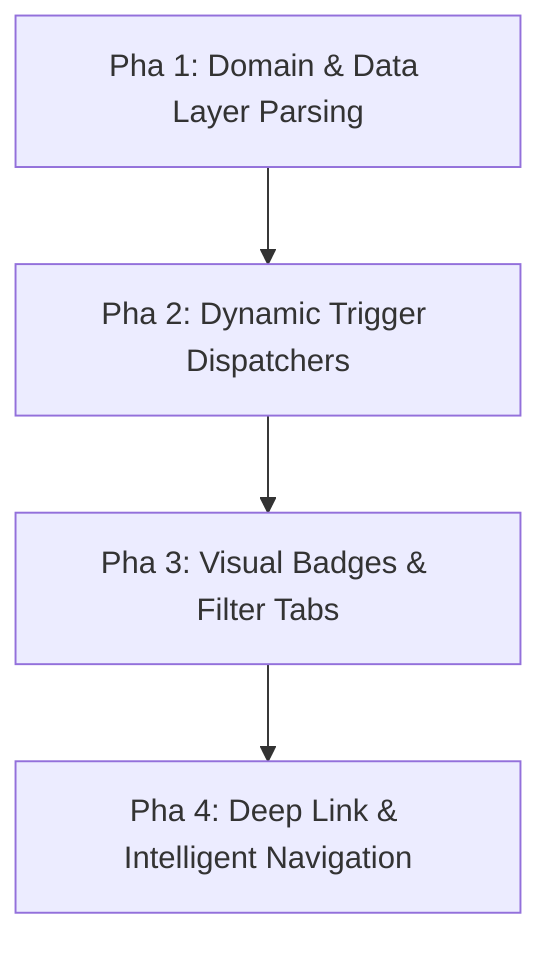

# BACKLOG - FINLUX APP

Danh sách các tính năng, ý tưởng và yêu cầu nâng cấp/sửa lỗi được ghi nhận để triển khai trong các phiên bản tương lai.

---

## 🚨 [BUG BACKLOG] - Wallet Transfer Balance Validation

> **Tên Ticket:** `[BUG CRITICAL] Thiếu kiểm tra số dư khi chuyển tiền giữa các ví (Wallet Transfer Insufficient Funds Validation)`  
> **Trạng thái:** ⏳ `[DONE] - Đã hoàn thiện trong v1.8.0`  
> **Mức độ ưu tiên:** 🔴 Critical / High  
> **Ngày ghi nhận:** 2026-08-15  
> **File ảnh hưởng:** `TransferMoneyUseCase.kt`, `WalletsViewModel.kt`, `ModernWalletsScreen.kt`, `ClassicWalletsScreen.kt`, `QuickAddSheet.kt`

---

### 1. 🐞 Mô Tả Vấn Đề (Problem Description)
- Hiện tại form **Chuyển tiền giữa các ví** (`TransferEditor` / `TransferSheet` / `QuickAddSheet`) **KHÔNG KIỂM TRA** số dư khả dụng của ví nguồn trước khi thực hiện chuyển tiền.
- **Ví dụ thực tế:** Ví *"Tiền mặt"* có số dư = `0 đ` nhưng người dùng vẫn nhập và chuyển thành công `1.000.000.000 đ` sang ví *"Sacombank"*.
- **Hậu quả nghiêm trọng:**
  1. **Số dư ví nguồn bị âm vô lý:** Biến thành `-1.000.000.000 đ` (đối với ví tiền mặt/ngân hàng thông thường không có thấu chi).
  2. **Vỡ hiển thị tỷ trọng tài sản:** Khi tổng số dư hoặc số dư ví bị âm, công thức tính % tỷ lệ tài sản bị lỗi chia, dẫn đến hiển thị các con số quái dị như `-32411%` và `32415%`.

---

### 2. 🛠️ Yêu Cầu Logic & Giải Pháp Kỹ Thuật (Solution Specs)

#### A. Tầng UI / Form Chuyển Tiền (`TransferEditor` & `QuickAddSheet`)
- Tự động lấy số dư khả dụng của ví nguồn được chọn (`val sourceBalance = wallets.find { it.id == source }?.balance?.value ?: 0L`).
- Với các ví **không phải Thẻ tín dụng** (`sourceWallet.type != WalletType.CARD`):
  - Khi người dùng nhập `amount > sourceBalance`:
    * Hiển thị dòng cảnh báo màu đỏ (`MaterialTheme.colorScheme.error`):  
      *⚠️ "Số dư ví nguồn không đủ (Số dư hiện tại: X đ)"*.
    * **Disable** nút `[Xác nhận chuyển tiền]`.

#### B. Tầng Domain / Nghiệp Vụ (`TransferMoneyUseCase.kt`)
- Bổ sung validation kiểm tra ràng buộc số dư:
  ```kotlin
  if (sourceWallet.type != WalletType.CARD && amount > sourceWallet.balance.value) {
      return AppResult.Error("Số dư ví nguồn không đủ để thực hiện chuyển tiền")
  }
  ```
- Đảm bảo thực thi trong **Firestore Transaction** nguyên tử (Atomic), không để xảy ra race condition.

#### C. Tầng Tính Toán & Hiển Thị Tỷ Trọng (% Ratio Calculation)
- Chuẩn hóa hàm tính % tỷ trọng tài sản của từng ví:
  - Nếu `total <= 0` hoặc `wallet.balance.value <= 0`: Gán % tỷ trọng an toàn về `0%` thay vì để xảy ra phép chia âm/vô cực.

---

### 💬 3. Prompt Kích Hoạt Nhanh Khi Triển Khai Fix (Activation Prompt)

Khi sẵn sàng tiến hành sửa bug này, gửi prompt sau:

> *"Em ơi, bắt đầu triển khai fix [BUG CRITICAL] Thiếu kiểm tra số dư khi chuyển tiền giữa các ví theo mô tả chi tiết tại BACKLOG.md nhé! Tiến hành kiểm tra và chặn ở cả Domain UseCase lẫn UI Form TransferEditor."*

---

## [BACKLOG] v1.6.0 - Multi-type Notification System (Hệ thống Thông báo Đa năng)

> **Trạng thái:** ⏸️ DONE - Đã hoàn thiện trong v1.8.0 (Tạm hoãn để ưu tiên các task gấp khác)  
> **Ngày ghi nhận:** 2026-08-14  
> **File thiết kế liên quan:** `AppNotification.kt`, `NotificationRepository.kt`, `NotificationsScreen.kt`, `NotificationsViewModel.kt`

---

### 📌 1. Bối Cảnh & Đánh Giá Hiện Trạng (Audit Summary)
- **Model `AppNotification` hiện tại:** Chỉ chứa các trường `id`, `title`, `body`, `amount`, `reminderId`, `categoryId`, `walletId`, `timestamp`, `isRead`, `isPaid`.
- **Giới hạn hiện tại:** 100% thông báo đang được sinh ra từ `AlarmReminderScheduler.kt` dưới dạng Nhắc nhở thanh toán hóa đơn (`REMINDER`). Tất cả thông báo có `amount > 0` hoặc `reminderId != null` đều bị cố định nút `[💳 Xác nhận thanh toán]`.
- **Mục tiêu nâng cấp:** Mở rộng thành Trung tâm Cảnh báo Tài chính Đa năng (Smart Financial Notification Hub), phân loại đa dạng thông báo và hỗ trợ điều hướng thông minh (Deep Link Navigation).

---

### 🏗️ 2. Phân Loại & Mở Rộng Data Model

#### A. Enum `NotificationType` (`domain/model/NotificationType.kt`)
```kotlin
package com.finlux.app.domain.model

enum class NotificationType {
    REMINDER,            // Nhắc nhở thanh toán hóa đơn / khoản chi định kỳ
    BUDGET_ALERT,        // Cảnh báo chạm ngưỡng ngân sách (80%, 100%)
    GOAL_MILESTONE,      // Cột mốc mục tiêu tiết kiệm (25%, 50%, 75%, 100%)
    TRANSACTION_SUMMARY, // Tóm tắt biến động tài chính tuần/tháng
    SYSTEM               // Thông báo hệ thống, mẹo tài chính, cập nhật app
}
```

#### B. Mở rộng Model `AppNotification` (`domain/model/AppNotification.kt`)
```kotlin
package com.finlux.app.domain.model

import java.time.Instant

data class AppNotification(
    val id: String = "",
    val title: String = "",
    val body: String = "",
    val type: NotificationType = NotificationType.REMINDER, // Fallback mặc định cho bản ghi cũ
    val amount: Money = Money(0L),
    val reminderId: String? = null,
    val categoryId: String? = null,
    val walletId: String? = null,
    val targetRoute: String? = null,    // Route điều hướng (Route.Budget, Route.Goals, Route.Reports...)
    val targetId: String? = null,       // ID đối tượng liên quan (budgetId, goalId...)
    val actionUrl: String? = null,      // URL mở trang ngoài (nếu có)
    val timestamp: Instant = Instant.now(),
    val isRead: Boolean = false,
    val isPaid: Boolean = false,
)
```

---

### 🚀 3. Kế Hoạch Triển Khai 4 Pha (4-Phase Implementation Roadmap)



#### 🔹 Pha 1: Domain & Data Layer Standardization
1. **Tạo `NotificationType.kt`** trong package `domain/model/`.
2. **Mở rộng `AppNotification.kt`** với các thuộc tính `type`, `targetRoute`, `targetId`, `actionUrl`.
3. **Cập nhật Mapper Data Layer:**
   - `FirebaseReadRepository.kt`: Parse & Save các trường `type`, `targetRoute`, `targetId`, `actionUrl` lên Firestore subcollection `users/{uid}/notifications`. Fallback `type = REMINDER` cho bản ghi legacy.
   - `DemoFinluxRepository.kt`: Cập nhật lưu trữ local state flow.

#### 🔹 Pha 2: Dynamic Trigger Dispatchers (Bộ phát thông báo tự động)
1. **`BudgetAlertDispatcher`:** Tích hợp vào `AddTransactionUseCase` / `EditTransactionUseCase`. Khi giao dịch mới làm ngân sách vượt 80% (Cảnh báo vàng) hoặc 100% (Cảnh báo đỏ), tự động tạo `AppNotification` loại `BUDGET_ALERT` kèm `targetRoute = Route.Budget.value`.
2. **`GoalMilestoneDispatcher`:** Tích hợp vào luồng tích lũy tiết kiệm. Khi nạp tiền vào Mục tiêu chạm mốc 50% hoặc 100%, phát `AppNotification` loại `GOAL_MILESTONE` kèm `targetRoute = Route.Goals.value`.
3. **`SystemNotificationDispatcher`:** Hỗ trợ tạo thông báo chào mừng hoặc mẹo quản lý tài chính.

#### 🔹 Pha 3: UI Redesign `NotificationsScreen.kt` (Badges & Filter Chips)
1. **Icon & Màu sắc phân biệt theo `NotificationType`:**
   - 🔴 `BUDGET_ALERT`: Badge Warning/PieChart màu Đỏ rực (`Color(0xFFE53935)`).
   - 🟡 `GOAL_MILESTONE`: Badge EmojiEvents/Flag màu Vàng kim (`Color(0xFFFFB300)`).
   - 🟢 `REMINDER`: Badge EventRepeat/Check màu Xanh lá (`Color(0xFF168A62)`).
   - 🔵 `SYSTEM`: Badge Campaign/Info màu Xanh lam (`Color(0xFF1E88E5)`).
2. **Thanh Lọc Filter Chips (TopBar):**
   - Cho phép người dùng lọc danh sách thông báo theo: `[Tất cả]`, `[Nhắc nhở]`, `[Ngân sách]`, `[Mục tiêu]`, `[Hệ thống]`.

#### 🔹 Pha 4: Deep Link Navigation Thông Minh
1. Khi bấm vào thẻ thông báo trên UI:
   - Nếu `type == REMINDER` $\rightarrow$ Mở Quick Payment Sheet.
   - Nếu `targetRoute` có giá trị $\rightarrow$ Tự động gọi `navController.navigate(targetRoute)` nhảy trực tiếp sang màn tương ứng (`BudgetScreen`, `GoalsScreen`, `ReportsScreen`...).

---

### 💬 4. Prompt Kích Hoạt Nhanh Khi Làm Tiếp (Activation Prompt)

Khi sẵn sàng quay lại làm Task v1.6.0, chỉ cần gửi prompt sau cho AI Agent:

> *"Em ơi, bắt đầu triển khai Task v1.6.0 (Hệ thống Thông báo Đa năng) theo kế hoạch đã lưu chi tiết tại BACKLOG.md nhé! Tiến hành Pha 1 (Domain & Data Layer) và Pha 2 (Dispatchers) trước nhé."*

---
