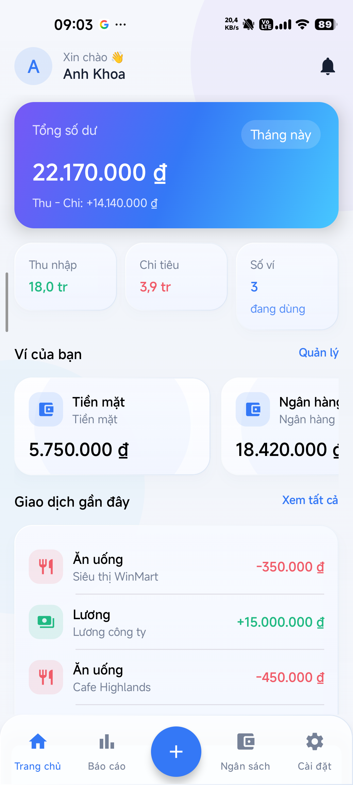
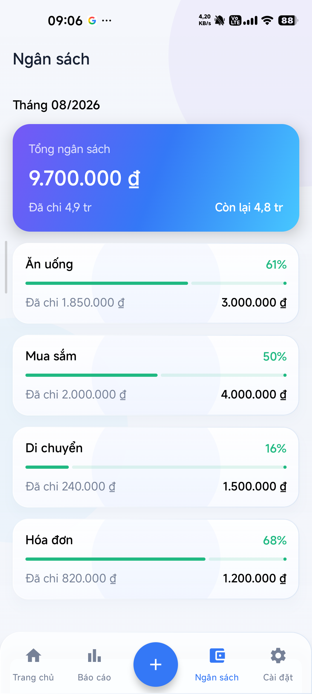
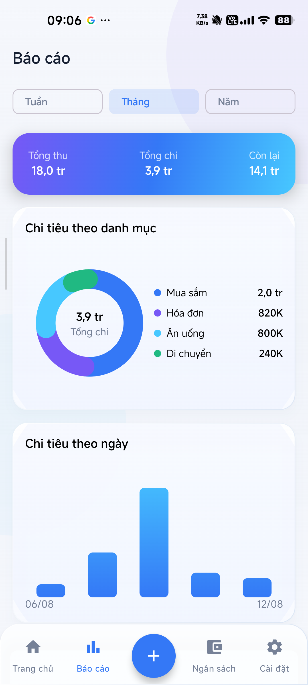

# FinLux Android — Open-Source Personal Finance App 🚀

[](https://kotlinlang.org/)
[](https://developer.android.com/jetpack/compose)
[](https://developer.android.com/topic/architecture)
[](https://firebase.google.com/)
[](LICENSE)

**FinLux** là ứng dụng quản lý thu chi cá nhân mã nguồn mở (Open-Source Android Native), được phát triển trên nền tảng **Kotlin**, **Jetpack Compose (Material 3)** và **Firebase Backend**. Ứng dụng nổi bật với ngôn ngữ thiết kế **Liquid Glass (iOS 26 Visual Style)**, hỗ trợ linh hoạt 3 phong cách giao diện (Tối giản hiện đại, Glassmorphism, Gradient năng động) cùng kiến trúc bảo toàn số dư nguyên tử qua **Firestore Transactions**.

---

## 📸 Giao diện ứng dụng (Screenshots)

### 📱 Màn hình chức năng chính (Core App Screens)
| Đăng nhập & Xác thực | Trang chủ (Dashboard) | Quản lý Ngân sách | Báo cáo & Thống kê |
| :---: | :---: | :---: | :---: |
|  |  |  |  |

---


## ✨ Tính năng cốt lõi (Key Features)

### 1. Quản lý Thu Chi & Giao dịch
- **CRUD Giao dịch toàn diện**: Thêm/sửa/xóa giao dịch Thu nhập, Chi tiêu và Chuyển tiền giữa các ví.
- **Nguồn thu & Chi tiêu chi tiết**: Phân tích danh mục, số tiền, ngày giao dịch, ghi chú và hóa đơn đính kèm.
- **Tự động bảo toàn số dư (Atomic Balance)**: Sử dụng `Firestore Transaction` đảm bảo tuyệt đối không xẩy ra race condition khi cập nhật số dư ví trên nhiều thiết bị.

### 2. Quản lý Đa ví & Tài khoản
- **Đa dạng loại ví**: Tiền mặt, Ngân hàng, Ví điện tử, Thẻ tín dụng, Tài khoản đầu tư.
- **Chuyển tiền nội bộ (Transfer)**: Chuyển khoản qua lại giữa hai ví nguyên tử, không làm sai lệch tổng Thu/Chi báo cáo.

### 3. Ngân sách & Cảnh báo thông minh
- **Hạn mức theo danh mục**: Đặt hạn mức chi tiêu hàng tháng cho từng danh mục.
- **Cảnh báo ngưỡng 80% & 100%**: Đẩy thông báo Push (FCM) và Notification nội bộ khi sắp hoặc đã vượt hạn mức.

### 4. Báo cáo & Phân tích trực quan
- **Đa dạng chu kỳ**: Xem báo cáo theo Tuần, Tháng, Quý, Năm hoặc Khoảng thời gian tùy chọn.
- **Biểu đồ chuyên nghiệp**: Biểu đồ đường xu hướng (Line Chart), Biểu đồ tỷ trọng (Donut Chart) và Ô tỷ trọng bất đối xứng (Treemap Chart).
- **Xuất dữ liệu**: Xuất file báo cáo Excel (.xlsx 2 sheet) và PDF tóm tắt có biểu đồ.

### 5. Tùy biến Giao diện Liquid Glass
- **3 Phong cách độc đáo**: Tối giản hiện đại (Modern Dark), Glassmorphism (Kính mờ) và Gradient năng động (Dynamic Gradient).
- **Thích ứng Sáng/Tối (Light/Dark Theme)**: Tự động điều chỉnh độ trong mờ, vệt sáng khúc xạ (rim-light) và độ tương phản đọc theo WCAG AA.

### 6. Offline-First & Đồng bộ Cloud
- **Offline Persistence**: Hoạt động mượt mà ngay cả khi mất kết nối mạng.
- **Realtime Sync**: Tự động đồng bộ tức thì khi có mạng trở lại qua Firestore Snapshot Listeners.

---

## 🏗 Kiến trúc mã nguồn (Clean Architecture)

Mã nguồn FinLux được tổ chức nghiêm ngặt theo chuẩn **Clean Architecture** 3 lớp kết hợp **MVVM Pattern**:

```text
app/src/main/java/com/finlux/app/
├── core/                   # Các thành phần dùng chung toàn app
│   ├── common/             # Result wrapper, AppResult, Extension functions
│   ├── designsystem/       # Liquid Glass components, Theme, Design Tokens, VisualStyle
│   └── navigation/         # Routes, FinluxNavHost, BottomNav configuration
├── domain/                 # Lớp Nghiệp vụ cốt lõi (Pure Kotlin, độc lập UI/Framework)
│   ├── model/              # Transaction, Wallet, Category, Budget, Reminder, UserProfile
│   ├── repository/         # Repository Interfaces (AuthRepository, TransactionRepository...)
│   └── usecase/            # Pure Business Use Cases (AddTransactionUseCase, UpdateProfileUseCase...)
├── data/                   # Lớp Dữ liệu & Kết nối ngoại vi
│   ├── local/              # DataStore (ThemePref, Local UI State)
│   ├── remote/firebase/    # FirestoreAdapter, FirebaseAuthAdapter, FirebaseStorageAdapter
│   ├── repository/         # Implementation của Domain Repositories
│   └── di/                 # Dependency Injection modules (Hilt)
└── presentation/           # Lớp Giao diện người dùng (Jetpack Compose + ViewModel)
    ├── auth/               # SplashScreen, LoginScreen, RegisterScreen, ForgotPasswordScreen
    ├── home/               # DashboardScreen, KPI Summary, Quick Actions
    ├── expense/            # ExpenseScreen (Chi tiêu theo tháng & danh mục)
    ├── income/             # IncomeScreen (Thu nhập theo nguồn)
    ├── wallet/             # WalletsScreen, TransferDialog, EditWalletDialog
    ├── budget/             # BudgetScreen, SetBudgetDialog
    ├── reports/            # ReportsScreen, Line/Donut/Treemap Charts, Export Dialog
    ├── settings/           # SettingsScreen, ChangeProfileDialog, ThemeSelector
    └── components/         # MainBottomBar, GlassTopBar, GlassCard, Dialogs
```

---

## 🛠 Công nghệ & Thư viện sử dụng (Tech Stack)

| Hạng mục | Công nghệ / Thư viện | Mô tả |
| :--- | :--- | :--- |
| **Language** | Kotlin 2.0.21 | Ngôn ngữ phát triển chính |
| **UI Framework** | Jetpack Compose + Material 3 | Giao diện declarative hiện đại |
| **Design System** | Liquid Glass (Custom Layer) | Blur hiệu năng cao, Kính mờ & Gradient |
| **Architecture** | Clean Architecture + MVVM | Tách biệt hoàn toàn UI, Domain và Data |
| **Dependency Injection** | Dagger Hilt 2.52 | Quản lý phụ thuộc tự động |
| **Asynchronous** | Kotlin Coroutines + Flow / StateFlow | Xử lý bất đồng bộ & Reactive State Stream |
| **Navigation** | Navigation Compose | Điều hướng Single-Activity mượt mà |
| **Backend / DB** | Firebase (Auth, Firestore, Storage, FCM) | Đăng nhập, DB Realtime, Storage & Push Notification |
| **Local Storage** | DataStore Preferences | Lưu cấu hình giao diện & cài đặt local |
| **Export** | Apache POI / Android PdfDocument | Xuất file Excel (.xlsx) và PDF (.pdf) |
| **Testing** | JUnit 5 + MockK + Turbine | Unit Test cho UseCases & ViewModels |

---

## 🚀 Hướng dẫn Chạy Dự Án (Getting Started)

### Yêu cầu môi trường (Prerequisites)
- **Android Studio**: Ladybug / Jellyfish (AGP 8.7+ / 9.0+)
- **JDK**: Java 17 (OpenJDK 17)
- **Android SDK**: Target API 36, Min API 26 (Android 8.0+)

### 1. Clone Repository
```bash
git clone https://github.com/khoaiprovip123/FinLux.git
cd FinLux
```

### 2. Chạy Chế Độ Demo (Out-of-the-Box)
Project được thiết kế sẵn **Demo Data Adapter**. Khi chưa kết nối Firebase, ứng dụng tự động chạy với dữ liệu mẫu hoàn chỉnh:
1. Mở thư mục dự án trong Android Studio.
2. Chờ Gradle Sync hoàn tất.
3. Chọn variant `debug` và nhấn **Run** (`Shift + F10`).
4. Bạn có thể thử nghiệm đầy đủ giao diện, thêm/sửa/xóa giao dịch, đổi theme và đổi thông tin cá nhân ngay tức thì.

### 3. Kết Nối Firebase Thực Tế (Optional)
Nếu muốn kết nối với Firebase Console của chính bạn:
1. Tạo project mới trên [Firebase Console](https://console.firebase.google.com/).
2. Đăng ký Android App với package name `com.finlux.app`.
3. Tải file `google-services.json` và đặt vào thư mục `app/`.
4. Deploy Firestore & Storage Rules từ các file cấu hình trong dự án (`firestore.rules`, `storage.rules`).

---

## 🧪 Kiểm thử & Quality Assurance (Testing)

Dự án đi kèm bộ Unit Test đầy đủ cho các Use Case quan trọng:

```powershell
# Chạy toàn bộ Unit Tests
.\gradlew.bat testDebugUnitTest

# Build file APK Debug
.\gradlew.bat assembleDebug
```

---

## 📜 Tài liệu Tham chiếu (Documentation Index)

Dự án đi kèm bộ tài liệu đặc tả chi tiết phục vụ phát triển & đóng góp:

- 📄 [`PROJECT_PROFILE.md`](docs/PROJECT_PROFILE.md): Tổng quan dự án, phạm vi V1 và roadmap phát triển.
- 📄 [`BA_SPEC.md`](docs/BA_SPEC.md): Đặc tả nghiệp vụ, danh sách Use Cases và Ma trận Business Rules (BR-01 đến BR-14).
- 📄 [`UI_SPEC.md`](docs/UI_SPEC.md): Quy chuẩn thiết kế UI/UX, bố cục từng màn hình và Liquid Glass System.
- 📄 [`DATA_SPEC.md`](docs/DATA_SPEC.md): Firestore Schema, Security Rules và thiết kế Cloud Functions.
- 📄 [`CONTEXT.md`](docs/CONTEXT.md): Hướng dẫn kiến trúc kỹ thuật dành cho Nhà phát triển.
- 📄 [`PLAN.md`](docs/PLAN.md): Kế hoạch sprint và lộ trình kỹ thuật.
- 📄 [`BACKLOG.md`](docs/BACKLOG.md): Danh sách tính năng và nhiệm vụ tồn đọng.
- 📄 [`CHANGELOG.md`](CHANGELOG.md): Lịch sử cập nhật phiên bản dự án.
- 📄 [`HANDOVER_LOG.md`](HANDOVER_LOG.md): Nhật ký bàn giao và quản lý task.
- 📄 [`AGENTS.md`](AGENTS.md): Quy tắc & Hướng dẫn dành cho AI Coding Agents.

---

## 🤝 Đóng góp phát triển (Contributing)

Mọi đóng góp từ cộng đồng mã nguồn mở đều được hoan nghênh! Hãy mở an **Issue** để góp ý tính năng / báo lỗi, hoặc tạo **Pull Request** theo quy trình:
1. Fork repository này.
2. Tạo nhánh mới (`git checkout -b feature/AmazingFeature`).
3. Commit thay đổi (`git commit -m 'feat: Add some AmazingFeature'`).
4. Push lên branch (`git push origin feature/AmazingFeature`).
5. Tạo **Pull Request**.

---

## 📄 Giấy phép (License)

Dự án được phân phối theo giấy phép **MIT License**. Chi tiết xem tại file `LICENSE`.

