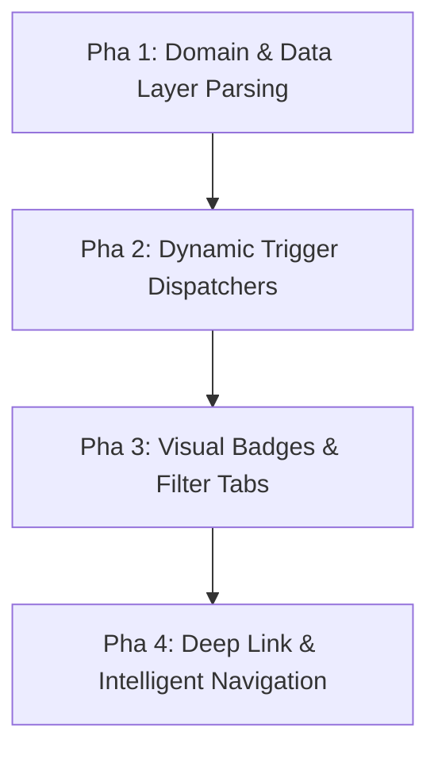

# BACKLOG - FINLUX APP

Danh sách các tính năng, ý tưởng và yêu cầu nâng cấp/sửa lỗi được ghi nhận để triển khai trong các phiên bản tương lai.

---

## 📌 [FEATURE PLAN] - Quản Lý Nợ: Lịch Sử Thanh Toán Chi Tiết & Hệ Thống Nhắc Nợ Đến Hạn

> **Tên Kế Hoạch:** `[DEBT ENHANCEMENT] Kế hoạch triển khai Lịch sử thanh toán nợ (History & Filters) và Bật/Tắt thông báo nhắc nợ đến hạn (Due Date Reminders)`  
> **Trạng thái:** 📋 `[PLANNED] - Sẵn sàng triển khai`  
> **Mức độ ưu tiên:** 🟡 Medium-High / Core Debt Usability  
> **Ngày lập kế hoạch:** 2026-08-24  
> **Các module liên quan:**  
> - `domain/model/DebtModels.kt`, `domain/model/NotificationType.kt`, `domain/repository/DebtRepository.kt`  
> - `data/remote/firebase/FirebaseDebtRepository.kt`, `data/local/reminder/AlarmReminderScheduler.kt`  
> - `presentation/debt/*` (`DebtDashboardScreen`, `DebtViewModel`, `AddEditDebtSheet`, `DebtPaymentHistorySheet`)  
> - `presentation/settings/*`, `presentation/notifications/*`  

---

### 1. 🎯 Mục Tiêu & Phạm Vi (Objective & Scope)
Nâng cấp module **Quản lý Nợ & Tín dụng** (`com.finlux.app.presentation.debt`) với 2 tính năng cốt lõi còn thiếu:
1. **Lịch sử thanh toán nợ toàn diện (Debt Payment History & Filters):**
   - Cho phép người dùng theo dõi toàn bộ các lần đã trả nợ trong quá khứ.
   - Hỗ trợ xem **Lịch sử thanh toán chung (toàn bộ các khoản nợ)** hoặc **Lọc riêng theo từng khoản nợ** cụ thể (Thẻ tín dụng HSBC, Vay ngân hàng, Vay mua xe...).
   - Hiển thị đầy đủ thông tin: Ngày giờ thanh toán, Số tiền đã trả, Phân bổ chi tiết Gốc (`principalPaid`) vs Lãi (`interestPaid`), Ví nguồn thanh toán và Ghi chú.
2. **Hệ thống bật/tắt & thông báo nhắc nợ đến hạn (Due Date Notification & Reminder):**
   - Cung cấp toggle bật/tắt nhắc nợ cho từng khoản nợ (trong form Thêm/Sửa nợ) và toggle tổng thể trong Cài đặt thông báo.
   - Cho phép chọn thời gian nhắc trước: Trước 1 ngày, 2 ngày, 3 ngày hoặc 5 ngày trước ngày đến hạn (`dueDate` / `statementDate`).
   - Tự động phát thông báo đẩy Android (System Push) và ghi nhận vào danh sách Chuông thông báo trong app (`AppNotification`), khi nhấn vào sẽ mở ngay màn hình trả nợ.

---

### 2. 🧩 Tận Dụng Thành Phần Sẵn Có (Codebase Reusability)
- **Model có sẵn:** `DebtPaymentHistory` đã được định nghĩa trong `DebtModels.kt` với các trường `debtId`, `walletId`, `amount`, `principalPaid`, `interestPaid`, `paymentDate`, `note`.
- **Dữ liệu Firestore có sẵn:** `FirebaseDebtRepository.processPayment(...)` đã tự động ghi log vào subcollection `users/{uid}/debts/{debtId}/payments/{paymentId}` trong mỗi lần trả nợ.
- **Hạ tầng Thông báo có sẵn:** Tái sử dụng `FirebaseNotificationRepository`, `AlarmReminderScheduler` và `AppNotification` chuẩn của FinLux.

---

### 3. 🛠️ Thiết Kế Kỹ Thuật Chi Tiết (Technical Architecture)

#### 🅰️ TÍNH NĂNG 1: LỊCH SỬ THANH TOÁN CÁC KHOẢN NỢ

```
                    ┌───────────────────────────────┐
                    │      DebtDashboardScreen      │
                    │ (Nút "Lịch sử" trên TopBar    │
                    │  hoặc icon trên DebtCard)     │
                    └───────────────┬───────────────┘
                                    │ mở BottomSheet
                    ┌───────────────▼───────────────┐
                    │    DebtPaymentHistorySheet    │
                    ├───────────────────────────────┤
                    │ • Dải FilterChip ngang:       │
                    │   [ Tất cả ] [ Thẻ VIB ] ...  │
                    │ • Hero Card Tổng hợp:         │
                    │   - Tổng tiền đã trả          │
                    │   - Đã giảm gốc / Tiền lãi    │
                    │ • Danh sách DebtPaymentItem   │
                    └───────────────────────────────┘
```

1. **Tầng Data & Repository (`DebtRepository.kt` & `FirebaseDebtRepository.kt`):**
   - Thêm method: `fun observeAllPaymentHistory(): Flow<List<DebtPaymentHistory>>` (sử dụng Firestore `collectionGroup("payments")` hoặc query tổng hợp từ danh sách nợ).
   - Tối ưu query sắp xếp theo `paymentDate` giảm dần (mới nhất lên đầu).

2. **Tầng Domain UseCase:**
   - Tạo `GetDebtPaymentHistoryUseCase(val repository: DebtRepository)` hỗ trợ lấy lịch sử thanh toán theo `debtId: String? = null` (nếu null là lấy tất cả).

3. **Tầng Presentation & UI (`DebtPaymentHistorySheet.kt`):**
   - **Header & Thống kê:**
     - Tiêu đề: *"Lịch sử thanh toán nợ"* kèm icon `Icons.Default.History`.
     - Thẻ GlassCard tóm tắt:
       + `Tổng đã thanh toán: X đ` (Màu xanh lá `FinluxColors.IncomeGreen`).
       + `Gốc đã giảm: Y đ` | `Lãi đã trả: Z đ`.
     - Dải lọc ngang (`LazyRow` + `FilterChip`): `[ Tất cả (N) ]` + từng khoản nợ `[ {debt.name} ]`.
   - **Item lịch sử (`DebtPaymentHistoryItem`):**
     - Icon ví thanh toán (`walletIcon`).
     - Tên khoản nợ & Ghi chú (nếu có).
     - Ngày giờ thanh toán formatted: `dd/MM/yyyy · HH:mm`.
     - Số tiền trả (Màu xanh dương hoặc xanh lá): `+5.000.000 đ`.
     - Tag phân bổ: `Gốc: 4.500.000 đ · Lãi: 500.000 đ`.
   - **Tích hợp vào `DebtDashboardScreen`:**
     - Bổ sung nút bấm "Lịch sử" (`Icons.Default.History`) trên Header.
     - Bổ sung nút icon Lịch sử trên từng `DebtCard` để mở lọc nhanh lịch sử riêng của khoản nợ đó.

---

#### 🅱️ TÍNH NĂNG 2: BẬT/TẮT & THÔNG BÁO NHẮC NỢ ĐẾN HẠN

1. **Mở rộng Data Model (`DebtAccount` trong `DebtModels.kt`):**
   ```kotlin
   data class DebtAccount(
       // ... các trường hiện tại ...
       val isReminderEnabled: Boolean = true,  // Bật/tắt nhắc nợ cho khoản nợ này
       val reminderDaysBefore: Int = 3,        // Nhắc trước N ngày (1, 2, 3, 5)
   )
   ```

2. **Tầng Giao Diện (`AddEditDebtSheet.kt`):**
   - Thêm khối **Cài đặt nhắc nợ (Due Date Reminder Section)**:
     - Dòng Switch toggle: *"Nhắc nhở thanh toán khi đến hạn"* (`isReminderEnabled`).
     - Khi bật toggle, hiển thị dải chip chọn số ngày nhắc trước:
       `[ Trước 1 ngày ] [ Trước 2 ngày ] [ Trước 3 ngày (Mặc định) ] [ Trước 5 ngày ]`.
     - Ghi chú phụ đề: *"Thông báo sẽ được gửi vào 08:00 sáng trước ngày đến hạn X ngày"*.

3. **Tầng Notification Engine (`AlarmReminderScheduler.kt` / Background Worker):**
   - Thêm type vào `NotificationType.kt`: `DEBT_DUE_ALERT` (Cảnh báo nợ đến hạn).
   - Logic kích hoạt thông báo:
     + Quét các khoản nợ chưa tất toán (`!isSettled && remainingBalance > 0 && isReminderEnabled`).
     + Tính toán ngày kích hoạt: `TargetDate = dueDate - reminderDaysBefore`.
     + Khi đến hẹn, tạo thông báo `AppNotification`:
       - Tiêu đề: `⚠️ Nhắc nhở: Sắp đến hạn thanh toán [Tên khoản nợ]`
       - Nội dung: `Khoản nợ [Tên khoản nợ] đến hạn ngày [X]. Số tiền tối thiểu cần thanh toán: [Y đ].`
       - Action Deep-link: Khi nhấn vào thông báo -> Mở `Route.Debts` và tự động mở BottomSheet thanh toán (`payingDebt = debt`).

---

### 4. 📅 Kế Hoạch Triển Khai Từng Bước (Implementation Steps)

| Bước | Nội dung công việc | File chỉnh sửa chính |
|:---:|---|---|
| **1** | Mở rộng model `DebtAccount` (`isReminderEnabled`, `reminderDaysBefore`) + `NotificationType.DEBT_DUE_ALERT` | `DebtModels.kt`, `NotificationType.kt` |
| **2** | Bổ sung `observeAllPaymentHistory` và map dữ liệu Firestore | `DebtRepository.kt`, `FirebaseDebtRepository.kt` |
| **3** | Thêm khối Toggle nhắc nợ & dải chip số ngày nhắc trong Form thêm/sửa nợ | `AddEditDebtSheet.kt` |
| **4** | Xây dựng UI `DebtPaymentHistorySheet.kt` (Bộ lọc khoản nợ, thống kê tổng trả, danh sách thẻ lịch sử) | `presentation/debt/DebtPaymentHistorySheet.kt` |
| **5** | Tích hợp nút Lịch sử vào `DebtDashboardScreen.kt` & `DebtCard.kt` | `DebtDashboardScreen.kt`, `DebtCard.kt` |
| **6** | Lập lịch thông báo nhắc nợ với `AlarmReminderScheduler` | `AlarmReminderScheduler.kt`, `FirebaseNotificationRepository.kt` |
| **7** | Viết Unit Test kiểm thử (Payment History query, Reminder schedule) & Build APK | `test/DebtRepositoryTest.kt`, `test/DebtViewModelTest.kt` |

---

## 🚨 [BUG CRITICAL] - Không Chặn Tạo Giao Dịch Chi Tiêu Khi Số Dư Ví Thanh Toán <= 0 Hoặc Không Đủ Tiền

> **Tên Ticket:** `[BUG CRITICAL] Không chặn tạo giao dịch chi tiêu khi nguồn tiền ví thanh toán <= 0 hoặc nhỏ hơn số tiền chi tiêu (Expense Insufficient Wallet Funds Validation)`  
> **Trạng thái:** ⏳ `[OPEN] - Chờ triển khai`  
> **Mức độ ưu tiên:** 🔴 High / Financial Integrity & Balance Validation  
> **Ngày ghi nhận:** 2026-08-24  
> **File ảnh hưởng:**  
> - `app/src/main/java/com/finlux/app/presentation/transaction/AddTransactionSheet.kt`  
> - `app/src/main/java/com/finlux/app/presentation/transaction/AddTransactionViewModel.kt`  
> - `app/src/main/java/com/finlux/app/domain/usecase/TransactionValidation.kt`  
> - `app/src/main/java/com/finlux/app/domain/usecase/AddTransactionUseCase.kt`  
> - `app/src/main/java/com/finlux/app/presentation/components/QuickAddSheet.kt`  

---

### 1. 🐞 Mô Tả Hiện Tượng (Problem Description)
- **Hành vi thực tế:** Trong màn hình **"Thêm chi"** (`AddTransactionSheet.kt` & `QuickAddSheet.kt`):
  1. Người dùng chọn mục **"Chi tiêu"** (Expense).
  2. Chọn ví thanh toán có số dư `<= 0 đ` (Ví dụ: ví *Tiền mặt* đang có số dư âm `-50.000 đ` hoặc `0 đ`).
  3. Nhập số tiền chi tiêu: `100.000 đ`.
  4. **Lỗi phát sinh:** Nút lưu (biểu tượng dấu tích xanh `Icons.Default.Check` trên TopBar) vẫn ở trạng thái khả dụng, không có bất kỳ cảnh báo màu đỏ nào. Khi người dùng bấm lưu, hệ thống vẫn chấp thuận và tạo thành công giao dịch chi tiêu `Xăng: -100.000 đ` từ ví Tiền mặt.
  5. Hậu quả: Số dư ví tiền mặt bị trừ âm sâu hơn thành `-150.000 đ`.
- **Rủi ro nghiệp vụ:** Ngoại trừ thẻ tín dụng (`WalletType.CARD` có hạn mức thấu chi / dư nợ tín dụng), các ví thông thường như Tiền mặt (`CASH`), Tài khoản ngân hàng (`BANK`), Ví điện tử (`EWALLET`), Sổ tiết kiệm (`INVESTMENT`) về bản chất đời thực không thể chi tiêu khi số dư đã cạn kiệt hoặc âm tiền.

---

### 2. 🛠️ Đặc Tả Giải Pháp Kỹ Thuật (Solution Specs)

#### A. Tầng Giao Diện Người Dùng (UI/UX Layer - `AddTransactionSheet.kt` & `QuickAddSheet.kt`)
1. **Kiểm tra tức thời (Reactive Balance Check):**
   - Khi chọn tab **Chi tiêu** (`TransactionType.EXPENSE`), lấy số dư của ví đang chọn (`selectedWallet.balance.value`).
   - Nếu `selectedWallet.type != WalletType.CARD` (không phải thẻ tín dụng):
     - Nếu `selectedWallet.balance.value <= 0`:
       - Hiển thị dòng cảnh báo màu đỏ nổi bật (`tokens.error`): `⚠️ Ví thanh toán đã hết số dư (Hiện có: ${selectedWallet.balance.value.toVnd()})`.
       - Vô hiệu hóa nút Lưu (màu xám / `enabled = false`).
     - Nếu `enteredAmount > selectedWallet.balance.value`:
       - Hiển thị dòng cảnh báo màu đỏ: `⚠️ Số dư ví không đủ để chi tiêu (Khả dụng: ${selectedWallet.balance.value.toVnd()})`.
       - Vô hiệu hóa nút Lưu hoặc yêu cầu xác nhận rõ ràng nếu có cấu hình cho phép số dư âm.

#### B. Tầng Domain UseCase & Validation (`TransactionValidation.kt` & `AddTransactionUseCase.kt`)
1. **Chặn chặt chẽ từ gốc logic nghiệp vụ:**
   - Trong `AddTransactionUseCase` và `EditTransactionUseCase`, trước khi gọi `repository.addWithBalanceUpdate(transaction)`:
     - Lấy thông tin ví `val wallet = walletRepository.getWalletById(transaction.walletId)`.
     - Nếu `transaction.type == TransactionType.EXPENSE && wallet.type != WalletType.CARD`:
       - Nếu `wallet.balance.value < transaction.amount.value`:
         - Trả về `AppResult.Error("Số dư ví thanh toán không đủ để thực hiện chi tiêu")`.

---

## 🚨 [BUG UI/UX] - Chuẩn Hóa Hiển Thị Giao Dịch Chuyển Tiền Giữa Các Ví (Double-entry Transfer Display)

> **Tên Ticket:** `[BUG UI/UX] Chuẩn hóa hiển thị giao dịch Chuyển tiền giữa các ví (TRANSFER_OUT & TRANSFER_IN) tránh hiểu lầm Chi tiêu trùng lặp`  
> **Trạng thái:** ✅ `[DONE] - Đã hoàn thiện trong v1.9.1`  
> **Mức độ ưu tiên:** 🔴 High / Financial Semantic Parity  
> **Ngày ghi nhận:** 2026-08-24  
> **File ảnh hưởng:** `PrismHomeScreen.kt`, `PrismTransactionsScreen.kt`, `TransactionDetailSheet.kt`, `ModernTransactionsScreen.kt`, `ClassicTransactionsScreen.kt`, `QuickAddSheet.kt`

---

### 1. 🐞 Mô Tả Hiện Tượng & Nguyên Nhân Gốc
- **Hiện tượng:** Khi người dùng thực hiện chuyển tiền từ Ví A sang Ví B (ví dụ Momo sang Vietcombank), hệ thống tạo 2 bản ghi giao dịch kế toán kép `TRANSFER_OUT` và `TRANSFER_IN`. Tuy nhiên trên màn hình Trang chủ và Lịch sử, cả 2 giao dịch đều bị hiển thị là **"Chi tiêu"**, icon nhãn `[🏷️]` màu đỏ, số tiền âm `-5.250.000 đ` màu đỏ, khiến người dùng lầm tưởng mình bị trừ tiền 2 lần thành -10.500.000 đ.
- **Nguyên nhân gốc:** Các Composable giao dịch chỉ kiểm tra boolean `isIncome = (type == INCOME)` dẫn đến `TRANSFER_OUT` và `TRANSFER_IN` đều rơi vào nhánh `else` (coi là `EXPENSE`).

### 2. 🛠️ Giải Pháp Đã Triển Khai
- Phân biệt rõ 4 loại giao dịch: `INCOME`, `EXPENSE`, `TRANSFER_OUT`, `TRANSFER_IN`.
- `TRANSFER_OUT`: Tiêu đề tự động `Chuyển tiền đến [Ví nhận]`, icon `SwapHoriz`, màu xanh `FinluxColors.TransferBlue`, định tuyến `[Ví nguồn] ➔ [Ví nhận]`, số tiền `-amount`.
- `TRANSFER_IN`: Tiêu đề tự động `Nhận tiền từ [Ví nguồn]`, icon `SwapHoriz`, màu xanh `FinluxColors.TransferBlue`, định tuyến `[Ví nguồn] ➔ [Ví nhận]`, số tiền `+amount`.
- `TransactionDetailSheet`: Hiển thị đúng nhãn `"Chuyển tiền đi"` / `"Nhận tiền chuyển"`, loại giao dịch `"Chuyển tiền giữa các ví"`, và `"Định tuyến ví: [Ví A] ➔ [Ví B]"`.

---

## 🚨 [BUG UI/UX] - Thiếu Bộ Chọn Ví Nguồn & Ví Nhận Trong Form Chuyển Tiền Giao Diện Prism

> **Tên Ticket:** `[BUG UI/UX] Thiếu bộ chọn ví nguồn, ví nhận & nút hoán đổi chiều chuyển tiền trong form Chuyển tiền giao diện FinLux Prism (Missing Source/Dest Wallet Selector & Swap Action in Prism Transfer Sheet)`  
> **Trạng thái:** ✅ `[DONE] - Đã hoàn thiện trong v1.9.1`  
> **Mức độ ưu tiên:** 🔴 High / UI-UX Parity  
> **Ngày ghi nhận:** 2026-08-24  
> **File ảnh hưởng:** `app/src/main/java/com/finlux/app/presentation/wallet/prism/PrismWalletsScreen.kt`

---

### 1. 🐞 Mô Tả Vấn Đề (Problem Description)
- **Hiện trạng so sánh giữa 2 giao diện:**
  - **Giao diện Cổ điển (Liquid Glass Classic / Modern Luxury):** Form *"Chuyển tiền giữa các ví"* (`TransferEditor` tại `ClassicWalletsScreen.kt` & `ModernWalletsScreen.kt`) hiển thị đầy đủ và trực quan:
    1. **Dải chọn Ví nguồn (Chuyển đi):** Hiển thị danh sách thẻ chip kèm tên ví và số dư khả dụng (`Vietcombank (0 đ)`, `Momo (5,3 tr)`, `Tiền mặt`).
    2. **Dải chọn Ví nhận (Chuyển đến):** Tự động lọc bỏ ví nguồn đã chọn, hiển thị rõ số dư ví nhận.
    3. **Nút Swap/Đảo chiều chuyển tiền (`Icons.Default.SwapHoriz` ⇄):** Cho phép hoán đổi nhanh Ví nguồn ↔ Ví nhận.
    4. **Kiểm tra & Cảnh báo số dư ví nguồn:** Chặn nút xác nhận và hiển thị thông báo lỗi màu đỏ khi nhập tiền lớn hơn số dư ví nguồn.
  - **Giao diện Mới (FinLux Prism - `PrismWalletsScreen.kt`):** 
    - Form BottomSheet *"Chuyển tiền giữa các ví"* (dòng 398–457) **HOÀN TOÀN THIẾU TOÀN BỘ GIAO DIỆN CHỌN VÍ NGUỒN VÀ VÍ NHẬN**!
    - Code chỉ khởi tạo 2 biến state ngầm `var sourceWalletId by remember { mutableStateOf(wallets[0].id) }` và `destWalletId = wallets[1].id` nhưng không vẽ component nào để người dùng xem hay chọn đổi ví.
    - Người dùng bị ép buộc chuyển từ ví thứ 1 sang ví thứ 2 trong danh sách, không thể chọn ví khác và không biết tiền sẽ đi từ đâu về đâu.

---

### 2. 🛠️ Yêu Cầu Giao Diện & Giải Pháp Kỹ Thuật (Solution Specs)

Tái cấu trúc lại BottomSheet Chuyển tiền trong `PrismWalletsScreen.kt` theo chuẩn thiết kế Liquid Glass Prism:

#### A. Header & Tiêu Đề
- Tiêu đề: *"Chuyển tiền giữa các ví"*.
- Phụ đề: *"Dịch chuyển số dư nhanh chóng và an toàn"* (`tokens.onSurfaceVariant`).
- Nút icon hoán đổi `Icons.Default.SwapHoriz` (⇄) đặt ở góc phải header hoặc giữa 2 mục ví nguồn / ví nhận để đổi vị trí 2 ví chỉ với 1 chạm.

#### B. Khối Chọn Ví Nguồn (Chuyển đi) & Ví Nhận (Chuyển đến)
- **Ví nguồn (Chuyển đi):**
  - Dải cuộn ngang (`LazyRow`) chứa các `FilterChip` (hoặc `GlassChip` bo góc `tokens.radius.sm`).
  - Label hiển thị: `"{wallet.name} ({wallet.balance.value.toShortVnd()})"`.
  - Chip được chọn có viền sáng Prism / nền `tokens.primaryContainer`.
- **Ví nhận (Chuyển đến):**
  - Dải cuộn ngang `LazyRow` hiển thị các ví còn lại (`wallets.filter { it.id != sourceWalletId }`).
  - Label hiển thị tên ví và số dư khả dụng.

#### C. Ô Nhập Tiền Tệ & Kiểm Tra Số Dư (Amount & Validation)
- Tái sử dụng component chuẩn `FinluxAmountInputCard`:
  - Ô nhập số tiền lớn (30sp), tự động định dạng phân tách hàng nghìn VNĐ, nút `[x]` clear nhanh, dải chip cộng nhanh `[+100k, +200k, +500k, +1tr, +2tr, +5tr]`.
- **Ràng buộc an toàn số dư (Insufficient Funds Validation):**
  - Nếu `sourceWallet.type != WalletType.CARD` và `amount > sourceWallet.balance.value`:
    - Hiển thị dòng cảnh báo màu đỏ (`tokens.error`): `⚠️ Số dư ví nguồn không đủ (Khả dụng: ${sourceWallet.balance.value.toVnd()})`.
    - Disable nút `[Xác nhận chuyển]`.

#### D. Nút Hành Động & Phản Hồi
- Ô nhập Ghi chú chuyển tiền (Tùy chọn) tối đa 120 ký tự.
- Nút `[Xác nhận chuyển tiền]` với hiệu ứng Liquid Glass Spring Physics:
  - Chỉ enable khi: `amount > 0L && sourceWalletId.isNotBlank() && destWalletId.isNotBlank() && sourceWalletId != destWalletId && !isInsufficientFunds`.
  - Hiển thị trạng thái loading khi đang thực hiện transaction.

---

### 💬 3. Prompt Kích Hoạt Nhanh Khi Triển Khai Fix (Activation Prompt)

Khi sẵn sàng tiến hành sửa bug này, gửi prompt sau:

> *"Em ơi, bắt đầu triển khai fix [BUG UI/UX] Thiếu bộ chọn ví nguồn & ví nhận trong form Chuyển tiền giao diện Prism theo mô tả chi tiết tại BACKLOG.md nhé! Đồng bộ đầy đủ tính năng chọn ví nguồn/đích, nút đảo chiều ⇄ và validation số dư như giao diện Classic."*

---

## 🚨 [BUG BACKLOG] - Wallet Transfer Balance Validation

> **Tên Ticket:** `[BUG CRITICAL] Thiếu kiểm tra số dư khi chuyển tiền giữa các ví (Wallet Transfer Insufficient Funds Validation)`  
> **Trạng thái:** ⏳ `[DONE] - Đã hoàn thiện trong v1.8.0`  
> **Mức độ ưu tiên:** 🔴 Critical / High  
> **Ngày ghi nhận:** 2026-08-15  
> **File ảnh hưởng:** `TransferMoneyUseCase.kt`, `WalletsViewModel.kt`, `ModernWalletsScreen.kt`, `ClassicWalletsScreen.kt`, `QuickAddSheet.kt`

---

### 1. 🐞 Mô Tả Vấn Đề (Problem Description)
- Hiện tại form **Chuyển tiền giữa các ví** (`TransferEditor` / `TransferSheet` / `QuickAddSheet`) **KHÔNG KIỂM TRA** số dư khả dụng của ví nguồn trước khi thực hiện chuyển tiền.
- **Ví dụ thực tế:** Ví *"Tiền mặt"* có số dư = `0 đ` nhưng người dùng vẫn nhập và chuyển thành công `1.000.000.000 đ` sang ví *"Sacombank"*.
- **Hậu quả nghiêm trọng:**
  1. **Số dư ví nguồn bị âm vô lý:** Biến thành `-1.000.000.000 đ` (đối với ví tiền mặt/ngân hàng thông thường không có thấu chi).
  2. **Vỡ hiển thị tỷ trọng tài sản:** Khi tổng số dư hoặc số dư ví bị âm, công thức tính % tỷ lệ tài sản bị lỗi chia, dẫn đến hiển thị các con số quái dị như `-32411%` và `32415%`.

---

### 2. 🛠️ Yêu Cầu Logic & Giải Pháp Kỹ Thuật (Solution Specs)

#### A. Tầng UI / Form Chuyển Tiền (`TransferEditor` & `QuickAddSheet`)
- Tự động lấy số dư khả dụng của ví nguồn được chọn (`val sourceBalance = wallets.find { it.id == source }?.balance?.value ?: 0L`).
- Với các ví **không phải Thẻ tín dụng** (`sourceWallet.type != WalletType.CARD`):
  - Khi người dùng nhập `amount > sourceBalance`:
    * Hiển thị dòng cảnh báo màu đỏ (`MaterialTheme.colorScheme.error`):  
      *⚠️ "Số dư ví nguồn không đủ (Số dư hiện tại: X đ)"*.
    * **Disable** nút `[Xác nhận chuyển tiền]`.

#### B. Tầng Domain / Nghiệp Vụ (`TransferMoneyUseCase.kt`)
- Bổ sung validation kiểm tra ràng buộc số dư:
  ```kotlin
  if (sourceWallet.type != WalletType.CARD && amount > sourceWallet.balance.value) {
      return AppResult.Error("Số dư ví nguồn không đủ để thực hiện chuyển tiền")
  }
  ```
- Đảm bảo thực thi trong **Firestore Transaction** nguyên tử (Atomic), không để xảy ra race condition.

#### C. Tầng Tính Toán & Hiển Thị Tỷ Trọng (% Ratio Calculation)
- Chuẩn hóa hàm tính % tỷ trọng tài sản của từng ví:
  - Nếu `total <= 0` hoặc `wallet.balance.value <= 0`: Gán % tỷ trọng an toàn về `0%` thay vì để xảy ra phép chia âm/vô cực.

---

### 💬 3. Prompt Kích Hoạt Nhanh Khi Triển Khai Fix (Activation Prompt)

Khi sẵn sàng tiến hành sửa bug này, gửi prompt sau:

> *"Em ơi, bắt đầu triển khai fix [BUG CRITICAL] Thiếu kiểm tra số dư khi chuyển tiền giữa các ví theo mô tả chi tiết tại BACKLOG.md nhé! Tiến hành kiểm tra và chặn ở cả Domain UseCase lẫn UI Form TransferEditor."*

---

## [BACKLOG] v1.6.0 - Multi-type Notification System (Hệ thống Thông báo Đa năng)

> **Trạng thái:** ⏸️ DONE - Đã hoàn thiện trong v1.8.0 (Tạm hoãn để ưu tiên các task gấp khác)  
> **Ngày ghi nhận:** 2026-08-14  
> **File thiết kế liên quan:** `AppNotification.kt`, `NotificationRepository.kt`, `NotificationsScreen.kt`, `NotificationsViewModel.kt`

---

### 📌 1. Bối Cảnh & Đánh Giá Hiện Trạng (Audit Summary)
- **Model `AppNotification` hiện tại:** Chỉ chứa các trường `id`, `title`, `body`, `amount`, `reminderId`, `categoryId`, `walletId`, `timestamp`, `isRead`, `isPaid`.
- **Giới hạn hiện tại:** 100% thông báo đang được sinh ra từ `AlarmReminderScheduler.kt` dưới dạng Nhắc nhở thanh toán hóa đơn (`REMINDER`). Tất cả thông báo có `amount > 0` hoặc `reminderId != null` đều bị cố định nút `[💳 Xác nhận thanh toán]`.
- **Mục tiêu nâng cấp:** Mở rộng thành Trung tâm Cảnh báo Tài chính Đa năng (Smart Financial Notification Hub), phân loại đa dạng thông báo và hỗ trợ điều hướng thông minh (Deep Link Navigation).

---

### 🏗️ 2. Phân Loại & Mở Rộng Data Model

#### A. Enum `NotificationType` (`domain/model/NotificationType.kt`)
```kotlin
package com.finlux.app.domain.model

enum class NotificationType {
    REMINDER,            // Nhắc nhở thanh toán hóa đơn / khoản chi định kỳ
    BUDGET_ALERT,        // Cảnh báo chạm ngưỡng ngân sách (80%, 100%)
    GOAL_MILESTONE,      // Cột mốc mục tiêu tiết kiệm (25%, 50%, 75%, 100%)
    TRANSACTION_SUMMARY, // Tóm tắt biến động tài chính tuần/tháng
    SYSTEM               // Thông báo hệ thống, mẹo tài chính, cập nhật app
}
```

#### B. Mở rộng Model `AppNotification` (`domain/model/AppNotification.kt`)
```kotlin
package com.finlux.app.domain.model

import java.time.Instant

data class AppNotification(
    val id: String = "",
    val title: String = "",
    val body: String = "",
    val type: NotificationType = NotificationType.REMINDER, // Fallback mặc định cho bản ghi cũ
    val amount: Money = Money(0L),
    val reminderId: String? = null,
    val categoryId: String? = null,
    val walletId: String? = null,
    val targetRoute: String? = null,    // Route điều hướng (Route.Budget, Route.Goals, Route.Reports...)
    val targetId: String? = null,       // ID đối tượng liên quan (budgetId, goalId...)
    val actionUrl: String? = null,      // URL mở trang ngoài (nếu có)
    val timestamp: Instant = Instant.now(),
    val isRead: Boolean = false,
    val isPaid: Boolean = false,
)
```

---

### 🚀 3. Kế Hoạch Triển Khai 4 Pha (4-Phase Implementation Roadmap)



#### 🔹 Pha 1: Domain & Data Layer Standardization
1. **Tạo `NotificationType.kt`** trong package `domain/model/`.
2. **Mở rộng `AppNotification.kt`** với các thuộc tính `type`, `targetRoute`, `targetId`, `actionUrl`.
3. **Cập nhật Mapper Data Layer:**
   - `FirebaseReadRepository.kt`: Parse & Save các trường `type`, `targetRoute`, `targetId`, `actionUrl` lên Firestore subcollection `users/{uid}/notifications`. Fallback `type = REMINDER` cho bản ghi legacy.
   - `DemoFinluxRepository.kt`: Cập nhật lưu trữ local state flow.

#### 🔹 Pha 2: Dynamic Trigger Dispatchers (Bộ phát thông báo tự động)
1. **`BudgetAlertDispatcher`:** Tích hợp vào `AddTransactionUseCase` / `EditTransactionUseCase`. Khi giao dịch mới làm ngân sách vượt 80% (Cảnh báo vàng) hoặc 100% (Cảnh báo đỏ), tự động tạo `AppNotification` loại `BUDGET_ALERT` kèm `targetRoute = Route.Budget.value`.
2. **`GoalMilestoneDispatcher`:** Tích hợp vào luồng tích lũy tiết kiệm. Khi nạp tiền vào Mục tiêu chạm mốc 50% hoặc 100%, phát `AppNotification` loại `GOAL_MILESTONE` kèm `targetRoute = Route.Goals.value`.
3. **`SystemNotificationDispatcher`:** Hỗ trợ tạo thông báo chào mừng hoặc mẹo quản lý tài chính.

#### 🔹 Pha 3: UI Redesign `NotificationsScreen.kt` (Badges & Filter Chips)
1. **Icon & Màu sắc phân biệt theo `NotificationType`:**
   - 🔴 `BUDGET_ALERT`: Badge Warning/PieChart màu Đỏ rực (`Color(0xFFE53935)`).
   - 🟡 `GOAL_MILESTONE`: Badge EmojiEvents/Flag màu Vàng kim (`Color(0xFFFFB300)`).
   - 🟢 `REMINDER`: Badge EventRepeat/Check màu Xanh lá (`Color(0xFF168A62)`).
   - 🔵 `SYSTEM`: Badge Campaign/Info màu Xanh lam (`Color(0xFF1E88E5)`).
2. **Thanh Lọc Filter Chips (TopBar):**
   - Cho phép người dùng lọc danh sách thông báo theo: `[Tất cả]`, `[Nhắc nhở]`, `[Ngân sách]`, `[Mục tiêu]`, `[Hệ thống]`.

#### 🔹 Pha 4: Deep Link Navigation Thông Minh
1. Khi bấm vào thẻ thông báo trên UI:
   - Nếu `type == REMINDER` $\rightarrow$ Mở Quick Payment Sheet.
   - Nếu `targetRoute` có giá trị $\rightarrow$ Tự động gọi `navController.navigate(targetRoute)` nhảy trực tiếp sang màn tương ứng (`BudgetScreen`, `GoalsScreen`, `ReportsScreen`...).

---

### 💬 4. Prompt Kích Hoạt Nhanh Khi Làm Tiếp (Activation Prompt)

Khi sẵn sàng quay lại làm Task v1.6.0, chỉ cần gửi prompt sau cho AI Agent:

> *"Em ơi, bắt đầu triển khai Task v1.6.0 (Hệ thống Thông báo Đa năng) theo kế hoạch đã lưu chi tiết tại BACKLOG.md nhé! Tiến hành Pha 1 (Domain & Data Layer) và Pha 2 (Dispatchers) trước nhé."*

---
