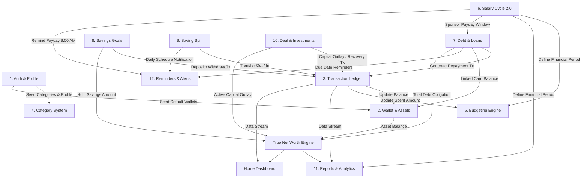

# BẢN ĐỒ KIẾN TRÚC TỔNG THỂ & MA TRẬN ĐIỀU PHỐI HỆ THỐNG FINLUX
*(FINLUX SYSTEM ARCHITECTURE MATRIX & UNIFIED MONEY FLOW CONSTITUTION)*

- **Dự án:** FinLux — Quản lý Tài chính Cá nhân Thông minh (Android / Jetpack Compose / Firebase)
- **Phiên bản hiện tại:** v1.25.1 (versionCode 175)
- **Tài liệu tham chiếu cốt lõi:** `docs/BA_SPEC.md`, `docs/UI_SPEC.md`, `docs/DATA_SPEC.md`, `docs/debt_category_mapping_investigation.md`
- **Mục tiêu:** Định danh 100% các module/tiểu hệ thống, lập bản đồ phụ thuộc chéo, chỉ rõ các điểm gãy xung đột dữ liệu, thiết lập Hiến pháp Tài chính Bất biến (Financial Invariants) và lộ trình tái cấu trúc triệt để.

---

## PHẦN 1: ĐIỀU TRA & ĐỊNH DANH TOÀN DIỆN MỌI MODULE (FULL CODEBASE RECONNAISSANCE)

Dựa trên kết quả rà soát toàn bộ 4 tầng kiến trúc (`presentation/`, `domain/`, `data/`, `docs/` và `FinluxNavHost.kt`), hệ thống FinLux bao gồm **16 Module / Tiểu hệ thống cốt lõi**:

| STT | Tên Module | Phạm vi Mã Nguồn (Presentation / Domain / Data) | % Hoàn thiện | Chức năng Cốt lõi đang Vận hành | Điểm Còn Dở, Hardcode hoặc Chắp Vá |
|:---:|:---|:---|:---:|:---|:---|
| **1** | **Auth & Profile** | `presentation/auth` `domain/model/UserProfile.kt` `data/remote/firebase/FirebaseAuthRepository.kt` | 95% | Đăng nhập/Đăng ký Email + Google Sign-In, Guest mode, Avatar, Auto-seed 5 category mặc định khi đăng ký mới. | Thiếu seed đầy đủ 15 danh mục phong phú như Demo repo (chỉ có 5 danh mục cơ bản). Chưa có flow xóa tài khoản chuẩn GDPR (Data deletion). |
| **2** | **Wallet & Assets** | `presentation/wallet` `domain/model/FinanceModels.kt` (`Wallet`, `WalletType`) `FirebaseWalletRepository.kt` | 95% | Quản lý Ví tiền mặt, Ngân hàng (MB, VCB...), Ví điện tử (MoMo, ZaloPay), Thẻ tín dụng, Ví đầu tư. Điều chỉnh số dư, Lưu trữ lịch sử chuyển ví nội bộ. | Nghiệp vụ thẻ tín dụng âm tiền (`CARD`) chưa có cơ chế khóa hạn mức cứng (credit limit check) ở tầng giao diện ví; phụ thuộc vào liên kết bên module Nợ. |
| **3** | **Transaction Ledger** | `presentation/transaction`, `expense`, `income` `domain/usecase/AddTransactionUseCase.kt`, `Edit...`, `Delete...` `FirebaseTransactionRepository.kt` | 90% | Sổ cái giao dịch kép: Thu (`INCOME`), Chi (`EXPENSE`), Chuyển khoản (`TRANSFER_OUT`/`TRANSFER_IN`). Đảm bảo nguyên tử tính số dư ví qua Firestore Transaction (BR-06, BR-14). | Hàm nội bộ `budgetRef()` trong `FirebaseTransactionRepository.kt` (dòng 549) đang **hardcode cứng dạng `${catId}_month:${month}`**, bị gãy khi người dùng dùng Ngân sách theo Chu kỳ lương (`salary:...`). |
| **4** | **Category System** | `presentation/category` `domain/model/FinanceModels.kt` (`Category`, `CategoryType`) `FirebaseCategoryRepository.kt` | 85% | Quản lý danh mục Thu/Chi, icon động, mã màu hex, cờ bảo vệ danh mục mặc định (`isDefault`), cờ phân loại thiết yếu (`isEssential`). | Các category ID hệ thống (`"debt_payment"`, `"savings"`, `"salary"`, `"food"`...) đang nằm rải rác dưới dạng chuỗi string tự do ở nhiều UseCase, chưa có một `SystemCategoryRegistry` tập trung duy nhất (Single Source of Truth). |
| **5** | **Budgeting Engine** | `presentation/budget` `domain/model/FinanceModels.kt` (`Budget`), `SaveBudgetUseCase.kt` `FirebaseBudgetRepository.kt` | 85% | Lập ngân sách theo danh mục, tính toán `spentAmount` động từ lịch sử giao dịch (BR-08), cảnh báo ngưỡng 80% & 100%, sao chép ngân sách sang kỳ mới. | Giao diện Budget cổ điển/hiện đại (`ClassicBudgetScreen`, `ModernBudgetScreen`) ở một số chỗ vẫn mặc định trói buộc với `YearMonth` (tháng dương lịch 1..30/31), chưa phản ánh triệt để mốc Chu kỳ lương 2 lần/tháng. |
| **6** | **Salary Cycle 2.0** | `presentation/settings/salarycycle` `SalaryCycleModels.kt`, `SalaryCycleCalculator.kt` `FirebaseSalaryCycleRepository.kt` | 95% | Chu kỳ lương 1 lần/tháng vs 2 lần/tháng (`SEMI_MONTHLY`), phân chia 2 sub-cycles liên tục không chồng lấn, quản lý ví nhận lương & lương dự kiến, tự động tính FCF và Next Upcoming Payday. | Chưa ép ngược mốc sub-cycles này làm bộ lọc mặc định trong màn hình Báo cáo khi người dùng chọn chế độ xem theo chu kỳ lương bán nguyệt (mới áp dụng mức Macro cycle). |
| **7** | **Debt & Loan Engine** | `presentation/debt` `DebtModels.kt`, `AnalyzeDebtCashflowUseCase.kt`, `CalculatePayoffStrategyUseCase.kt` `FirebaseDebtRepository.kt` | 95% | Quản lý 4 loại nợ (Vay ngân hàng, Vay cá nhân, Trả góp, Thẻ tín dụng), Lập lịch trả nợ Snowball/Avalanche, Khắc phục bẫy nợ âm, Phân luồng nợ theo đợt lương bảo trợ, Ghi lịch sử thanh toán nợ nguyên tử. | Đã chuẩn hóa category ID `"debt_payment"` ở v1.25.1. Cần hoàn thiện UI lọc lịch sử trả nợ theo từng khoản nợ riêng biệt trên giao diện chi tiết. |
| **8** | **Savings Goals** | `presentation/goal` `FinanceModels.kt` (`FinancialGoal`), `DepositToGoalUseCase.kt` `FirebaseGoalRepository.kt` | 85% | Đặt mục tiêu tích lũy, theo dõi tiến độ %, Nạp tiền từ ví vào mục tiêu, Rút tiền từ mục tiêu về ví. | Khi nạp mục tiêu (`depositToGoal`), repository sinh giao dịch `EXPENSE` với `categoryId = "savings"`. Việc này làm tăng tổng chi tiêu của tháng, dễ gây hiểu lầm rằng tích lũy là "tiêu xài mất đi" nếu báo cáo không bóc tách. |
| **9** | **Saving Spin** | `presentation/savingspin` `SavingSpinModels.kt`, `CompleteSavingSpinUseCase.kt` `FirebaseSavingSpinRepository.kt` | 95% | Vòng quay tiết kiệm vi mô hàng ngày (Micro-saving Gamification), streak theo ngày/tuần, cấu hình mốc tiền thưởng, liên kết nơi cất tiền (Heo đất tiền mặt hoặc Ví ngân hàng tích lũy). | Hoàn thiện tốt. Cơ chế chuyển khoản ngân hàng dùng `transferBetweenWallets` bảo toàn số dư chuẩn mực. |
| **10** | **Deal & Investments** | `presentation/deal` `DealModels.kt`, `DealUseCases.kt` `FirebaseDealRepository.kt` | 90% | Theo dõi thương vụ đầu tư ngắn hạn & cho vay ngoài: Xuất vốn (`OUTLAY_CAPITAL`), Thu hồi vốn (`PRINCIPAL_RECOVERY`), Chốt lời (`CAPITAL_GAIN`), Chốt lỗ (`CAPITAL_LOSS`). Tự động rollback số dư khi xóa deal. | Người dùng chưa thể chỉnh sửa số tiền từng đợt xuất vốn/thu hồi sau khi đã lưu (chỉ cho phép ghi mới hoặc xóa toàn bộ deal). |
| **11** | **Reports & Analytics** | `presentation/reports` `DailyStatementCalculator.kt`, `GetTrueNetWorthUseCase.kt` `ReportsViewModel.kt` | 90% | Báo cáo Thu/Chi, Biểu đồ Cash Flow theo ngày, Cơ cấu chi phí theo danh mục, Chi tiết chi tiêu theo ví tài sản, Tài sản ròng toàn diện (`TrueNetWorth = Assets + ActiveDeals - Debts`), Bảng sao kê đối chiếu quá khứ. | `ReportsViewModel` đã lọc chi phí sinh hoạt bằng `isLivingExpense()`, nhưng KPI "Chi tiêu" trên `HomeScreen` hiện vẫn đang cộng gộp cả nợ gốc (`OUTLAY_CAPITAL` bị loại nhưng nợ gốc vẫn bị tính), gây ra sự **lệch số liệu giữa Home Dashboard và Màn hình Báo cáo**. |
| **12** | **Reminders & Alert** | `presentation/reminders` `ReminderUtils.kt`, `SyncDebtReminderUseCase.kt` `FirebaseReminderRepository.kt`, `AlarmManager` | 90% | Lập lịch nhắc hóa đơn, nhắc nợ định kỳ trước N ngày, nhắc trích lương 2 đợt (09:00 sáng), tích hợp Firebase Cloud Messaging (FCM). | `AlarmManager` trên một số dòng máy Android 13+ (Xiaomi, Samsung) có thể bị Doze Mode làm trễ nếu người dùng không cấp quyền `SCHEDULE_EXACT_ALARM` tường minh trong Cài đặt hệ thống. |
| **13** | **Receipt & Scanner** | `presentation/receipt` `FirebaseReceiptStorageRepository.kt` | 85% | Chụp ảnh hóa đơn qua Camera, chọn ảnh từ bộ nhớ máy, nén ảnh và tải lên Firebase Cloud Storage, liên kết URL vào giao dịch. | Chưa tích hợp bộ phân tích OCR tự động bóc tách số tiền và ngày tháng từ hóa đơn (hiện tại người dùng vẫn phải gõ tay số tiền sau khi chụp). |
| **14** | **Security & Lock** | `core/security/` `BiometricHelper.kt`, `AppLockManager.kt` | 95% | Khóa ứng dụng bằng vân tay/khuôn mặt, tùy chỉnh thời gian timeout (ngay lập tức, 1 phút, 5 phút), bảo vệ vòng đời tránh sự kiện inactive giả lập. | Hoàn thiện tốt, tuân thủ đúng quy chuẩn AndroidX Biometric. |
| **15** | **In-App Updater** | `presentation/updater` `AppUpdateViewModel.kt`, `AppUpdateManager.kt` | 90% | Kiểm tra phiên bản mới từ GitHub Release API, thông báo changelog dạng pop-up kính Liquid Glass, tải APK về máy và gọi Intent cài đặt. | Chưa có thanh tiến trình % chi tiết khi tải file APK nặng trên mạng yếu (hiện tại hiển thị vòng xoay spinner). |
| **16** | **Design System** | `core/designsystem/` `FinluxTheme.kt`, `FinluxTokens.kt`, `LiquidGlassSurface.kt` | 98% | Hệ thống Liquid Glass đa tầng (VisionOS style), 5 bảng màu (Dark, Light, Prism, Classic, Modern), 3 phong cách (Classic Liquid, Modern Liquid, Prism Liquid), Spring Physics tương tác mượt mà. | Hoàn thiện xuất sắc, 100% không hardcode mã màu tĩnh theo đúng 3 Nguyên Tắc Cốt Lõi Bắt Buộc. |

---

## PHẦN 2: BẢN ĐỒ PHỤ THUỘC & CÁC ĐIỂM GÃY XUNG ĐỘT (CROSS-MODULE DEPENDENCY & FRICTION MAP)

### 2.1. Sơ Đồ Ma Trận Dòng Dữ Liệu Tương Tác Giữa Các Module

---

### 2.2. Bốn "Điểm Gãy" (Architectural Friction Points) Đang Gây Lỗi Dây Chuyền

#### 💥 ĐIỂM GÃY 1: Lệch Mốc Thời Gian (Time Window & Period Key Desynchronization)
- **Vị trí gãy:** `FirebaseTransactionRepository.kt` (dòng 549) vs `FinancialPeriodResolver.kt` (dòng 108–117) vs `BudgetViewModel.kt` (dòng 83–92).
- **Hiện tượng:**
  * `FinancialPeriodResolver`: Khi bật Chu kỳ lương, sinh `periodKey = "salary:YYYY-MM-DD"`.
  * `FirebaseTransactionRepository.budgetRef`: Lại **hardcode tìm document `${catId}_month:${month}`** trên Firestore!
  * Hậu quả: Khi người dùng chi tiêu trong chu kỳ lương (ví dụ chu kỳ ngày 25 đến 24 tháng sau), Firestore Transaction cập nhật vào một document ngân sách tháng dương lịch không tồn tại hoặc sai lệch, làm gãy cơ chế cảnh báo vượt ngân sách thời gian thực.

#### 💥 ĐIỂM GÃY 2: Bất Nhất Giữa Tổng Chi Tiêu Home Dashboard vs Báo Cáo Sinh Hoạt
- **Vị trí gãy:** `HomeViewModel.kt` (dòng 154–156) vs `ReportsViewModel.kt` (dòng 499–514).
- **Hiện tượng:**
  * Trong `ReportsViewModel`: Chi phí được lọc qua `it.isLivingExpense()` (đã bóc tách trả nợ gốc ra khỏi chi phí sinh hoạt).
  * Trong `HomeViewModel`: Thẻ KPI "Chi tiêu" vẫn tính:
    `it.type == TransactionType.EXPENSE && it.dealFlowType != DealFlowType.OUTLAY_CAPITAL`.
  * Hậu quả: Khi trả nợ gốc 5.000.000 đ:
    - Trên Home: Mục "Chi tiêu" nhảy vọt thêm 5.000.000 đ.
    - Trong Báo cáo: Chi tiêu sinh hoạt lại không tăng 5.000.000 đ mà nằm riêng ở mục "Trả nợ".
    ➡️ **Người dùng nhìn thấy 2 con số Chi tiêu khác nhau trên cùng một ứng dụng!**

#### 💥 ĐIỂM GÃY 3: Tích Lũy Mục Tiêu (Goal Deposit) Bị Coi Là Chi Phí Sinh Hoạt Mất Đi
- **Vị trí gãy:** `FirebaseGoalRepository.kt` (dòng 114–117) vs `TransactionSemantics.kt` (`isLivingExpense`).
- **Hiện tượng:**
  * Khi nạp tiền vào Mục tiêu tích lũy (ví dụ 10 triệu mua laptop): Hệ thống ghi `EXPENSE`, category `"savings"`.
  * Trong `isLivingExpense()`, danh mục `"savings"` hiện tại vẫn được xem là `EXPENSE` sinh hoạt thông thường.
  * Hậu quả: Người dùng càng tích lũy nhiều tiền thì Báo cáo tài chính lại càng báo người dùng "tiêu xài hoang phí", kéo tỷ lệ tiết kiệm ròng tụt xuống âm!

#### 💥 ĐIỂM GÃY 4: Thiếu Centralized Category Registry Dẫn Tới Nguy Cơ "ID Mồ Côi" Mới
- **Vị trí gãy:** Rải rác khắp `FirebaseDebtRepository`, `FirebaseGoalRepository`, `FirebaseAuthRepository`, `DemoFinluxRepository`.
- **Hiện tượng:**
  * Category ID đang được gõ tay dưới dạng literal string: `"debt_payment"`, `"savings"`, `"salary"`, `"food"`...
  * Không có lớp Type-Safe kiểm soát. Chỉ cần một lập trình viên gõ nhầm `"debt-payment"` (dấu gạch ngang) hoặc `"debt_principal"`, hệ thống lập tức sinh ra ID mồ côi, làm vỡ hiển thị Biên lai và gãy Ngân sách như sự cố vừa qua.

---

## PHẦN 3: HIẾN PHÁP TÀI CHÍNH & MA TRẬN LUỒNG TIỀN BẤT BIẾN (UNIFIED MONEY FLOW INVARIANTS)

### 3.1. 4 NGUYÊN TẮC BẢO VỆ KIẾN TRÚC HỆ THỐNG (FOUR ARCHITECTURAL GUARDING PRINCIPLES)

1. **Transaction Lifecycle Rollback:**
   - Thao tác Sửa/Xóa giao dịch **bắt buộc hoàn trả nguyên tử (Rollback)** số dư ví và trừ ngược `spentAmount` của Ngân sách theo đúng `periodKey` gốc của giao dịch đó trước khi ghi nhận giá trị mới.
   - Không được chỉ ghi đè giá trị mới mà bỏ qua bước hoàn trả giá trị cũ (BR-06, BR-14).

2. **Transaction-based Date Resolution:**
   - `resolvePeriodKey` luôn dựa trên `transaction.date` và `financeTimeZone`, **tuyệt đối không dùng `Instant.now()`**.
   - Đảm bảo khi người dùng ghi chép chi tiêu bù cho các ngày trong quá khứ hoặc tương lai, giao dịch luôn rơi đúng vào chu kỳ tài chính của ngày phát sinh, không bị lệch chu kỳ thực tế.

3. **Quy Ước Ngân Sách 2 Đợt (Semi-Monthly Budget Convention):**
   - Giữ nguyên hạn mức ngân sách tổng thể cho cả tháng (**Macro Envelope**) để người dùng dễ kiểm soát kế hoạch lớn.
   - Chia nhịp cảnh báo chi tiêu và đánh giá tiến độ theo từng kỳ lương 15 ngày (**Sub-cycle Rhythm & Alerts**) để cảnh báo sớm rủi ro "cháy túi" trước đợt lương kế tiếp.

4. **Central Category Registry:**
   - **100% Category ID hệ thống** (`DEBT_PAYMENT`, `SAVINGS`, `SALARY`, `FOOD`, `TRANSPORT`...) bắt buộc phải truy xuất từ một nguồn duy nhất: `SystemCategories`.
   - Cấm tuyệt đối việc sử dụng chuỗi string tự do ("debt_payment", "savings", "debt_principal"...) rải rác trong code.

---

### 3.2. Ma Trận Luồng Tiền Bất Biến (15 Luồng Nghiệp Vụ Cốt Lõi)

Để chấm dứt vĩnh viễn tình trạng "sửa chỗ này thủng chỗ khác", mọi luồng tiền phát sinh trong FinLux **BẮT BUỘC TUÂN THỦ 100% HIẾN PHÁP DƯỚI ĐÂY**:

| STT | Nghiệp Vụ Tài Chính | Loại Giao Dịch (`type`) | Category ID Chuẩn (`categoryId`) | Thuộc Tính Bổ Trợ (`dealFlowType` / Cờ) | Tác Động Số Dư Ví (`Wallets`) | Tính Vào Ngân Sách (`Budget`)? | Tính Vào Chi Tiêu Sinh Hoạt (`isLivingExpense`)? | Tác Động Dòng Tiền Ròng (`Cashflow Point`) | Tác Động Tài Sản Ròng (`True Net Worth`) | Quy Tắc Kiểm Soát Thời Gian (Chu kỳ lương / Hạn mức) |
|:---:|:---|:---:|:---:|:---:|:---:|:---|:---:|:---:|:---:|:---:|:---|
| **1** | **Chi tiêu hàng ngày** *(Ăn uống, cafe, xăng xe)* | `EXPENSE` | `food`, `transport`, `shopping`... | `null` | Trừ ví chi tiêu (-Amount) | ✅ Có (trừ ngân sách danh mục tương ứng) | ✅ **Có** (Chi phí sinh hoạt thực tế) | Giảm dòng tiền (-Amount) | Giảm tài sản (-Amount) | Nằm trong Sub-cycle chi tiêu hiện tại |
| **2** | **Quẹt Thẻ tín dụng mua sắm** | `EXPENSE` | `food`, `shopping`... | `null` | Giảm ví Thẻ tín dụng (Balance âm thêm) | ✅ Có (trừ ngân sách mua sắm ngay lúc quẹt) | ✅ **Có** (Ghi nhận chi phí tại thời điểm tiêu dùng) | Giảm dòng tiền (-Amount) | Giảm tài sản (-Amount: nợ thẻ tăng) | Quẹt lúc nào tính vào chu kỳ lúc đó |
| **3** | **Thanh toán sao kê Thẻ tín dụng** *(Trả nợ thẻ)* | `TRANSFER_OUT` + `TRANSFER_IN` | `null` (Cấm gán category chi phí) | Cặp Transfer nội bộ | - Ví nguồn (-Amount) + Ví Thẻ (+Amount: xóa âm) | ❌ **Không** (Chống tính trùng chi phí lần 2) | ❌ **Không** (Đã tính chi phí lúc quẹt thẻ ở dòng 2) | ⚖️ Hòa vốn (Chuyển dịch nội bộ) | ⚖️ Bất biến (Tiền mặt giảm = Dư nợ thẻ giảm) | Được đợt lương gần nhất bảo trợ trước ngày hạn sao kê (`dueDate`) |
| **4** | **Trả nợ vay - Tiền Gốc** *(Bank / Cá nhân / Trả góp)* | `EXPENSE` | `debt_payment` | `note` không chứa từ khóa lãi | Trừ ví trả (-Amount) | ✅ **Có** (Đếm đủ 100% vào Ngân sách "Trả nợ & Tín dụng") | ❌ **Không** (Hoán đổi tài sản: giảm tiền = giảm nợ) | Giảm dòng tiền ra (-Amount) | ⚖️ Bất biến (Tổng tài sản giảm = Tổng nợ giảm) | Được đợt lương bảo trợ dựa trên `dueDate` |
| **5** | **Trả nợ vay - Tiền Lãi** *(Chi phí lãi vay)* | `EXPENSE` | `debt_payment` | `note` chứa từ khóa lãi (`tiền lãi`, `trả lãi`...) | Trừ ví trả (-Amount) | ✅ **Có** (Tính vào Ngân sách "Trả nợ & Tín dụng") | ✅ **Có** (Chi phí tài chính thực tế mất đi) | Giảm dòng tiền ra (-Amount) | Giảm tài sản (-Amount) | Thuộc kỳ chi phí phát sinh |
| **6** | **Nhận tiền lương** *(Đợt 1 hoặc Đợt 2)* | `INCOME` | `salary` | `null` | Cộng ví nhận lương (+Amount) | ❌ Không áp ngân sách chi | ❌ Không phải chi | Tăng dòng tiền vào (+Amount) | Tăng tài sản (+Amount) | Điểm kích hoạt mở đầu Sub-cycle mới |
| **7** | **Thu nhập khác** *(Thưởng, Freelance, Lãi)* | `INCOME` | `bonus`, `freelance`, `interest`... | `null` | Cộng ví nhận (+Amount) | ❌ Không áp ngân sách chi | ❌ Không phải chi | Tăng dòng tiền vào (+Amount) | Tăng tài sản (+Amount) | Tăng thu nhập khả dụng của kỳ hiện tại |
| **8** | **Chuyển tiền giữa các ví** *(ATM sang Tiền mặt)* | `TRANSFER_OUT` + `TRANSFER_IN` | `null` | Cặp Transfer nội bộ | - Ví chuyển (-Amount) + Ví nhận (+Amount) | ❌ Không | ❌ Không | ⚖️ Hòa vốn | ⚖️ Bất biến | Không phụ thuộc chu kỳ lương |
| **9** | **Nạp tiền Mục tiêu tích lũy** *(Bỏ ống, mua xe)* | `EXPENSE` (hoặc `CAPITAL_ALLOCATION`) | `savings` | Cờ tích lũy tài sản | Trừ ví nguồn (-Amount) | ✅ Quản lý định mức trích lũy | ❌ **Không** (Tích lũy tài sản, không phải tiêu dùng mất đi) | Dòng tiền trích ra (-Amount) | ⚖️ Bất biến (Chuyển tiền ví sang Tài sản mục tiêu) | Trích vào ngày nhận lương |
| **10** | **Rút tiền Mục tiêu tích lũy** *(Rút về ví)* | `INCOME` | `savings` | Thu hồi tích lũy | Cộng ví nhận (+Amount) | ❌ Không | ❌ Không | Tăng tiền mặt (+Amount) | ⚖️ Bất biến (Giảm tài sản mục tiêu = Tăng tiền ví) | Tùy biến người dùng |
| **11** | **Trích quỹ Saving Spin** *(Quay tiết kiệm)* | `TRANSFER_OUT` + `TRANSFER_IN` (nếu ví) | `null` | Idempotent Session Key | - Ví nguồn (-Amount) + Ví tích lũy (+Amount) | ❌ Không | ❌ Không | ⚖️ Hòa vốn | ⚖️ Bất biến | Thực hiện theo streak hàng ngày |
| **12** | **Xuất vốn đầu tư / Cho vay** *(Deal Outlay)* | `EXPENSE` | `null` | `DealFlowType.OUTLAY_CAPITAL` | Trừ ví xuất vốn (-Amount) | ❌ Không tính vào ngân sách tiêu dùng | ❌ **Không** (Vốn lưu động đầu tư) | Giảm tiền mặt (-Amount) | ⚖️ Bất biến (Tiền mặt chuyển thành Vốn Deal lưu động) | Theo dõi độc lập trên Deal Dashboard |
| **13** | **Thu hồi vốn gốc Deal** *(Principal Recovery)* | `INCOME` | `null` | `DealFlowType.PRINCIPAL_RECOVERY` | Cộng ví nhận (+Amount) | ❌ Không | ❌ Không phải thu nhập thực nhận | Tăng tiền mặt (+Amount) | ⚖️ Bất biến (Vốn Deal lưu động chuyển về Tiền mặt) | Giảm dư nợ deal |
| **14** | **Thu lợi nhuận Deal / Chốt lời** *(Capital Gain)* | `INCOME` | `investment-income` | `DealFlowType.CAPITAL_GAIN` | Cộng ví nhận (+Amount) | ❌ Không | ❌ Không | Tăng dòng tiền vào (+Amount) | Tăng tài sản thực (+Amount) | Tính vào lợi nhuận ròng của kỳ |
| **15** | **Chốt lỗ Deal** *(Capital Loss / Mất vốn)* | `EXPENSE` | `investment-income` | `DealFlowType.CAPITAL_LOSS` | Không trừ ví (đã trừ lúc xuất vốn) | ❌ Không | ✅ **Có** (Chi phí thất thoát vốn thực tế) | 0 (Dòng tiền đã ra từ trước) | Giảm tài sản ròng (-Amount) | Đóng sổ deal |

---

## PHẦN 4: LỘ TRÌNH TỔNG THỂ & CHÍNH KIẾN KIẾN TRÚC (TECHNICAL ROADMAP)

Để toàn bộ hệ thống vận hành như một cỗ máy thống nhất, bền vững và chống hoàn toàn lỗi dây chuyền, em đề xuất lộ trình chuẩn hóa gồm **3 Giai Đoạn Trọng Tâm**:

### 🎯 Giai Đoạn 1: Chuẩn Hóa Domain Model & Bộ Đăng Ký Danh Mục Trung Tâm (Single Source of Truth)
1. **Thiết lập `SystemCategories.kt` (Central Category Registry):**
   - Định nghĩa enum/object quản lý toàn bộ category ID hệ thống:
     * `DEBT_PAYMENT` (`"debt_payment"`)
     * `SAVINGS` (`"savings"`)
     * `SALARY` (`"salary"`)
     * `FOOD` (`"food"`), `TRANSPORT` (`"transport"`)...
   - Cấm tuyệt đối việc sử dụng hardcode chuỗi string tự do trong UseCases và Repositories.
2. **Nâng cấp `TransactionSemantics.kt` thành Financial Invariants Core:**
   - Mở rộng hàm `isLivingExpense()`: Loại bỏ nợ gốc (`isDebtPrincipalSettlement`) VÀ loại bỏ nạp tiền mục tiêu (`categoryId == SystemCategories.SAVINGS`).
   - Đảm bảo tính toán Chi phí sinh hoạt phản ánh 100% chuẩn xác số tiền tiêu dùng mất đi.

### 🎯 Giai Đoạn 2: Hợp Nhất Thời Gian (Unified Financial Period Engine) Cho Ngân Sách & Báo Cáo
1. **Refactor `FirebaseTransactionRepository.budgetRef`:**
   - Xóa bỏ việc hardcode `${catId}_month:${month}`.
   - Sử dụng `FinancialPeriodResolver.resolvePeriodKey(transaction.date, salaryConfig)` để tìm đúng document ngân sách, bất kể người dùng đang chọn tính theo Tháng dương lịch hay Chu kỳ lương 1 đợt / 2 đợt.
2. **Đồng bộ hóa KPI "Chi tiêu" giữa Home Dashboard và Báo Cáo:**
   - Trong `HomeViewModel`: Áp dụng bộ lọc `it.isLivingExpense()` cho thẻ KPI Chi tiêu và Dòng tiền để con số hiển thị tại Trang Chủ khớp 100% với Báo Cáo Tài Chính.
   - Thêm dòng chú thích minh bạch trên Home: *"Chi tiêu sinh hoạt: X đ · Trả nợ & Tích lũy: Y đ"*.

### 🎯 Giai Đoạn 3: Hoàn Thiện Tự Động Hóa & Kiểm Thử Hồi Quy Toàn Bộ Ma Trận (Regression Suite)
1. **Bổ sung Full NxN State Transition Test cho mọi Luồng tiền:**
   - Viết test case giả lập toàn bộ 15 kịch bản luồng tiền trong Bảng Hiến pháp Tài chính.
   - Kiểm tra tính bất biến của `TrueNetWorth`, `Cashflow`, `LivingExpense` và `Budget.spentAmount`.
2. **Đồng bộ tài liệu SOP:**
   - Cập nhật `docs/BA_SPEC.md`, `docs/DATA_SPEC.md` theo đúng bảng Ma trận luồng tiền chuẩn mực này.

---

## TỔNG KẾT
Tài liệu này đóng vai trò là **"Bản Hiến Pháp Kiến Trúc"** cho FinLux. Kể từ nay, mọi thay đổi code liên quan đến Ví, Nợ, Ngân sách, Giao dịch hay Chu kỳ lương đều bắt buộc phải đối chiếu với Bảng Ma trận Luồng Tiền ở Phần 3 để đảm bảo không bao giờ phá vỡ tính toàn vẹn của hệ thống.
