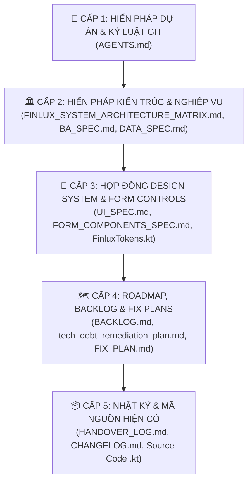

# BẢN ĐỒ QUAN HỆ QUY TẮC & MA TRẬN DẪN CHIẾU HỆ THỐNG FINLUX
*(FINLUX RULE MAPPING MATRIX & GOVERNANCE CONSTITUTION)*

- **Dự án:** FinLux — Quản lý Tài chính Cá nhân Thông minh (Android / Jetpack Compose / Firebase)
- **Phiên bản hiện tại:** v1.25.6 (versionCode 180)
- **Mục tiêu:** Thiết lập bản đồ quan hệ dẫn chiếu, thứ bậc thẩm quyền và ma trận kích hoạt tài liệu bắt buộc cho toàn bộ AI Coding Agents & Developers, chấm dứt triệt để tình trạng vi phạm quy chuẩn, quên luật hoặc lệch pha giữa tài liệu và mã nguồn.

---

## 🧭 PHẦN 1: DANH MỤC QUY CHUẨN & THỨ BẬC THẨM QUYỀN (RULE REGISTRY & HIERARCHY OF TRUTH)

### 1.1. Bảng Danh Mục Các File Quy Chuẩn Trong Kho Mã Nguồn
| Tên File | Vị Trí Lưu Trữ | Thẩm Quyền & Phạm Vi Điều Chỉnh (Scope & Authority) | Vai Trò Trong Dự Án |
|---|---|---|---|
| **`AGENTS.md`** | Gốc repo (`/AGENTS.md`) | **Hiến pháp Tối cao của Dự án**: Điều chỉnh hành vi của Agent/Dev, quy trình 4 bước Kickoff, kỷ luật Git, các điều cấm kỵ, quy trình Release. | Phủ quyết tất cả file khác về mặt quy trình vận hành và kỷ luật kỹ thuật. |
| **`FINLUX_SYSTEM_ARCHITECTURE_MATRIX.md`** | `docs/` | **Hiến pháp Kiến trúc Hệ thống**: Định nghĩa 16 module cốt lõi, 15 luồng tiền (Money Flows F-01..F-15), phân định ranh giới và System Invariants. | Nguồn chân lý tối cao về dòng tiền, liên kết liên module và phòng chống tính trùng. |
| **`BA_SPEC.md`** | `docs/` | **Đặc tả Nghiệp vụ Kế toán**: Định nghĩa các UseCase (UC-01..UC-30), công thức tính toán tài chính, Business Rules (BR-01..BR-15), chu kỳ lương và bẫy nợ âm. | Nguồn chân lý về bản chất kế toán và logic nghiệp vụ người dùng. |
| **`DATA_SPEC.md`** | `docs/` | **Đặc tả Mô hình Dữ liệu & Firestore**: Định nghĩa Data Schema, Entity Keys, Subcollections, Quy tắc bất biến (Immutability Pattern) và Whitelist Keys. | Ràng buộc cấu trúc dữ liệu Firestore, Room và Data Transfer Objects (DTO). |
| **`UI_SPEC.md` & `CONTEXT.md`** | `docs/` | **Đặc tả Giao diện & Kiến trúc Liquid Glass**: Quy chuẩn Clean Architecture (Domain/Data/Presentation), Design Tokens, Spacing, Radius, Dark/Light Mode. | Nguồn chân lý về thẩm mỹ, kiến trúc phân tầng UI và chuẩn Jetpack Compose. |
| **`FORM_COMPONENTS_SPEC.md`** | `docs/` | **Hợp đồng Biểu mẫu Tiêu chuẩn (Form Contract)**: Đặc tả chi tiết các control nhập liệu form (`FinluxAmountInput`, `ErgonomicCompactAmountCard`, `FinluxWalletSelector`...), thuật toán Magnitude Scaling. | Ràng buộc 100% các màn hình nhập liệu phải dùng chung control. |
| **`BACKLOG.md`** | `docs/` | **Định vị Roadmap & Quản lý Yêu cầu**: Bản đồ Phase triển khai (v1.0..v2.0), phân loại ưu tiên (P0, P1, P2), theo dõi Bug Critical và tính năng tồn đọng. | Xác định phạm vi task (Scope Gate), ngăn chặn làm lan man ngoài roadmap. |
| **`tech_debt_remediation_plan.md` & `FIX_PLAN.md`** | `docs/` | **Kế hoạch Xử lý Kỹ thuật Phân kỳ**: Lộ trình 3 Phase xử lý nợ kỹ thuật, kế hoạch fix bug phân kỳ, kiến trúc dùng chung. | Hướng dẫn chi tiết từng đợt tái cấu trúc và chỉ tiêu kiểm thử. |
| **`HANDOVER_LOG.md`** | Gốc repo (`/HANDOVER_LOG.md`) | **Nhật ký Bàn giao Phiên Làm Việc (SOP Tracker)**: Bắt buộc ghi nhận 2 bước PRE-EXECUTION và POST-EXECUTION cho từng task. | Cầu nối ngữ cảnh giữa các phiên làm việc, chống mất dữ liệu khi đứt session. |
| **`CHANGELOG.md`** | Gốc repo (`/CHANGELOG.md`) | **Lịch sử Phát hành (Release History)**: Ghi nhận các phiên bản chính thức theo chuẩn Semantic Versioning sau khi build và test thành công. | Ghi nhận release chính thức. |

---

### 1.2. Tháp Phân Cấp Thẩm Quyền (Hierarchy of Truth - 5 Cấp Độ)

Khi phát sinh mâu thuẫn thông tin giữa các file tài liệu hoặc giữa tài liệu với code thực tế, Agent **BẮT BUỘC** áp dụng thứ bậc phủ quyết sau:



#### ⚖️ Quy Tắc Phân Xử Xung Đột (Conflict Resolution Protocols):
1. **Code vs Spec:** Mã nguồn hiện tại (`.kt`) **KHÔNG PHẢI** là chân lý tối thượng nếu code đó viết sai so với `BA_SPEC.md` hoặc `FINLUX_SYSTEM_ARCHITECTURE_MATRIX.md`. Khi code mâu thuẫn với Spec -> **Code bị coi là BUG và phải sửa Code theo Spec**.
2. **Spec vs Hiến pháp Kiến trúc:** Nếu một màn hình trong `UI_SPEC.md` yêu cầu hiển thị nút hoặc logic vi phạm `FINLUX_SYSTEM_ARCHITECTURE_MATRIX.md` (ví dụ: đòi tính nợ gốc vào chi tiêu sinh hoạt) -> **Hiến pháp kiến trúc phủ quyết**, giữ nguyên bản chất kế toán.
3. **Spec vs Kỷ luật Vận hành:** Mọi yêu cầu commit/push tự động trong bất kỳ plan nào đều bị `AGENTS.md` (Cấp 1) vô hiệu hóa hoàn toàn -> **Bắt buộc chờ lệnh phê duyệt bằng văn bản từ Tech Lead**.
4. **Phát hiện tài liệu lỗi thời:** Khi tài liệu Cấp 3 hoặc Cấp 4 lệch pha so với thực tế đã thống nhất (ví dụ: đường dẫn file cũ), Agent phải lập báo cáo cảnh báo Tech Lead và cập nhật đồng bộ tài liệu, không được âm thầm làm sai.
5. **Nguyên tắc Đồng bộ Đặc tả Ngược (Spec Parity Invariant - Điều II.9):** Code và Spec bắt buộc khớp nhau 100%. Khi thay đổi UseCase, Validator, Invariants, Form Controls hay Schema, Agent bắt buộc phải cập nhật ngược lại tài liệu đặc tả tương ứng (`docs/BA_SPEC.md`, `docs/FINLUX_SYSTEM_ARCHITECTURE_MATRIX.md`, `docs/FORM_COMPONENTS_SPEC.md`, `docs/DATA_SPEC.md`). Cấm tuyệt đối coi task là hoàn thành khi chỉ có code/test mà chưa cập nhật tài liệu.
6. **Nguyên tắc Triệt tiêu Code Cục bộ & Quy hoạch Mã Dùng Chung (DRY Invariant - Điều II.10):** Cấm viết các khối `when (type)`, `when (categoryId)` hoặc tự parse/format ngày giờ, tiền tệ lặp lại trong các file Composable UI. Mọi logic ánh xạ xuất hiện từ 2 vị trí trở lên bắt buộc phải được trích xuất về `core/common` hoặc `core/designsystem` trước khi bàn giao.
7. **Quy tắc Zero Magic Numbers & Raw Literals (Điều II.11):** Cấm viết số nguyên, float, hoặc chuỗi literal mô tả ngưỡng nghiệp vụ, kỹ thuật (chunk size, backup limit, alarm request code) hoặc múi giờ rải rác. Bắt buộc 100% kế thừa từ `FinanceBusinessConstants`, `AppSystemConfig`, hoặc `FirestoreSchema`.
8. **Quy tắc Firestore Schema Governance (Điều II.12):** Cấm chuỗi tên collection hoặc field thô trong tầng Repository, UseCase và Services. 100% tên collection, documents, và fields dùng chung phải đi qua `FirestoreSchema`.
9. **Quy tắc Anti-Code Defragmentation & SSoT (Điều II.13):** Mọi cấu hình, trạng thái, định tuyến (Theme, UI Style, Fallback, Date Ranges) bắt buộc phải có Single Source of Truth (SSoT) duy nhất. Cấm triệt để việc sửa 1 tính năng mà phải vá víu thủ công qua 5-10 file; cấm prop-drilling khi đã có `CompositionLocal` hoặc Singleton Provider.
10. **Quy tắc Strict DRY & Chống Sao Chép Màn Hình (Điều II.14):** CẤM sao chép nguyên màn hình để phục vụ các phong cách giao diện khác nhau (nhân bản `Classic*Screen`, `Modern*Screen`, `Prism*Screen`). Bắt buộc áp dụng Component-driven Adaptive Architecture: 1 Screen duy nhất quản lý State/ViewModel, các phần tử hiển thị tự động đổi bề mặt theo `LocalFinluxTokens`.
11. **Quy tắc Dead Code Elimination & Strict Encapsulation (Điều II.15 & II.16):** Xóa sạch 100% code thừa, unused functions, zombie variables, import rác sau refactor. Luôn áp dụng Minimum Privilege: thuộc tính/hàm mặc định `private`, cấm expose `MutableStateFlow`/`MutableList` ra ngoài ViewModel/Repository.

---

## 🔗 PHẦN 2: MA TRẬN ÁNH XẠ DẪN CHIẾU & PHỤ THUỘC (RULE DEPENDENCY MATRIX)

Bảng phân tích mối quan hệ chéo, điều khoản ràng buộc và hậu quả nghiêm trọng nếu Agent bỏ qua:

| File Gốc (Source) | Dẫn Chiếu / Bị Ràng Buộc Bởi (Target) | Điều Khoản / Nội Dung Ràng Buộc Cụ Thể | Rủi Ro & Hậu Quả Nếu Agent Bỏ Qua |
|---|---|---|---|
| **`AGENTS.md`**<br>(Điều II.1 - Điều tra trước khi code) | `docs/FINLUX_SYSTEM_ARCHITECTURE_MATRIX.md`<br>`docs/BACKLOG.md` | Bắt buộc đối soát 16 module và 15 luồng tiền; lập Implementation Plan trước khi chạm vào file `.kt`. | Gây lỗi dây chuyền (Blast Radius), sửa một màn hình làm gãy 3 module khác. |
| **`AGENTS.md`**<br>(Điều II.2 - Kỷ luật Git) | Lệnh chat trực tiếp của người dùng | TUYỆT ĐỐI CẤM chạy `git commit` hoặc `git push` nếu chưa nhận được xác nhận bằng văn bản cụ thể. | Làm bẩn lịch sử Git, đẩy code lỗi/chưa kiểm thử lên remote repository. |
| **`AGENTS.md`**<br>(Điều II.3 - Bảo vệ luồng tiền) | `FINLUX_SYSTEM_ARCHITECTURE_MATRIX.md`<br>`BA_SPEC.md` (Mục 7)<br>`SystemCategories.kt` | • Cấm dùng string literal danh mục.<br>• Phân tách `isLivingExpense()`: cấm tính Nợ gốc, Tiết kiệm, Xuất vốn vào chi phí sinh hoạt.<br>• Rollback số dư nguyên tử khi Sửa/Xóa. | Méo mó báo cáo tài chính, làm sai lệch dòng tiền tự do (FCF), tính trùng chi phí thẻ tín dụng. |
| **`AGENTS.md`**<br>(Điều II.4 - Đồng bộ Theme) | `docs/UI_SPEC.md`<br>`FinluxTokens.kt` | CẤM hardcode mã màu hex (`Color(0xFF...)`, `#FFFFFF`...). 100% màu phải lấy từ `LocalFinluxTokens.current` và `MaterialTheme.colorScheme`. | Màn hình bị chói lóa ở Dark Mode hoặc chữ tàng hình ở Light Mode, vỡ phong cách Liquid Glass. |
| **`AGENTS.md`**<br>(Điều II.5 & II.6 - Form tiêu chuẩn) | `docs/FORM_COMPONENTS_SPEC.md`<br>`FinluxFormControls.kt` | 100% form nhập liệu phải kế thừa `FinluxAmountInput` (Decimal Magnitude Scaling), `FinluxDateTimePicker`, `FinluxWalletSelector`, `FinluxNoteInput`. | Sinh ra code trùng lặp (Anti-Zombie Code), mỗi màn hình một kiểu nhập tiền, mất dải chip gợi ý, lỗi che khuất bàn phím IME. |
| **`AGENTS.md`**<br>(Điều II.8 - Firestore Rules) | `docs/DATA_SPEC.md`<br>`firestore.rules` | Mỗi khi thêm trường dữ liệu: BẮT BUỘC cập nhật `firestore.rules` (whitelist `keys().hasOnly(...)`) và bảo toàn trường bất biến. | Thao tác ghi Firestore bị chặn quyền (`PERMISSION_DENIED`), crash ứng dụng trên môi trường thực tế. |
| **`AGENTS.md`**<br>(Điều II.9 - Đồng bộ đặc tả ngược) | `docs/BA_SPEC.md`<br>`docs/FORM_COMPONENTS_SPEC.md`<br>`docs/FINLUX_SYSTEM_ARCHITECTURE_MATRIX.md`<br>`docs/DATA_SPEC.md` | Bất kỳ thay đổi nào về UseCase/Validation/Invariants PHẢI cập nhật `BA_SPEC.md` & `ARCHITECTURE_MATRIX`; thay đổi UI Control/Component PHẢI cập nhật `FORM_COMPONENTS_SPEC.md`; thay đổi Schema PHẢI cập nhật `DATA_SPEC.md`. | Lệch pha nghiêm trọng giữa đặc tả và mã nguồn (Spec Drift), agent phiên sau hiểu sai nghiệp vụ, gây lỗi dây chuyền. |
| **`AGENTS.md`**<br>(Điều II.10 - Triệt tiêu code cục bộ) | `core/common/` (`FinanceTime`, `CategoryIconHelper`)<br>`core/designsystem/` (`TransactionSemantics`, `FinluxTokens`) | Cấm viết logic mapping màu, icon, định dạng thời gian/tiền tệ cục bộ trong Composable UI. Xuất hiện $\ge 2$ nơi bắt buộc trích xuất Shared Helper trước khi làm tính năng mới. | Codebase phân mảnh, duplicate logic khắp nơi, sửa màu hoặc format ở một màn hình bị sót các màn hình khác. |
| **`AGENTS.md`**<br>(Điều II.11 - Zero Magic Numbers) | `FinanceBusinessConstants.kt`<br>`AppSystemConfig.kt`<br>`FirestoreSchema.kt` | Cấm viết số nguyên/float/string literal thô (80%, 100%, 180 ngày, 400 chunk size, Alarm codes, "Asia/Ho_Chi_Minh"). 100% phải kế thừa từ file trung tâm. | Phân mảnh ngưỡng nghiệp vụ, sai lệch múi giờ, rò rỉ bug ngầm khi cập nhật logic ở một nơi nhưng sót nơi khác. |
| **`AGENTS.md`**<br>(Điều II.12 - Firestore Schema) | `FirestoreSchema.kt`<br>`firestore.rules` | 100% tên collection, documents, và fields dùng chung BẮT BUỘC phải đi qua `FirestoreSchema` (`USERS`, `Collections.*`, `Fields.*`). Cấm string thô trong Repository/UseCase. | Sai chính tả tên collection/field dẫn đến mất dữ liệu ngầm, truy vấn rỗng, gãy đồng bộ đa nền tảng. |
| **`AGENTS.md`**<br>(Điều II.13 - Anti-Defragmentation & SSoT) | `LocalFinluxTokens.current`<br>Singleton Providers<br>`FinanceModels.kt` | Mọi cấu hình, trạng thái, style bắt buộc có 1 SSoT duy nhất. Cấm prop-drilling trạng thái toàn cục, cấm sửa 1 tính năng mà phải vá thủ công qua 5-10 file. | Codebase phân mảnh, state drift, xung đột trạng thái giữa các màn hình, tăng đột biến chi phí bảo trì. |
| **`AGENTS.md`**<br>(Điều II.14 - Strict DRY & Anti Copy-Paste) | Component-driven Adaptive Architecture<br>Design System Tokens | CẤM clone/copy-paste nguyên màn hình (`Classic*Screen`, `Modern*Screen`, `Prism*Screen`). Chỉ giữ 1 Screen duy nhất, các sub-component tự đổi bề mặt theo Token. Logic dùng chung $\ge 2$ nơi trích xuất UseCase/Extension. | Bùng nổ mã nguồn trùng lặp, sửa 1 bug phải sửa lặp lại ở 3 màn hình nhân bản, nguy cơ sót lỗi cực cao. |
| **`AGENTS.md`**<br>(Điều II.15 - Dead Code Elimination) | Mã nguồn toàn dự án | Xóa sạch triệt để code thừa, unused functions, import rác, code comment-out sau refactor. Cấm giữ lại code zombie dạng "dự phòng". | Phình to bundle size, gây hoang mang cho agent và dev phiên sau, tích tụ nợ kỹ thuật trầm trọng. |
| **`AGENTS.md`**<br>(Điều II.16 - Strict Encapsulation) | ViewModel & Repository APIs | Mặc định `private`, chỉ mở rộng `internal`/`public` khi cần thiết. Cấm tuyệt đối expose `MutableStateFlow`, `MutableSharedFlow`, `MutableList` ra ngoài. | Phá vỡ tính đóng gói, UI có thể tự ý mutate state ngầm bỏ qua UseCase/ViewModel, gây race condition và lỗi dữ liệu. |
| **`AGENTS.md`**<br>(Phần III - Quản lý tài liệu) | `HANDOVER_LOG.md` | Bắt buộc 2 bước: PRE-EXECUTION (`[IN PROGRESS]`) trước khi code và POST-EXECUTION (`[DONE]`) sau khi test. | Agent phiên sau bị mất ngữ cảnh, không biết việc làm dở, lặp lại công việc tốn token/quota. |
| **`AGENTS.md`**<br>(Phần IV - Release Pipeline) | `app/build.gradle.kts`<br>`CHANGELOG.md` | Bắt buộc: 100% tests PASS -> Bump Version (+1) -> Sync Changelog -> Build APK -> ADB Deploy -> Nghiệm thu máy thật 5 điểm + DoD (Spec Parity, Shared Code). | Phát hành APK lỗi, sai lệch phiên bản phát hành, không thể cập nhật đè lên máy người dùng. |
| **`docs/BACKLOG.md`** | `FINLUX_SYSTEM_ARCHITECTURE_MATRIX.md` | Mọi ticket phát triển hoặc sửa lỗi phải định vị chính xác thuộc Module nào trong 16 module. | Phát triển tính năng lạc lõng, chồng chéo chức năng đã có. |
| **`tech_debt_remediation_plan.md`** | `WalletBalanceValidator.kt`<br>`FinluxFormControls.kt` | Quy hoạch logic kiểm tra số dư và UI cảnh báo thành module dùng chung, không viết cục bộ trong từng màn hình. | Phát sinh nợ kỹ thuật phân mảnh (Siloed Logic), bỏ lọt lỗ hổng âm ví ở các màn hình Chuyển tiền, Trả nợ, Nạp hũ. |

---

## 🚦 PHẦN 3: MA TRẬN KÍCH HOẠT THEO NGỮ CẢNH (CONTEXT TRIGGER RULES)

Quy tắc **"ĐỤNG ĐẾN ĐÂU — BẮT BUỘC ĐỌC & ĐỐI SOÁT ĐÓ"** dành cho AI Agent:

```
┌────────────────────────────────────────────────────────────────────────┐
│                        NGỮ CẢNH CÔNG VIỆC                              │
├────────────────────────────────┬───────────────────────────────────────┤
│ 1. Form nhập liệu, Ô tiền,     │ 📖 docs/FORM_COMPONENTS_SPEC.md       │
│    DatePicker, Selector, Sheet │ 📖 FinluxFormControls.kt              │
│                                │ 📖 AGENTS.md (Điều II.5, II.6)        │
├────────────────────────────────┼───────────────────────────────────────┤
│ 2. UseCase, Luồng tiền, Số dư, │ 📖 FINLUX_SYSTEM_ARCHITECTURE_MATRIX  │
│    Ví, Ngân sách, Nợ, Lương    │ 📖 docs/BA_SPEC.md & DATA_SPEC.md     │
│                                │ 📖 AGENTS.md (Điều II.3)              │
├────────────────────────────────┼───────────────────────────────────────┤
│ 3. UI, Screen, Thẩm mỹ, Theme, │ 📖 docs/UI_SPEC.md & CONTEXT.md       │
│    Liquid Glass, Bento Box     │ 📖 FinluxTokens.kt & FinluxTheme.kt   │
│                                │ 📖 AGENTS.md (Điều II.4, II.7)        │
├────────────────────────────────┼───────────────────────────────────────┤
│ 4. Thêm/Sửa Model, DTO, Entity │ 📖 docs/DATA_SPEC.md                  │
│    hoặc Firestore Field        │ 📖 firestore.rules                    │
│                                │ 📖 AGENTS.md (Điều II.8)              │
├────────────────────────────────┼───────────────────────────────────────┤
│ 5. Khởi động / Bàn giao task   │ 📖 HANDOVER_LOG.md (PRE / POST)       │
│    trong mọi phiên làm việc    │ 📖 AGENTS.md (Phần I.2, Phần III)     │
├────────────────────────────────┼───────────────────────────────────────┤
│ 6. Đóng gói Release / Chạy Git │ 📖 AGENTS.md (Phần II.2, Phần IV)     │
│    Commit & Push               │ 📖 CHANGELOG.md                       │
└────────────────────────────────┴───────────────────────────────────────┘
```

### Chi Tiết Yêu Cầu Tuân Thủ Cho Từng Ngữ Cảnh:

#### 🟢 Ngữ Cảnh 1: Thao Tác Với Form Nhập Liệu & Bộ Chọn (Inputs & Form Controls)
- **Tài liệu kích hoạt bắt buộc:** `docs/FORM_COMPONENTS_SPEC.md` + `FinluxFormControls.kt` + `AGENTS.md` (Mục II.5, II.6, II.9).
- **Quy tắc kích hoạt đặc tả ngược (Spec Parity Trigger - Điều II.9):**
  * **KHI SỬA BẤT KỲ UI CONTROL / COMPONENT NÀO** $\rightarrow$ BẮT BUỘC kích hoạt cập nhật `docs/FORM_COMPONENTS_SPEC.md` hoặc `docs/UI_SPEC.md` (ghi nhận tham số mới, viền cảnh báo, banner, typography auto-scaling).
- **Checklist Không Thể Bỏ Qua:**
  - [ ] Ô nhập tiền: Dùng `FinluxAmountInput` hoặc `ErgonomicCompactAmountCard` (mặc định `AmountChipMode.MAGNITUDE_SCALING` $V = N \times 10^k$, auto-scaling font, inline `₫`). CẤM tự vẽ TextField thủ công.
  - [ ] Chọn ngày giờ: Dùng `FinluxDateTimePicker` (chọn cả Ngày VÀ Giờ:Phút). CẤM dùng DatePicker đơn lẻ làm mất thông tin giờ giao dịch.
  - [ ] Chọn ví: Dùng `FinluxWalletSelector` có truyền `validationResult: WalletValidationResult`.
  - [ ] Chuyển tiền: Dùng `FinluxTransferWalletPair` có truyền `sourceValidationResult`.
  - [ ] Ghi chú: Dùng `FinluxNoteInput`.

#### 🔵 Ngữ Cảnh 2: Thao Tác Với Dòng Tiền, Kế Toán & UseCase (Money Flows & Financial Logic)
- **Tài liệu kích hoạt bắt buộc:** `docs/FINLUX_SYSTEM_ARCHITECTURE_MATRIX.md` + `docs/BA_SPEC.md` + `docs/DATA_SPEC.md` + `AGENTS.md` (Mục II.3, II.9).
- **Quy tắc kích hoạt đặc tả ngược (Spec Parity Trigger - Điều II.9):**
  * **KHI SỬA BẤT KỲ FILE USECASE / VALIDATION / INVARIANT NÀO** $\rightarrow$ BẮT BUỘC kích hoạt cập nhật `docs/BA_SPEC.md` và `docs/FINLUX_SYSTEM_ARCHITECTURE_MATRIX.md` (đồng bộ Business Rules, điều kiện biên, múi giờ, bảo vệ danh mục).
- **Checklist Không Thể Bỏ Qua:**
  - [ ] Xuất tiền khỏi ví: Bắt buộc xác thực qua `WalletBalanceValidator` (hoặc `wallet.validateSufficientFunds`).
  - [ ] Định danh Category: 100% lấy từ `SystemCategories.kt`, cấm hardcode string tự do (`"food"`, `"debt_payment"`...).
  - [ ] Phân loại kế toán: Trả nợ gốc (`DEBT_PAYMENT`), Tích lũy mục tiêu (`SAVINGS`), Xuất vốn (`OUTLAY_CAPITAL`) là hoán đổi tài sản — CẤM tính vào `isLivingExpense()`.
  - [ ] Hoàn trả vòng đời: Sửa/Xóa giao dịch bắt buộc rollback nguyên tử số dư ví và ngân sách theo đúng `periodKey` gốc.
  - [ ] Thời gian tài chính: `resolvePeriodKey` phải dựa vào `transaction.date` + timezone, tuyệt đối không dùng `Instant.now()`.

#### 🟣 Ngữ Cảnh 3: Thao Tác Với Giao Diện, Theme & Liquid Glass (Presentation & Styling)
- **Tài liệu kích hoạt bắt buộc:** `docs/UI_SPEC.md` + `docs/CONTEXT.md` + `FinluxTokens.kt` + `AGENTS.md` (Mục II.4, II.7, II.10).
- **Quy tắc kích hoạt quy hoạch mã dùng chung (Zero Duplication Trigger - Điều II.10):**
  * **KHI VIẾT HOẶC SỬA LOGIC MAPPING MÀU, ICON, ĐỊNH DẠNG THỜI GIAN / TIỀN TỆ** $\rightarrow$ BẮT BUỘC quy hoạch tập trung về `core/common` (`CategoryIconHelper`, `FinanceTime`) hoặc `core/designsystem` (`TransactionSemantics`, `FinluxTokens`). Tuyệt đối CẤM viết các khối `when (type)`, `when (categoryId)` hoặc tự định dạng thời gian cục bộ lặp lại ở từng Screen.
- **Checklist Không Thể Bỏ Qua:**
  - [ ] Tuyệt đối không hardcode mã màu hex (`#...` hay `Color(...)`). Dùng 100% `LocalFinluxTokens.current` và `MaterialTheme.colorScheme`.
  - [ ] Màn hình có nền kính Liquid Glass: Bắt buộc dùng `FinluxStyleBackdrop` và `containerColor = Color.Transparent`.
  - [ ] Khoảng cách & Bo góc: Sử dụng `tokens.spacing.*` và `tokens.radius.*`.
  - [ ] Không tạo component mới trong `component/` nếu chưa rà soát các component chuẩn hiện có.
  - [ ] Logic hiển thị (Icon, Color tint, Prefix, Date/Time): Dùng helper tập trung (`FinanceTime`, `getTransactionSemanticColor`, `getTransactionIconBrush`, `getTransactionAmountPrefix`, `CategoryIconHelper`).

#### 🟡 Ngữ Cảnh 4: Thao Tác Với Schema Dữ Liệu & Firestore Rules (Data & Security)
- **Tài liệu kích hoạt bắt buộc:** `docs/DATA_SPEC.md` + `firestore.rules` + `AGENTS.md` (Mục II.8).
- **Checklist Không Thể Bỏ Qua:**
  - [ ] Thêm/sửa trường dữ liệu: Cập nhật `firestore.rules` whitelist `keys().hasOnly(...)`.
  - [ ] Trường bất biến: Áp dụng pattern `(!('<field>' in request.resource.data) || request.resource.data.<field> == resource.data.<field>)`.
  - [ ] Chạy test bảo vệ: `npm --prefix functions run check` và `functions/test/firestore.rules.test.ts`.

#### 🟠 Ngữ Cảnh 5: Bắt Đầu, Bàn Giao & Quản Lý Phiên Làm Việc (Session Management)
- **Tài liệu kích hoạt bắt buộc:** `HANDOVER_LOG.md` + `AGENTS.md` (Phần I.2, Phần III).
- **Checklist Không Thể Bỏ Qua:**
  - [ ] Trước khi code (PRE-EXECUTION): Mở `HANDOVER_LOG.md`, ghi rõ mục tiêu task, danh sách file dự kiến sửa, gắn trạng thái `[IN PROGRESS]`.
  - [ ] Sau khi code & test (POST-EXECUTION): Ghi nhận kết quả unit test, danh sách file thực tế đã sửa, cập nhật trạng thái `[DONE]`.

#### 🔴 Ngữ Cảnh 6: Đóng Gói Release, Build APK & Kỷ Luật Git (Deployment & Git Gate)
- **Tài liệu kích hoạt bắt buộc:** `AGENTS.md` (Phần II.2, Phần IV) + `CHANGELOG.md`.
- **Checklist Không Thể Bỏ Qua:**
  - [ ] Chạy test gate: `.\gradlew.bat testDebugUnitTest` đạt 100% PASS.
  - [ ] Đóng gói APK: `.\gradlew.bat assembleDebug`.
  - [ ] Nạp máy thật qua ADB: `adb install -r ...` và mở app `am start ...`.
  - [ ] Tự đối chiếu 5 điểm nghiệm thu: Theme, Large Number, Keyboard IME, Full Flow, Logcat.
  - [ ] **KỶ LUẬT GIT CHỐT CHẶN:** DỪNG LẠI báo cáo người dùng nghiệm thu, TUYỆT ĐỐI CHƯA COMMIT/PUSH nếu chưa có lệnh xác nhận bằng văn bản!

---

## 🔍 PHẦN 4: RÀ SOÁT CÁC ĐIỂM MÂU THUẪN & LỆCH PHA HIỆN TẠI (CONFLICT DETECTION)

Qua đợt tổng kiểm toán đối soát giữa toàn bộ các file tài liệu quy chuẩn và codebase thực tế, phát hiện **4 điểm lệch pha cốt lõi** cần được chuẩn hóa:

| STT | Điểm Lệch Pha Phát Hiện | Tài Liệu / Codebase Ghi Nhận | Thực Tế Hiện Tại Trong Codebase | Mức Độ Rủi Ro | Phương Án Chuẩn Hóa Đồng Bộ |
|:---:|---|---|---|:---:|---|
| **1** | **Lệch đường dẫn lưu trữ Form Controls** | `docs/FORM_COMPONENTS_SPEC.md` (Dòng 9-12) trỏ về: `component/FinluxFormComponents.kt` và `component/FinluxTransactionComponents.kt` | Đã sáp nhập tập trung về `app/src/main/java/com/finlux/app/core/designsystem/component/form/FinluxFormControls.kt` | 🟡 Trung bình | Cập nhật lại dòng 9-12 trong `docs/FORM_COMPONENTS_SPEC.md` trỏ chính xác về `FinluxFormControls.kt`. |
| **2** | **Trạng thái Ticket [BUG CRITICAL] trong Backlog** | `docs/BACKLOG.md` (Dòng 203-206) đang để trạng thái: `⏳ [OPEN] - Chờ triển khai` | Đã giải quyết triệt để tại Phase 1 (`WalletBalanceValidator`, `FinluxWalletSelector`, 413 tests PASS) | 🟢 Thấp | Cập nhật trạng thái ticket trong `docs/BACKLOG.md` sang `✅ [RESOLVED] - Đã giải quyết trong Phase 1 (v1.25.7)`. |
| **3** | **Hardcode mã màu tĩnh rải rác trong UI** | `AGENTS.md` (Điều II.4) & `docs/UI_SPEC.md` quy định: 100% màu phải qua `LocalFinluxTokens.current` | Còn hơn 800 vị trí dùng `Color(0xFF...)` tĩnh trong `presentation/` | 🟡 Trung bình | Đã đưa vào lộ trình Phase 3 (`tech_debt_remediation_plan.md` Mục 3.1) để dọn dẹp dần về Design Tokens. |
| **4** | **Phiên bản hệ thống ghi trong Architecture Matrix** | `docs/FINLUX_SYSTEM_ARCHITECTURE_MATRIX.md` ghi phiên bản v1.25.1 | Codebase hiện tại đang ở v1.25.6 (versionCode 180) | 🟢 Thấp | Cập nhật header của `FINLUX_SYSTEM_ARCHITECTURE_MATRIX.md` lên đúng phiên bản hiện hành. |

---

## 📌 PHẦN 5: BẢO TOÀN HIỆU LỰC & HƯỚNG DẪN DÀNH CHO AGENT MỚI (BOOTSTRAP INSTRUCTION)

Mỗi khi một AI Coding Agent mới bắt đầu phiên làm việc trong dự án FinLux:
1. **BẮT BUỘC ĐỌC ĐẦU TIÊN:** File này (`docs/RULE_MAPPING_MATRIX.md`) và `AGENTS.md`.
2. **TRA CỨU NGỮ CẢNH:** Tra cứu Phần 3 (Context Trigger Rules) tương ứng với task được giao để mở đúng tài liệu chuyên sâu.
3. **TUÂN THỦ THỨ BẬC THẨM QUYỀN:** Luôn áp dụng Tháp 5 cấp độ (Phần 1.2), không tự ý suy diễn hoặc tự tiện commit mã nguồn.
