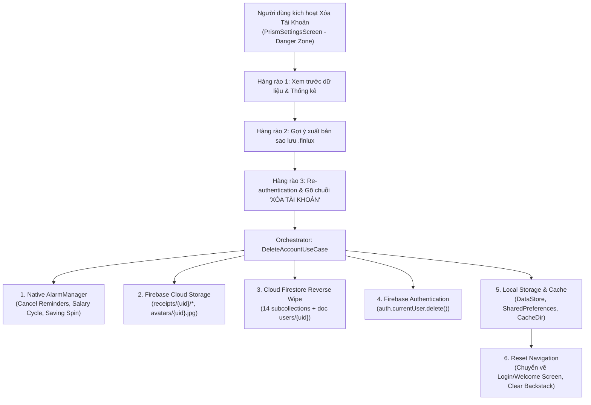
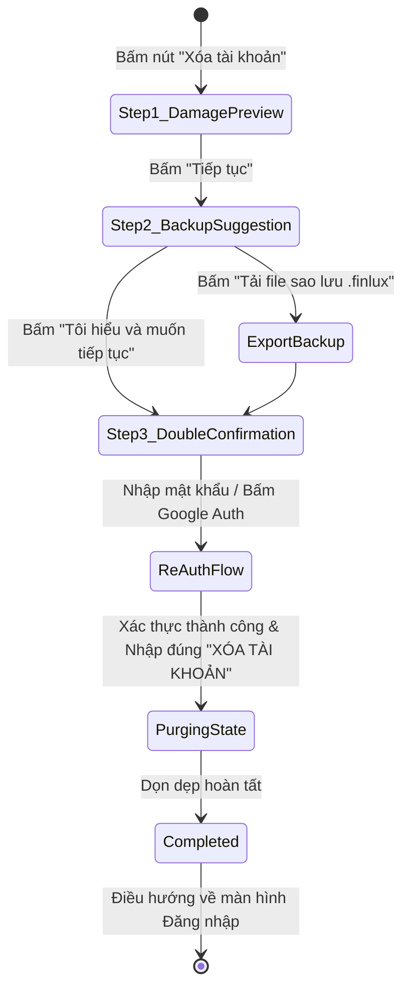

# ĐẶC TẢ KỸ THUẬT: XÓA TÀI KHOẢN & DỌN DẸP DỮ LIỆU TOÀN DIỆN
## ACCOUNT DELETION & FULL DATA PURGE ENGINE SPECIFICATION
*(Phù hợp Chính sách Google Play Console & Tiêu chuẩn Bảo mật GDPR / CCPA)*

> **Trạng thái:** 📋 [DRAFT — Chờ phê duyệt Tech Lead]  
> **Phiên bản đặc tả:** 1.0.0  
> **Ngày soạn thảo:** 2026-09-21  
> **Phạm vi:** Triển khai tính năng Xóa tài khoản & Dọn dẹp toàn bộ dữ liệu cá nhân (Cloud Firestore, Cloud Storage, Firebase Auth, Local Schedulers & Storage)  
> **Liên kết kiến trúc:** `docs/FINLUX_SYSTEM_ARCHITECTURE_MATRIX.md` (Module 1 & Module 14), `docs/DATA_SPEC.md`, `docs/BA_SPEC.md`, `docs/RULE_MAPPING_MATRIX.md`  

---

## 🧭 PHẦN 1: BỐI CẢNH NGHIỆP VỤ & RÀNG BUỘC PHÁP LÝ (LEGAL & STORE COMPLIANCE)

### 1.1. Chính Sách Google Play Console (Play Policy Compliance)
Từ ngày 07/12/2023, Google Play áp dụng chính sách nghiêm ngặt về **Xóa tài khoản người dùng (User Data Deletion Policy)**:
1. **In-App Deletion:** Ứng dụng cho phép tạo tài khoản (Email, Google) **BẮT BUỘC** phải cung cấp đường dẫn dễ thấy trong ứng dụng để người dùng có thể tự xóa tài khoản và dữ liệu liên quan.
2. **Web-based Deletion Resource:** Nhà phát triển phải cung cấp một đường dẫn web (URL) công khai trong phần Khai báo An toàn Dữ liệu (Data Safety Form) để người dùng có thể gửi yêu cầu xóa tài khoản mà không cần cài đặt lại ứng dụng.
3. **Phạm vi xóa dữ liệu:** Bắt buộc xóa vĩnh viễn toàn bộ dữ liệu nhận dạng cá nhân (PII), hồ sơ tài chính, lịch sử giao dịch và tài sản đa phương tiện (ảnh hóa đơn, avatar) khỏi máy chủ.

### 1.2. Tiêu Chuẩn Quyền Được Lãng Quên (GDPR / CCPA Right to be Forgotten)
- Khi người dùng chọn "Xóa tài khoản":
  * Tuyệt đối không để lại dữ liệu mồ côi (Orphan data) trôi nổi trên Cloud Firestore hoặc Cloud Storage.
  * Hủy bỏ toàn bộ các bộ đếm thời gian và thông báo ngầm native (`AlarmManager`) trên thiết bị.
  * Xóa sạch bộ nhớ cục bộ (`DataStore`, `SharedPreferences`, Cache tệp).
  * Hủy định danh xác thực `FirebaseUser` trên Firebase Authentication.

---

## 🏛️ PHẦN 2: KHẢO SÁT KIẾN TRÚC & DANH MỤC DỮ LIỆU BỊ XÓA (DATA INVENTORY & BLAST RADIUS)

Khi một tài khoản người dùng (`uid`) được lệnh xóa, hệ thống phải kích hoạt cơ chế quét dọn trên **4 mặt trận hạ tầng**:



### 2.1. Danh mục Chi tiết Cloud Firestore (14 Subcollections & Root Document)
Tất cả tài nguyên thuộc phạm vi người dùng đều nằm dưới đường dẫn `users/{uid}`:

| STT | Tài nguyên Firestore | Loại | Thứ tự xóa (Reverse Order) | Ghi chú & Rủi ro |
|:---:|:---|:---|:---:|:---|
| 1 | `users/{uid}/deals` | Subcollection | Bước 1 | Thương vụ đầu tư |
| 2 | `users/{uid}/debts/{debtId}/payments` | Subcollection lồng | Bước 2a | Lịch sử trả nợ con (xóa trước debt cha) |
| 3 | `users/{uid}/debts` | Subcollection | Bước 2b | Khoản nợ gốc |
| 4 | `users/{uid}/transactions` | Subcollection | Bước 3 | Sổ cái giao dịch |
| 5 | `users/{uid}/budgets` | Subcollection | Bước 4 | Ngân sách chi tiêu |
| 6 | `users/{uid}/goals` | Subcollection | Bước 5 | Mục tiêu tiết kiệm |
| 7 | `users/{uid}/reminders` | Subcollection | Bước 6 | Nhắc nhở thanh toán |
| 8 | `users/{uid}/notifications` | Subcollection | Bước 7 | Thông báo in-app |
| 9 | `users/{uid}/salaryRollovers` | Subcollection | Bước 8 | Điểm chốt chuyển chu kỳ lương (*Cần sửa Rule*) |
| 10 | `users/{uid}/salaryCycleTimeline` | Subcollection | Bước 9 | Lịch sử timeline cấu hình chu kỳ lương |
| 11 | `users/{uid}/financialPreferences` | Subcollection | Bước 10 | Tài liệu `salaryCycle` |
| 12 | `users/{uid}/savingSpinConfigs` & `savingSpinDestinations` & `savingSpinSessions` | Subcollection | Bước 11 | Vòng quay tiết kiệm |
| 13 | `users/{uid}/categories` | Subcollection | Bước 12 | Danh mục thu chi |
| 14 | `users/{uid}/wallets` | Subcollection | Bước 13 | Danh sách ví và số dư |
| 15 | `users/{uid}` | Document gốc | Bước 14 | Hồ sơ cá nhân `UserProfile`, email, displayName, FCM tokens |

### 2.2. Danh mục Firebase Cloud Storage
1. Thư mục hóa đơn: `receipts/{uid}/*` (tất cả ảnh hóa đơn JPG đã tải lên).
2. Ảnh đại diện cá nhân: `avatars/{uid}.jpg`.

### 2.3. Danh mục Native Schedulers (AlarmManager trên Android)
1. `AlarmReminderScheduler`: Hủy toàn bộ các nhắc nhở đang lập lịch theo `reminder.id`.
2. `AlarmSalaryCycleScheduler`: Hủy `SALARY_PAYDAY_ALARM_REQUEST_CODE` (9925) và `SALARY_PAYDAY_ALARM_REQUEST_CODE_SECOND` (9926).
3. `AlarmSavingSpinScheduler`: Hủy `SAVING_SPIN_ALARM_REQUEST_CODE` (73091).

### 2.4. Danh mục Bộ Nhớ Cục Bộ (Local Storage & Cache)
1. DataStore Preferences:
   - `finlux_preferences` (Theme, UiStyle, Biometric settings, AutoCheckUpdates).
   - `finlux_debt_preferences` (Chiến lược Snowball/Avalanche, Extra Payment).
2. SharedPreferences:
   - `SavingSpinReceiver.PREFS` (Lưu streak và trạng thái vòng quay).
3. Local Cache Directory:
   - Thư mục `context.cacheDir` (chứa các tệp tạm `.finlux` hoặc ảnh nén tạm).
4. Runtime Memory Singletons:
   - `AppLockManager`: Reset trạng thái khóa sinh trắc học về `false`.
   - `DataSyncManager`: Phát xung dọn dẹp bộ nhớ đệm UI.

---

## 🔒 PHẦN 3: ĐIỀU CHỈNH QUY TẮC BẢO MẬT FIRESTORE (FIRESTORE RULES AUDIT)

Qua khảo sát tệp [firestore.rules](file:///d:/Sources/FinLux/firestore.rules), phát hiện **02 điểm nghẽn bảo mật** có thể chặn đứng thao tác xóa dữ liệu của người dùng:

### ⚠️ Điểm nghẽn 1: `salaryRollovers` cấm Delete hoàn toàn
- **Hiện trạng dòng 316:**
  ```javascript
  match /salaryRollovers/{docId} {
    allow read: if isOwner(uid);
    allow create: if isOwner(uid) && ...;
    allow update: if false;
    allow delete: if false; // 💥 CHẶN ĐỨNG XÓA DỮ LIỆU
  }
  ```
- **Khắc phục:** Cập nhật thành:
  ```javascript
  allow delete: if isOwner(uid);
  ```

### ⚠️ Điểm nghẽn 2: Ràng buộc `walletMovesBy` khi xóa `transactions`
- **Hiện trạng dòng 189–190:**
  ```javascript
  allow delete: if isOwner(uid)
    && walletMovesBy(uid, resource.data.walletId, 0 - transactionDelta(resource.data));
  ```
  Khi xóa toàn bộ tài khoản, các giao dịch bị xóa hàng loạt mà không cần hoàn trả số dư vào ví (vì ví cũng sắp bị xóa sạch ở bước sau). Nếu bắt buộc `walletMovesBy`, thao tác batch delete giao dịch sẽ bị Firestore Rules từ chối!
- **Khắc phục:** Cần bổ sung điều kiện cho phép xóa giao dịch dạng bulk/raw khi người dùng là chủ sở hữu `isOwner(uid)`.

---

## 🏗️ PHẦN 4: THIẾT KẾ KIẾN TRÚC TẦNG DOMAIN & USECASES

### 4.1. Mở rộng `AuthRepository` Interface
Bổ sung các phương thức nghiệp vụ xác thực & hủy tài khoản:

```kotlin
// domain/repository/AuthRepository.kt
interface AuthRepository {
    // ... các hàm hiện hữu ...

    /** Kiểm tra loại Provider chính của tài khoản hiện tại ("password" hoặc "google.com") */
    fun getAuthProviderId(): String

    /** Xác thực lại bằng Email/Password trước khi thực hiện hành động nhạy cảm */
    suspend fun reauthenticateWithPassword(password: String): AppResult<Unit>

    /** Xác thực lại bằng Google ID Token trước khi thực hiện hành động nhạy cảm */
    suspend fun reauthenticateWithGoogle(idToken: String): AppResult<Unit>

    /** Xóa hoàn toàn tài khoản người dùng trên Firebase Authentication */
    suspend fun deleteAuthAccount(): AppResult<Unit>
}
```

### 4.2. UseCase 1: `PurgeUserDataUseCase.kt` (Dọn Dẹp Dữ Liệu Đám Mây)
- **Nhiệm vụ:** Chuyên trách xóa sạch 100% dữ liệu Firestore và Cloud Storage của `uid`.
- **Nguyên tắc bất biến:**
  * Chia nhỏ batch write: Mỗi batch tối đa 400 documents (dưới ngưỡng 500 của Firestore) để tránh `TransactionTooLargeException`.
  * Xóa lồng: Đọc danh sách `debts`, với mỗi debt đọc subcollection `payments` để xóa sạch trước khi xóa debt cha.
  * Xóa Storage: Dùng `storage.reference.child("receipts/$uid").listAll()` xóa từng file ảnh và xóa `avatars/$uid.jpg`. Bọc `runCatching` để không bị văng lỗi nếu người dùng không có avatar hoặc hóa đơn.

```kotlin
// domain/usecase/account/PurgeUserDataUseCase.kt
class PurgeUserDataUseCase @Inject constructor(
    private val firestore: FirebaseFirestore,
    private val storage: FirebaseStorage,
) {
    suspend operator fun invoke(uid: String): AppResult<Unit>
}
```

### 4.3. UseCase 2: `DeleteAccountUseCase.kt` (Điều Phối Vòng Đời Xóa Tài Khoản)
- **Nhiệm vụ:** Nhạc trưởng điều phối pipeline xóa tài khoản toàn vẹn.
- **Thứ tự thực thi nghiêm ngặt (Execution Order):**
  1. **Pre-flight Auth Check:** Kiểm tra `currentUser != null`.
  2. **Local Alarms Cancellation:** Hủy toàn bộ AlarmManager (`ReminderScheduler`, `SalaryCycleScheduler`, `SavingSpinScheduler`).
  3. **Cloud Storage Purge:** Xóa sạch ảnh hóa đơn và avatar qua `PurgeUserDataUseCase`.
  4. **Cloud Firestore Purge:** Xóa toàn bộ 14 subcollections và profile document gốc.
  5. **Firebase Auth Deletion:** Gọi `authRepository.deleteAuthAccount()`.
     * *Nếu dính `FirebaseAuthRecentLoginException`:* Kích hoạt cờ yêu cầu Re-authentication.
  6. **Local Storage & Cache Reset:** Reset DataStore, SharedPreferences và thư mục cache.
  7. **Sign-out & Reset State:** Phát xung qua `DataSyncManager`, reset `AppLockManager`, emit trạng thái hoàn tất để Navigation điều hướng về `AuthScreen`.

---

## 🎨 PHẦN 5: THIẾT KẾ TRẢI NGHIỆM GIAO DIỆN & HÀNG RÀO AN TOÀN (UI/UX SAFETY GATES)

### 5.1. Vị Trí Trên Giao Diện (`PrismSettingsScreen.kt`)
Đặt một khu vực riêng biệt mang tên **"VÙNG NGUY HIỂM" (DANGER ZONE)** nằm ở đáy màn hình Cài đặt, ngay phía trên nút "Đăng xuất":
- Icon cảnh báo: `Icons.Default.WarningAmber` với sắc đỏ semantic `tokens.error` (hoặc `FinluxColors.ExpenseRed`).
- Card kính Liquid Glass viền đỏ nhạt: `BorderStroke(1.dp, tokens.error.copy(alpha = 0.35f))`.
- Nút bấm: *"Xóa tài khoản & Toàn bộ dữ liệu"*, phụ đề: *"Xóa vĩnh viễn dữ liệu đám mây, ví, giao dịch và tài khoản"*.

### 5.2. Luồng Trải Nghiệm 3 Bước (`DeleteAccountBottomSheet.kt`)



#### Bước 1: Thống kê Dữ liệu Sẽ Mất (Damage Summary & Warning)
- Hiển thị danh sách tóm tắt dữ liệu cá nhân sẽ bị hủy bỏ:
  * Số lượng Ví tài sản hiện có.
  * Số lượng Giao dịch trong sổ cái.
  * Số lượng Khoản nợ, Mục tiêu tích lũy và Nhắc nhở.
  * Toàn bộ ảnh hóa đơn chứng từ và lịch sử chu kỳ lương.
- Banner cảnh báo nổi bật: *"Hành động này là vĩnh viễn và KHÔNG THỂ HOÀN TÁC. Mọi dữ liệu trên đám mây và thiết bị sẽ bị xóa sạch."*

#### Bước 2: Gợi Ý Tải Bản Sao Lưu Ngoại Tuyến (Safety Net)
- Cung cấp nút tiện ích: *"Tải bản sao lưu (.finlux) về máy trước"*.
- Khi nhấn, kích hoạt `ExportBackupUseCase` để lưu một file snapshot an toàn vào thư mục Downloads của người dùng, giúp người dùng an tâm hoặc có cơ hội khôi phục ở tài khoản mới.

#### Bước 3: Hàng Rào Xác Nhận Kép (Double Confirmation Gate)
- Phân biệt theo hình thức đăng nhập:
  * **Nếu tài khoản Email/Password:** Hiển thị trường nhập `Mật khẩu hiện tại` để thẩm định danh tính.
  * **Nếu tài khoản Google:** Hiển thị nút bấm `Xác thực lại bằng Google (One-Tap Re-auth)`.
- **Khóa an toàn chống bấm nhầm:** Bắt buộc người dùng phải gõ chính xác cụm từ:
  ```text
  XÓA TÀI KHOẢN
  ```
- Nút màu đỏ `tokens.error` mang tên *"XÓA VĨNH VIỄN TÀI KHOẢN"* chỉ sáng lên và cho phép bấm khi và chỉ khi:
  1. Đã vượt qua Re-authentication thành công.
  2. Chuỗi nhập vào khớp 100% không thừa khoảng trắng.

#### Màn hình Loading Kính Kèm Tiến Trình (Purging State Overlay)
Trong suốt quá trình xóa (khoảng 2–5 giây tùy lượng dữ liệu), toàn bộ màn hình phủ lớp kính mờ Liquid Glass, vô hiệu hóa nút Back và cử chỉ vuốt, hiển thị thông điệp từng giai đoạn:
1. *"Đang hủy các nhắc nhở trên thiết bị..."*
2. *"Đang xóa ảnh hóa đơn và hồ sơ..."*
3. *"Đang dọn dẹp sổ cái tài chính trên đám mây..."*
4. *"Đang hủy tài khoản xác thực..."*
5. *"Hoàn tất. Tạm biệt bạn!"*

---

## 🧪 PHẦN 6: MA TRẬN KIỂM THỬ ĐỘC LẬP (TEST MATRIX)

Tuân thủ nghiêm ngặt Điều 10 trong `AGENTS.md`, tính năng phải có test suite độc lập đạt 100% PASS trước khi ghép nối UI:

### 6.1. `PurgeUserDataUseCaseTest.kt` (Kiểm Thử Dọn Dẹp Dữ Liệu)
- **`T-PURGE-01` (Complete Reverse Purge):** Kiểm tra khi chạy purge, toàn bộ 14 subcollections và document gốc `users/{uid}` đều được gọi xóa.
- **`T-PURGE-02` (Storage File Deletion):** Kiểm tra xóa thành công file ảnh `avatars/{uid}.jpg` và toàn bộ items trong `receipts/{uid}/`.
- **`T-PURGE-03` (Empty Storage Resilience):** Kiểm tra khi user không có avatar và không có hóa đơn nào, hàm vẫn thực thi trơn tru, không văng ngoại lệ `StorageException`.
- **`T-PURGE-04` (Network Error Propagation):** Khi Firestore gặp lỗi mạng ở giữa chừng, UseCase phải bắt lỗi và trả về `AppResult.Error` với thông điệp rõ ràng, không nuốt lỗi ngầm.

### 6.2. `DeleteAccountUseCaseTest.kt` (Kiểm Thử Điều Phối Xóa Tài Khoản)
- **`T-DEL-01` (Happy Path Deletion):** Toàn bộ pipeline (Hủy Alarms -> Purge Storage -> Purge Firestore -> Delete Auth -> Reset Local DataStore) thực thi chuẩn xác theo thứ tự.
- **`T-DEL-02` (Re-auth Exception Handling):** Khi `deleteAuthAccount()` ném `FirebaseAuthRecentLoginException`, UseCase trả về trạng thái yêu cầu Re-auth mà không làm hỏng dữ liệu cục bộ.
- **`T-DEL-03` (AlarmManager Cancellation):** Đảm bảo cả 3 scheduler (`AlarmReminderScheduler`, `AlarmSalaryCycleScheduler`, `AlarmSavingSpinScheduler`) đều được gọi hàm `cancel()`.
- **`T-DEL-04` (Local DataStore & SharedPreferences Clean):** Đảm bảo sau khi xóa tài khoản, preferences DataStore được reset về mặc định.
- **`T-DEL-05` (Re-authentication Failure Abort):** Khi người dùng nhập sai mật khẩu xác thực lại, toàn bộ pipeline dừng lại ngay lập tức, dữ liệu trên Firestore và thiết bị còn nguyên vẹn 100%.

### 6.3. `DeleteAccountViewModelTest.kt` (Kiểm Thử Trạng Thái UI)
- Kiểm thử chuyển đổi máy trạng thái: `INITIAL` -> `PREVIEW_DATA` -> `PROMPT_BACKUP` -> `CONFIRMATION_INPUT` -> `EXECUTING_PURGE` -> `SUCCESS_NAVIGATE`.

---

## 🗺️ PHẦN 7: KẾ HOẠCH PHÂN KỲ TRIỂN KHAI (ROADMAP & PHASES)

Lộ trình triển khai gồm **3 Phase cuốn chiếu**, đảm bảo từng giai đoạn đều có kiểm thử nghiệm thu:

### 📍 PHASE 1: HẠ TẦNG DỌN DẸP & LOGIC DOMAIN (Backend & Domain Engine)
1. **Firestore Rules:** Cập nhật `firestore.rules` bổ sung quyền xóa cho `salaryRollovers` và kiểm thử với bộ test quy tắc.
2. **Auth Layer:** Mở rộng `AuthRepository` & `FirebaseAuthRepository` hỗ trợ `reauthenticateWithPassword`, `reauthenticateWithGoogle`, và `deleteAuthAccount`.
3. **Domain Layer:** Viết `PurgeUserDataUseCase.kt` và `DeleteAccountUseCase.kt`.
4. **Unit Test Suite:** Hoàn thiện `PurgeUserDataUseCaseTest.kt` và `DeleteAccountUseCaseTest.kt` đạt 100% PASS.

### 📍 PHASE 2: TRẢI NGHIỆM GIAO DIỆN LIQUID GLASS & DOUBLE CONFIRMATION (UI/UX)
1. **ViewModel Layer:** Xây dựng `DeleteAccountViewModel.kt` và `DeleteAccountUiState.kt`.
2. **UI Components:** Thiết kế `DeleteAccountBottomSheet.kt` theo chuẩn Liquid Glass 3 bước (Thống kê -> Tải Backup -> Gõ chuỗi & Re-auth).
3. **Settings Integration:** Tích hợp khối "VÙNG NGUY HIỂM" vào đáy `PrismSettingsScreen.kt`.
4. **Navigation Reset:** Đảm bảo khi xóa thành công, ứng dụng xóa sạch toàn bộ backstack và chuyển hướng người dùng về màn hình Chào mừng / Đăng nhập.

### 📍 PHASE 3: KIỂM THỬ THIẾT BỊ THẬT & HỒ SƠ TUÂN THỦ GOOGLE PLAY (Verification & Compliance)
1. **Kiểm thử trên điện thoại thật qua ADB:**
   - Test xóa tài khoản đăng ký bằng Email/Password.
   - Test xóa tài khoản đăng nhập bằng Google Sign-In.
   - Kiểm tra trực tiếp trên Firebase Console: Xác nhận `users/{uid}` và tất cả subcollections đã biến mất hoàn toàn, Authentication mất tài khoản, Storage sạch sẽ.
2. **Tài liệu Google Play Console:**
   - Soạn thảo `docs/GOOGLE_PLAY_DATA_DELETION_GUIDE.md` hướng dẫn khai báo Data Safety Form trên Play Console và cấu hình web form hỗ trợ xóa tài khoản ngoài ứng dụng.
3. **Đồng bộ tài liệu SOP:** Cập nhật `HANDOVER_LOG.md`, `CHANGELOG.md` và `docs/FINLUX_SYSTEM_ARCHITECTURE_MATRIX.md`.

---

## 📝 PHẦN 8: TỔNG KẾT & CHỜ PHÊ DUYỆT TỪ TECH LEAD

Bản đặc tả kỹ thuật này thiết lập một quy chuẩn toàn diện cho tính năng **Xóa tài khoản & Dọn dẹp dữ liệu người dùng**, giải quyết triệt để yêu cầu của Google Play Console, bảo vệ quyền riêng tư người dùng theo chuẩn GDPR, đồng thời áp dụng cơ chế bảo vệ kép (Double Confirmation Gate + Re-auth + Backup Suggestion) để chống tuyệt đối tình trạng người dùng vô tình bấm nhầm làm mất dữ liệu.
