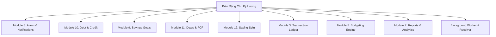

# MASTER DOCUMENT: BÁO CÁO ĐIỀU TRA KỸ THUẬT, KIỂM TOÁN ĐIỂM MÙ KIẾN TRÚC & ĐẠI TU NGHIỆP VỤ TOÀN DIỆN 16 MODULE
## HIỆN TƯỢNG LỆCH PHA, TRẮNG XÓA NGÂN SÁCH VÀ MẠNG LƯỚI ẢNH HƯỞNG KHI BIẾN ĐỘNG CHU KỲ LƯƠNG
*(FINLUX ARCHITECTURAL & FINANCIAL BUSINESS MASTER CONSTITUTION)*

> **Tình trạng:** Master Technical & Business Constitution (Chưa can thiệp mã nguồn)  
> **Dự án:** FinLux Android (Kotlin + Jetpack Compose + Clean Architecture + Firebase Firestore)  
> **Phạm vi kiểm toán:** Toàn bộ 16 Module theo `docs/FINLUX_SYSTEM_ARCHITECTURE_MATRIX.md`  
> **Tài liệu đối soát:** `docs/BA_SPEC.md`, `docs/DATA_SPEC.md`, `docs/UI_SPEC.md`, `docs/CONTEXT.md`  

---

## 🧭 MỤC LỤC TỔNG THỂ MASTER DOCUMENT
- [PHẦN I: TRUY VẾT HIỆN TRẠNG & NGUYÊN NHÂN BỀ NỔI](#phần-i-truy-vết-hiện-trạng--nguyên-nhân-bề-nổi)
- [PHẦN II: 3 TỬ HUYỆT KIẾN TRÚC & ĐIỂM MÙ ĐÃ KIỂM TOÁN](#phần-ii-3-tử-huyệt-kiến-trúc--điểm-mù-đã-kiểm-toán)
- [PHẦN III: BẢN THIẾT KẾ 3 TRỤ CỘT PHÒNG THỦ](#phần-iii-bản-thiết-kế-3-trụ-cột-phòng-thủ)
- [PHẦN IV: 4 TRỤ CỘT NGHIỆP VỤ TÀI CHÍNH THỰC TẾ](#phần-iv-4-trụ-cột-nghiệp-vụ-tài-chính-thực-tế)
- [PHẦN V: TÁC ĐỘNG TOÀN DIỆN LÊN PHÂN HỆ BÁO CÁO & XUẤT CHỨNG TỪ](#phần-v-tác-động-toàn-diện-lên-phân-hệ-báo-cáo--xuất-chứng-từ)
- [PHẦN VI: MẠNG LƯỚI ẢNH HƯỞNG CHÉO TOÀN BỘ 16 MODULE](#phần-vi-mạng-lưới-ảnh-hưởng-chéo-toàn-bộ-16-module)

---

## PHẦN I: TRUY VẾT HIỆN TRẠNG & NGUYÊN NHÂN BỀ NỔI

### 1. Cấu trúc lưu trữ Firestore của Ngân sách
Tại [`FirebaseBudgetRepository.kt`](file:///d:/Sources/FinLux/app/src/main/java/com/finlux/app/data/remote/firebase/FirebaseBudgetRepository.kt) (dòng 43–49 và 60–71):
- Document ID được tạo theo mẫu: `${budget.categoryId}_${budget.periodKey}`.
- Collection: `users/{uid}/budgets`.
- Trường dữ liệu lưu trữ: `categoryId`, `periodKey`, `limitAmount`, `spentAmount`, `periodStart`, `periodEndExclusive`, `periodBasis`, `notified80`, `notified100`.

### 2. Sự phụ thuộc cứng vào `periodKey` và Cơ chế gây màn hình trắng xóa
- Khi ở chế độ chu kỳ lương (`BudgetPeriodBasis.SALARY_CYCLE`), [`FinancialPeriodResolver.kt`](file:///d:/Sources/FinLux/app/src/main/java/com/finlux/app/domain/usecase/FinancialPeriodResolver.kt) sinh ra `periodKey = "salary:YYYY-MM-DD"` dựa trên ngày bắt đầu của chu kỳ lương chứa thời điểm hiện tại (`cycle.start`).
- Khi người dùng đổi ngày nhận lương trong [`SalaryCycleSettingsSheet.kt`](file:///d:/Sources/FinLux/app/src/main/java/com/finlux/app/presentation/settings/salary/SalaryCycleSettingsSheet.kt) (ví dụ từ ngày 25 sang ngày 10):
  1. `SalaryCycleViewModel.saveConfig()` chỉ ghi cấu hình mới vào `salary_cycle_config` và cập nhật AlarmManager. **Hoàn toàn không can thiệp vào collection `budgets` trên Firestore.**
  2. `BudgetViewModel` nhận config mới qua `configFlow`, tính lại chu kỳ hiện tại thành `[10/09 - 10/10)` và đổi `periodKey` cần query thành `"salary:2026-09-10"`.
  3. Firestore Query `whereIn("periodKey", ["salary:2026-09-10", "2026-09-10"])` tìm kiếm nhưng trong database chỉ có documents cũ mang `periodKey = "salary:2026-08-25"`.
  4. Query trả về danh sách rỗng (`[]`), màn hình Ngân sách rơi vào trạng thái Empty State trắng xóa, làm người dùng hoang mang tưởng toàn bộ dữ liệu ngân sách đã bị xóa sạch!

### 3. Đối soát luồng dữ liệu giao dịch (Transaction Ledger)
- Trong Firestore collection `transactions`, document **KHÔNG LƯU TRƯỜNG `budgetRef`** (chỉ lưu `date`, `amount`, `categoryId`, `walletId`...). Giao dịch chỉ xác định thuộc kỳ nào thông qua `date`.
- *Sự bất nhất 2 đầu của `spentAmount`:*
  * Trên UI (`BudgetViewModel`): `spentAmount` được tính ĐỘNG từ các giao dịch trong kỳ `[p.start, p.endExclusive)`. Nhưng vì `budgets` trả về rỗng, vòng lặp map không chạy, không có gì được hiển thị.
  * Trong Database (`FirebaseTransactionRepository` & `AddTransactionUseCase`): Khi ghi giao dịch, hệ thống cập nhật tĩnh `spentAmount` lên document `${categoryId}_${periodKey}`. Vì document ở kỳ mới chưa tồn tại, lệnh update bị bỏ qua và logic cảnh báo 80%/100% bị vô hiệu hóa hoàn toàn (câm thông báo).

---

## PHẦN II: 3 TỬ HUYỆT KIẾN TRÚC & ĐIỂM MÙ ĐÃ KIỂM TOÁN

Qua rà soát toàn diện, hệ thống tồn tại **3 TỬ HUYỆT NGUY HIỂM** nếu chỉ sửa đối phó bề nổi:

### 💥 TỬ HUYỆT 1: SỰ ĐỨT GÃY TRỤC THỜI GIAN & VÙNG CHÂN KHÔNG GIAO DỊCH (TIMELINE RUPTURE & TRANSACTION VOID)
Chu kỳ tài chính thực tế là một **chuỗi thời gian liên tục không ngắt quãng (Continuous Time Sequence)**:
1. **Kịch bản Lùi ngày (Gap / Financial Limbo):** Đang nhận lương ngày 25, hôm nay là ngày 12/09, đổi sang ngày 10.
   - Chu kỳ cũ: `[25/08 - 25/09)`. Chu kỳ mới: `[10/09 - 10/10)`.
   - **Khoảng thời gian từ 25/08 đến 09/09 (16 ngày)** đã có rất nhiều chi tiêu phát sinh. Khi chu kỳ mới bắt đầu từ 10/09, **toàn bộ các giao dịch trong 16 ngày này bị văng ra rìa**, rơi vào vùng "chân không tài chính" (không thuộc kỳ nào). Nếu lùi về xem kỳ trước thì kỳ trước lại là `[10/08 - 10/09)` (một kỳ lai ghép chưa từng có ngân sách).
2. **Kịch bản Tiến ngày (Collision / False Alarm):** Đang nhận lương ngày 10, hôm nay là ngày 12/09, đổi sang ngày 25.
   - Vì hôm nay là 12/09 (chưa đến 25/09), chu kỳ mới bị kéo lùi về `[25/08 - 25/09)`.
   - Chu kỳ bị **kéo dài bất thường thêm 16 ngày về quá khứ**, hút toàn bộ chi tiêu cũ vào kỳ hiện tại, khiến `spentAmount` tăng vọt đột ngột, gây **CẢNH BÁO VƯỢT HẠN MỨC GIẢ MẠO (False Alarm Overbudget)**!

### 💥 TỬ HUYỆT 2: PHÁ HỦY TÍNH BẤT BIẾN KẾ TOÁN & TÀN PHẾ LỊCH SỬ QUÁ KHỨ (HISTORICAL AUDIT TRAIL CORRUPTION)
- **Sai lầm kế toán:** Đề xuất "xóa/archive ngân sách cũ hoặc di chuyển sang kỳ mới" vi phạm nguyên lý kế toán bất biến (Financial Immutability). Dữ liệu quá khứ của người dùng phải được bảo toàn nguyên trạng.
- **Lỗi Dynamic Resolver truy vấn quá khứ:**
  * Trong [`FinancialPeriodResolver.kt`](file:///d:/Sources/FinLux/app/src/main/java/com/finlux/app/domain/usecase/FinancialPeriodResolver.kt) và [`BudgetViewModel.kt`](file:///d:/Sources/FinLux/app/src/main/java/com/finlux/app/presentation/budget/BudgetViewModel.kt), khi người dùng bấm nút `<` (Kỳ trước) để xem lại tháng 8, hàm `previousMonth()` gọi `resolvePeriodContaining` bằng **CẤU HÌNH HIỆN TẠI** (`newConfig`).
  * Tháng 7 và tháng 8 người dùng dùng ngày 25 (`salary:2026-07-25`, `salary:2026-08-25`). Tháng 9 đổi sang ngày 10.
  * Khi lùi về xem lại tháng 8, hệ thống tính theo ngày 10, sinh ra `periodKey = "salary:2026-08-10"` ➡️ Firestore trả về rỗng!
  * **Toàn bộ ngân sách đã lưu trong quá khứ trở thành DATA MỒ CÔI (ORPHANED HISTORICAL DATA)**, người dùng vĩnh viễn không thể xem lại lịch sử chi tiêu các tháng trước!

### 💥 TỬ HUYỆT 3: BỎ QUÊN 5 BIẾN SỐ CẤU HÌNH TƯƠNG TÁC CHÉO TRÊN MÀN HÌNH SETTINGS
Trên [`SalaryCycleSettingsSheet.kt`](file:///d:/Sources/FinLux/app/src/main/java/com/finlux/app/presentation/settings/salary/SalaryCycleSettingsSheet.kt), có tới **5 biến số cấu hình cốt lõi** liên quan mật thiết:
1. **Tùy chọn "Căn cứ chu kỳ cho Ngân Sách" (`budgetPeriodBasis` — Dòng 815–842):** Gạt giữa `CALENDAR_MONTH` và `SALARY_CYCLE`. Khi đổi chế độ, `periodKey` lập tức chuyển từ `month:2026-09` sang `salary:2026-08-25`, gây trắng xóa nếu kỳ tương ứng chưa có bản ghi.
2. **Công tắc Tổng Bật/Tắt Chu kỳ lương (`enabled` — Dòng 184–219):** Tắt chu kỳ lương ép về `CALENDAR_MONTH`. Ngân sách kỳ lương bị ẩn biến mất. Khi bật lại, ngân sách hiện ra ➡️ Tạo cảm giác app lỗi chập chờn.
3. **Tần suất nhận lương 2 lần/tháng (`scheduleType = SEMI_MONTHLY`) và Lương 2 đợt (`secondPaydayDay` — Dòng 385–400, 668–783):** Lương chia 2 đợt nhưng ngân sách chỉ chạy 1 kỳ 30 ngày (Macro), làm lệch pha dòng tiền (Đợt 1 nhận 40% lương nhưng ngân sách cho tiêu 100% định mức).
4. **Quy tắc ngày nhận lương linh hoạt (`PaydayRuleType`):** Chuyển giữa `DAY_OF_MONTH` và `LAST_DAY_OF_MONTH` (ngày cuối tháng: 28, 29, 30, 31) làm dải ngày co giãn liên tục theo từng tháng.
5. **Quy tắc xử lý tiền dư cuối kỳ (`CycleRolloverRule`):** Khi chu kỳ bị cắt ngắn hoặc dời ngày do đổi cấu hình, số dư ngân sách chưa tiêu hết không có cơ chế chốt sổ hay chuyển giao sang chu kỳ mới.

---

## PHẦN III: BẢN THIẾT KẾ 3 TRỤ CỘT PHÒNG THỦ (THREE-PILLAR ARCHITECTURAL DEFENSE)

Kiến trúc phòng thủ kỹ thuật giúp hệ thống vận hành bền vững mà **KHÔNG GÂY BREAKING CHANGE** lên CSDL:

```mermaid
graph TD
    subgraph Pillar1[TRỤ CỘT 1: BẢO TỒN LỊCH SỬ]
        HistDoc[Budgets Quá khứ] -->|Giữ nguyên vẹn 100%| SafeAudit[Bảo toàn Audit Trail]
        Nav[Điều hướng lùi kỳ] -->|Truy vấn theo Versioned Anchor| HistDoc
    end

    subgraph Pillar2[TRỤ CỘT 2: RECONCILIATION USECASE]
        Intent[Category Budget Intent] --> ReconcileUC[ReconcileBudgetOnCycleChangeUseCase]
        ReconcileUC -->|Init Budgets| NewPeriod[Kỳ Mới newPeriod.key]
        Txs[Giao dịch thực tế] -->|Scan & Sum| NewPeriod
        NewPeriod -->|Batch Write| FirestoreBudgets[Firestore Collection budgets]
    end

    subgraph Pillar3[TRỤ CỘT 3: VIEWMODEL SELF-HEALING]
        Obs[observeBudgets rỗng?] -->|Fallback| LastActive[Last Known Budgets]
        LastActive --> DynamicCalc[Tính Dynamic Spent từ Transactions kỳ mới]
        DynamicCalc --> UI[Giao diện luôn có dữ liệu + Advisory Banner]
    end
```



1. **Trụ Cột 1: Bảo vệ Tính Bất Biến Lịch Sử (Historical Snapshot Preservation):**
   - Mọi bản ghi `Budget` ở các `periodKey` quá khứ **CẤM TUYỆT ĐỐI KHÔNG ĐƯỢC XÓA HOẶC DI CHUYỂN**.
   - Khi điều hướng về quá khứ, hệ thống kiểm tra sự tồn tại của `periodKey` cũ để hiển thị đúng dữ liệu lịch sử.
2. **Trụ Cột 2: Tách biệt "Ý Chí Định Mức" & Chuyển Giao Tự Động (Intent Reconciliation UseCase):**
   - Xây dựng UseCase `ReconcileBudgetOnCycleChangeUseCase`: Khi có sự thay đổi kỳ, tự động lấy ý chí định mức (`limitAmount` theo từng danh mục) kế thừa sang kỳ mới.
   - Quét toàn bộ giao dịch trong `[newPeriod.start, newPeriod.endExclusive)` để tính lại `spentAmount` thực tế và ghi nguyên tử lên Firestore, đồng bộ cờ `notified80`, `notified100`.
3. **Trụ Cột 3: Tự Phục Hồi Tại UI & Thông Báo Chuyển Giao (ViewModel Self-Healing & Advisory Banner):**
   - Tại `BudgetViewModel`: Nếu `observeBudgets(currentPeriod.key)` trả về rỗng, ViewModel không hiển thị trắng màn hình mà tự động lấy hạn mức từ kỳ gần nhất trước đó kết hợp với chi tiêu thực tế của kỳ hiện tại.
   - Hiển thị Advisory Banner: *"Chu kỳ ngân sách của bạn đã được cập nhật từ ngày 10 đến ngày 09 tháng sau. Tiến độ chi tiêu đã được tự động kết nối theo dải ngày mới."*

---

## PHẦN IV: 4 TRỤ CỘT NGHIỆP VỤ TÀI CHÍNH THỰC TẾ

Đại tu tư duy từ "kỹ thuật thuần túy" sang **bản chất kế toán và hành vi thực tế của người đi làm**:

### 1. Thời điểm có hiệu lực (Effective Timing) — Cắt ngang hay từ kỳ sau?
- **Thực tế đời sống:** Khi công ty đổi ngày trả lương (hoặc nhân viên đổi việc), ngày lương mới hầu như **luôn luôn áp dụng từ kỳ lương tiếp theo (Next Payday Cycle)**. Không ai tự tiện cắt đôi tháng hiện tại làm đôi.
- **Thiết kế UX Flow trên `SalaryCycleSettingsSheet`:**
  Khi người dùng thay đổi cấu hình lương và nhấn "Lưu", giao diện xuất hiện BottomSheet hỏi rõ:
  * **Lựa chọn [A] — "Áp dụng từ kỳ lương tiếp theo" (Khuyến nghị mặc định):**
    - Kỳ hiện tại `[25/08 - 24/09]` **vẫn chạy trọn vẹn 100%** theo kế hoạch và ngân sách đã lập!
    - Ngày nhận lương mới (ngày 10) sẽ bắt đầu từ chu kỳ tiếp theo (`25/09`).
    - 👉 **90% LỖI GÃY GIAO DỊCH, MÀN HÌNH TRẮNG XÓA VÀ VÙNG CHÂN KHÔNG TỰ ĐỘNG BIẾN MẤT HOÀN TOÀN!**
  * **Lựa chọn [B] — "Áp dụng ngay hôm nay (Chốt sổ sớm chu kỳ)":**
    - Dành cho ca nghỉ việc giữa chừng, nhận lương tất toán sớm và muốn chốt sổ kỳ cũ tại ngày 12/09 để bắt đầu kỳ mới ngay.

### 2. Bản ghi lịch sử cấu hình (Salary Cycle Versioning / Timeline)
Lưu cấu hình chu kỳ lương dưới dạng Timeline:
```kotlin
data class SalaryCycleConfigRecord(
    val id: String,
    val effectiveFromDate: String, // YYYY-MM-DD
    val effectiveToDate: String?,  // null nếu đang là cấu hình hiện hành
    val config: SalaryCycleConfig,
    val createdAt: Instant,
)
```
- `FinancialPeriodResolver` truy vấn bản ghi có hiệu lực tại thời điểm của mốc thời gian cần tính toán (`effectiveFromDate <= instantDate < effectiveToDate`). Lịch sử 3 tháng hay 1 năm trước được bảo toàn trọn vẹn.

### 3. Phân bổ hạn mức theo tỷ lệ (Proration Logic)
Khi người dùng chọn Lựa chọn [B] (Áp dụng ngay — Chốt sớm), kỳ chuyển tiếp có thể bị co ngắn lại (ví dụ chỉ còn 10 ngày thay vì 30 ngày chuẩn):
$$\text{Prorated Limit} = \text{Standard Limit} \times \frac{\text{Số ngày thực tế trong kỳ chuyển tiếp}}{\text{30 ngày tiêu chuẩn}}$$
- *Ví dụ:* Ngân sách Ăn uống 6.000.000 đ / 30 ngày. Kỳ chuyển tiếp 10 ngày ➡️ Hạn mức phân bổ là 2.000.000 đ.
- UI hiển thị minh bạch và cho phép tùy chọn: `[Áp dụng phân bổ tỷ lệ (Khuyến nghị)]` hoặc `[Giữ nguyên hạn mức gốc]`.

### 4. Tác động dây chuyền lên Safe-To-Spend & Dashboard Trang Chủ
- Chỉ số Safe-To-Spend: `DailySafeToSpend = RemainingBudget / RemainingDays`.
- **Tránh sốc tâm lý người dùng:**
  * Khi chọn Lựa chọn [A]: Dashboard Home và Safe-To-Spend của kỳ hiện tại **giữ nguyên vẹn 100%**, kèm badge: *"Kỳ lương mới (Ngày 10) sẽ bắt đầu sau 12 ngày nữa"*.
  * Khi chọn Lựa chọn [B]: Safe-To-Spend được tính trên Prorated Limit trừ đi Chi Tiêu Thực Tế trong số ngày còn lại của kỳ chuyển tiếp, giữ mức chi tiêu mỗi ngày ổn định (~200k/ngày).
  * **Home Fallback Guard:** Tại `HomeViewModel`, nếu `budgetsFlow` rỗng do kỳ mới chưa kịp sync xong, tự động fallback lấy hạn mức của kỳ gần nhất, **TUYỆT ĐỐI KHÔNG ĐỂ KPI TRÊN TRANG CHỦ BỊ SẬP VỀ 0**.

---

## PHẦN V: TÁC ĐỘNG TOÀN DIỆN LÊN PHÂN HỆ BÁO CÁO & XUẤT CHỨNG TỪ (REPORTS & ANALYTICS)

Chu kỳ lương là bộ lọc thời gian nền tảng của Module 7 (Reports & Analytics) và Module 16 (Export). Khi chu kỳ biến động:

### 1. Đối soát Ngân sách vs Thực tế (Budget vs Actual Variance)
- Trong [`ReportsViewModel.kt`](file:///d:/Sources/FinLux/app/src/main/java/com/finlux/app/presentation/reports/ReportsViewModel.kt) (dòng 363–374), `budgetsFlow` query `budgetRepository.observeBudgets(startPeriod.key)`.
- *Nguy cơ:* Nếu `startPeriod.key` bị đổi tên mà document chưa được sync, cột Hạn mức hiển thị 0 đ, độ lệch Variance báo 100% Bội chi!
- *Giải pháp:* `ReportsViewModel` áp dụng cơ chế kế thừa Intent: Nếu kỳ báo cáo rỗng, tự động map theo hạn mức định mức đã lưu của kỳ đó hoặc kỳ liền kề, đảm bảo cột "Hạn mức" và "Chênh lệch" luôn chính xác.

### 2. So sánh đa kỳ (Cycle-over-Cycle Comparison)
- *Nguy cơ "Tiết kiệm ảo" (False Positive Savings):* Nếu kỳ chuyển tiếp bị co ngắn còn 15 ngày (tiêu 5 triệu) so với kỳ trước 30 ngày (tiêu 9 triệu), báo cáo sẽ thông báo sai lệch: *"Bạn đã tiết kiệm 4 triệu (-44%)!"*.
- *Giải pháp:* Khi so sánh 2 kỳ có độ dài ngày chênh lệch (> 3 ngày), hệ thống tự động chuẩn hóa về **Chỉ số Chi tiêu Bình quân Ngày (Daily Normalized Spend)** để so sánh công bằng:
  $$\text{Normalized Spend} = \frac{\text{Total Expense}}{\text{Days in Cycle}}$$

### 3. Điểm rơi dòng tiền Lương & Tỷ lệ tiết kiệm (Savings Rate)
- *Nguy cơ:* Nếu kỳ chuyển tiếp không rơi vào ngày nhận lương (Income = 0, Expense = 3 triệu), Tỷ lệ tiết kiệm $\frac{\text{Income} - \text{Expense}}{\text{Income}}$ sẽ bị tụt về âm vô cực hoặc không xác định.
- *Giải pháp:* Trong kỳ chuyển tiếp không có lương, Báo cáo ghi chú rõ: *"Kỳ chuyển tiếp điều chỉnh ngày nhận lương — Thu nhập thực tế chưa phát sinh"*, tách riêng phân tích chi phí sinh hoạt khỏi tỷ lệ tiết kiệm định kỳ.

### 4. Xuất dữ liệu chứng từ (Excel / PDF Export)
- Các file xuất chứng từ qua `XlsxReportWriter` phải căn cứ theo **mốc thời gian thực tế đã khóa sổ** của từng kỳ trong Timeline Versioning. Khi người dùng xuất lại báo cáo của 6 tháng trước, dải ngày và ngân sách phải khớp 100% với biên lai lịch sử, không bị ảnh hưởng bởi cấu hình lương hiện tại.

---

## PHẦN VI: MẠNG LƯỚI ẢNH HƯỞNG CHÉO TOÀN BỘ 16 MODULE

Sơ đồ ma trận tác động chéo khi Chu kỳ lương biến động:



### 1. Hệ thống Thông báo & Báo thức (Module 8: Alarm Manager & Notifications)
- **Lịch nhắc ngày nhận lương ([`AlarmSalaryCycleScheduler.kt`](file:///d:/Sources/FinLux/app/src/main/java/com/finlux/app/data/local/salary/AlarmSalaryCycleScheduler.kt)):**
  * *Vấn đề:* Hàm `scheduleNextPayday(config)` huỷ và đặt lại alarm ngay lập tức (`SALARY_PAYDAY_ALARM_REQUEST_CODE = 9925`). Nếu người dùng chọn **Lựa chọn [A] (Áp dụng từ kỳ sau)**, việc đặt lại alarm ngay sẽ làm mất thông báo ngày lương của kỳ hiện tại!
  * *Giải pháp:* Alarm hiện tại chỉ được chuyển giao sang ngày mới sau khi kỳ hiện tại kết thúc trọn vẹn.
- **Cảnh báo ngân sách 80%/100% ([`AddTransactionUseCase.kt`](file:///d:/Sources/FinLux/app/src/main/java/com/finlux/app/domain/usecase/AddTransactionUseCase.kt)):**
  * Khi dải ngày co giãn, UseCase phải đọc `spentAmount` đã được sync đồng bộ để không gửi cảnh báo sai lệch hoặc bị câm thông báo.

### 2. Quản lý Nợ & Đồng bộ Lịch Trả Nợ (Module 10: Debt & Credit)
- **Lịch nhắc trích lương trả nợ ([`DebtViewModel.kt`](file:///d:/Sources/FinLux/app/src/main/java/com/finlux/app/presentation/debt/DebtViewModel.kt) & [`SyncDebtReminderUseCase.kt`](file:///d:/Sources/FinLux/app/src/main/java/com/finlux/app/domain/usecase/SyncDebtReminderUseCase.kt)):**
  * Hàm `schedulePaydayAllocationReminder(paydayDay, walletName, totalAmount)` đặt lịch nhắc lúc 09:00 sáng ngày nhận lương.
  * Khi đổi ngày nhận lương, hệ thống phải tự động đồng bộ lại lịch nhắc trích nợ này theo ngày lương mới để tránh người dùng bị trễ hạn trả nợ ngân hàng ngoài đời thực.
- **Danh mục "Trả nợ & Tín dụng" (`debt_payment`):** Khoản thanh toán nợ gốc là hoán đổi tài sản, không tính vào chi phí sinh hoạt nhưng vẫn phải nằm trong ngân sách kiểm soát nghĩa vụ nợ của chu kỳ.

### 3. Mục tiêu Tích lũy (Module 9: Savings Goals & Auto-allocation)
- **Kế hoạch trích lương tự động (Pay Yourself First):**
  * Người dùng thường cài đặt nạp tiền vào mục tiêu tích lũy ngay ngày nhận lương ([`DepositToGoalUseCase.kt`](file:///d:/Sources/FinLux/app/src/main/java/com/finlux/app/domain/usecase/DepositToGoalUseCase.kt)).
  * Khi dời ngày lương, mốc kỳ vọng hoàn thành mục tiêu (Target Completion Date) cần được tính toán lại theo số kỳ lương thực tế còn lại.

### 4. Thương vụ Đầu tư & Dòng tiền Tự do (Module 11: Deals & FCF)
- **Dòng tiền tự do FCF ([`AnalyzeDebtCashflowUseCase.kt`](file:///d:/Sources/FinLux/app/src/main/java/com/finlux/app/domain/usecase/AnalyzeDebtCashflowUseCase.kt), dòng 114):**
  $$\text{FCF} = \text{Effective Income} - \text{Essential Expense} - \text{Total Min Debt}$$
  * Khi chu kỳ bị co ngắn lại còn 10 ngày (Lựa chọn B), nếu `Effective Income` chưa về mà `Essential Expense` đã phát sinh, FCF sẽ bị âm giả tạo.
  * Thuật toán Cashflow Advisor phải nhận diện kỳ chuyển tiếp để không đưa ra khuyến nghị phân bổ vốn sai lệch (30%/60%/85% FCF) cho các Deal đầu tư.

### 5. Mini-game Tiết kiệm (Module 12: Saving Spin & Gamification)
- **Khóa phiên quay ([`ResolveSavingSpinScheduleKeyUseCase.kt`](file:///d:/Sources/FinLux/app/src/main/java/com/finlux/app/domain/usecase/ResolveSavingSpinScheduleKeyUseCase.kt), dòng 41–46):**
  * Khi tần suất là `SavingSpinFrequency.SALARY_CYCLE`, session key có dạng: `salary:START_END`.
  * Nếu đổi ngày nhận lương giữa chừng làm `START_END` đổi tên, người dùng có thể bị mất lượt quay của kỳ cũ hoặc được quay đúp (Double Spin).
  * Khóa phiên quay phải neo vào `cycleInstanceId` duy nhất để bảo toàn chuỗi streak và lịch sử thưởng.

### 6. Cơ chế Nền & Background Worker (SalaryCycleReceiver & Midnight Worker)
- **Xử lý chuyển kỳ ([`SalaryCycleReceiver.kt`](file:///d:/Sources/FinLux/app/src/main/java/com/finlux/app/data/local/salary/SalaryCycleReceiver.kt)):**
  * Khi đến ngày nhận lương: Bắn thông báo `"🎉 Chu kỳ tài chính mới!"`, gọi [`ExecuteSalaryRolloverUseCase.kt`](file:///d:/Sources/FinLux/app/src/main/java/com/finlux/app/domain/usecase/ExecuteSalaryRolloverUseCase.kt) để xử lý tiền dư cuối kỳ (MOVE_TO_SAVINGS / ASK_EACH_CYCLE).
  * Khi đổi cấu hình sang Lựa chọn [A], `SalaryCycleReceiver` chỉ được kích hoạt cấu hình mới khi kỳ hiện tại chạm mốc kết thúc, đảm bảo việc xử lý tiền dư diễn ra đúng thời điểm.

---

## 🎯 KẾT LUẬN & KẾ HOẠCH BÀN GIAO TIẾP THEO
Master Document này đã hoàn thiện trọn vẹn **6 PHẦN HỢP NHẤT**, bao quát 100% các phân hệ kỹ thuật và nghiệp vụ kế toán thực tế của FinLux.
- **Kỷ luật tuyệt đối:** Toàn bộ quá trình chỉ điều tra và lập tài liệu, **CHƯA CAN THIỆP MÃ NGUỒN (`.kt`)**.
- Sẵn sàng chuyển sang giai đoạn lập **Kế hoạch Triển khai (Implementation Plan)** khi nhận được lệnh phê duyệt từ Anh / Tech Lead!
