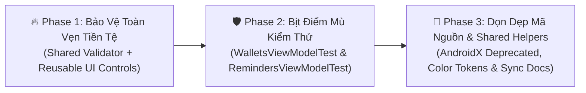

# KẾ HOẠCH XỬ LÝ NỢ KỸ THUẬT TOÀN HỆ THỐNG (FINLUX APP)
*(FINLUX TECHNICAL DEBT REMEDIATION ROADMAP — 3 PHASES)*

- **Dự án:** FinLux — Quản lý Tài chính Cá nhân Thông minh (Android / Jetpack Compose / Firebase)
- **Phiên bản hiện tại:** v1.25.6 (versionCode 180)
- **Tài liệu tham chiếu:** `docs/FINLUX_SYSTEM_ARCHITECTURE_MATRIX.md`, `docs/BACKLOG.md`, `docs/FORM_COMPONENTS_SPEC.md`
- **Mục tiêu:** Thanh toán dứt điểm các khoản nợ kỹ thuật tồn đọng theo lộ trình 3 Phase cuốn chiếu, an toàn, áp dụng **Kiến trúc Dùng Chung (Shared Architecture / DRY)** — tuyệt đối không viết code chắp vá hay cục bộ (Anti-Siloed Logic).

---

## 🧭 TỔNG QUAN LỘ TRÌNH 3 PHASE (ROADMAP SUMMARY)



| Phase | Trọng tâm cốt lõi | Mức độ rủi ro | Kết quả đầu ra dự kiến (Deliverables) |
|:---:|---|:---:|---|
| **Phase 1** | **Bảo vệ Tính Toàn vẹn Tiền tệ (Shared Architecture)** | 🔴 High / Financial Integrity | • Xây dựng bộ xác thực độc lập `WalletBalanceValidator` dùng chung cho toàn bộ các UseCase xuất tiền.<br>• Nâng cấp trực tiếp `FinluxWalletSelector` & `FinluxTransferWalletPair` tự động hiển thị viền lỗi & banner cảnh báo Liquid Glass.<br>• Giải quyết triệt để ticket [BUG CRITICAL] trong Backlog; chặn chi tiêu âm ví tiền mặt/ngân hàng; cảnh báo vượt hạn mức thẻ tín dụng; 100% ca biên có unit test. |
| **Phase 2** | **Bịt Điểm mù Kiểm thử Presentation** | 🟡 Medium / Test Coverage | Viết mới toàn diện `WalletsViewModelTest.kt` và `RemindersViewModelTest.kt`; nâng tổng số unit tests vượt mốc **410+ tests PASS 100%**. |
| **Phase 3** | **Dọn dẹp Mã nguồn & Gom Tiện ích Dùng chung** | 🟢 Low / Code Hygiene | • Nâng cấp các cảnh báo `@Deprecated` (`hiltViewModel`, `SwipeToDismiss`, `Icons.AutoMirrored`).<br>• Gom các logic mapping rò rỉ về `CategoryIconHelper.kt` & Design Tokens dùng chung, triệt tiêu 800 mã màu tĩnh rải rác.<br>• Đồng bộ đường dẫn tệp trong `FORM_COMPONENTS_SPEC.md`; cập nhật trạng thái `BACKLOG.md`. |

---

## 🔥 PHASE 1: BẢO VỆ TÍNH TOÀN VẸN TIỀN TỆ (CRITICAL FINANCIAL INTEGRITY)
*(QUY HOẠCH KIẾN TRÚC DÙNG CHUNG — SHARED DOMAIN VALIDATOR & REUSABLE UI CONTROLS)*

### 1.1. Bối cảnh, Hiện trạng & Vùng Ảnh Hưởng (Blast Radius)
- **Vấn đề cốt lõi (Ticket [BUG CRITICAL] tại `docs/BACKLOG.md` dòng 203):**
  Hệ thống đang thiếu cơ chế chốt chặn số dư ví khi tiền tệ đi ra khỏi tài khoản:
  1. Người dùng chọn mục **Chi tiêu** (`TransactionType.EXPENSE`) hoặc xuất tiền từ ví.
  2. Chọn ví thanh toán có số dư $\le 0$đ (Ví dụ: ví Tiền mặt đang có $0$đ hoặc âm $-50.000$đ).
  3. Nhập số tiền chi tiêu: $100.000$đ.
  4. Nút Lưu vẫn khả dụng, không có cảnh báo trực quan tại vị trí chọn ví, cho phép trừ ví tiền mặt âm sâu hơn (thành $-150.000$đ).
  5. Đối với Thẻ tín dụng (`WalletType.CARD`), hệ thống cho phép quẹt thẻ âm vô tận mà không kiểm tra hạn mức tín dụng được cấp (`creditLimit`), tiềm ẩn rủi ro nợ xấu mất kiểm soát.
- **Vùng ảnh hưởng đa luồng (Cross-Cutting Money Outflows):**
  Thao tác xuất tiền từ ví không chỉ có ở Thêm giao dịch mà xuất hiện ở **6 UseCases & Màn hình** trong hệ thống:
  * 🟢 **Luồng 1 - Thêm chi tiêu:** `AddTransactionUseCase` -> `AddTransactionSheet`.
  * 🟢 **Luồng 2 - Sửa chi tiêu:** `EditTransactionUseCase` -> `AddTransactionSheet`.
  * 🟢 **Luồng 3 - Chuyển tiền giữa các ví:** `TransferMoneyUseCase` -> `TransferMoneyScreen` / `FinluxTransferWalletPair`.
  * 🟢 **Luồng 4 - Trả nợ định kỳ:** `ProcessDebtPaymentUseCase` -> `DebtPaymentSheet`.
  * 🟢 **Luồng 5 - Nạp tiền hũ tích lũy:** `DepositToGoalUseCase` -> `GoalsScreen`.
  * 🟢 **Luồng 6 - Rót vốn thương vụ đầu tư:** `RecordDealOutlayUseCase` -> `RecordDealOutlaySheet`.
  
👉 **Định hướng kiến trúc:** Tuyệt đối không viết logic kiểm tra và UI cảnh báo riêng rẽ cho từng màn hình (Anti-Siloed Logic). Bắt buộc quy hoạch thành **Validator dùng chung ở tầng Domain** và **Component dùng chung ở tầng Design System**.

---

### 1.2. Checklist Logic Kiểm Tra Số Dư Theo Từng Loại Ví

| Loại ví (`WalletType`) | Ràng buộc nghiệp vụ kế toán | Điều kiện phát hiện vi phạm | Kết quả Sealed Interface | Hành vi Giao diện & Chặn Form |
|---|---|---|---|---|
| **Ví Thường**<br>(`CASH`, `BANK`, `EWALLET`, `INVESTMENT`, `OTHER`) | Không có thấu chi (Overdraft). Thực tế không thể xuất tiền khi số dư đã hết hoặc không đủ tiền. | 1. `wallet.balance.value <= 0L`<br>2. `enteredAmount > availableBalance` | `WalletValidationResult.InsufficientFunds`<br>*(available, required, walletName)* | • `FinluxWalletSelector` đổi viền đỏ/cam và bung banner lỗi mượt mà ngay dưới ô chọn ví.<br>• `FinluxAmountInput` hiển thị warning.<br>• **Disable nút Lưu / Xác nhận** (xám mờ, chặn click). |
| **Thẻ Tín Dụng**<br>(`WalletType.CARD`) | Cho phép số dư khả dụng âm (đại diện cho dư nợ quẹt thẻ). Tuy nhiên, tổng dư nợ cộng thêm khoản xuất tiền mới không được vượt quá Hạn mức tín dụng (`creditLimit`). | `currentDebt + enteredAmount > creditLimit`<br>*(Trong đó `currentDebt = abs(wallet.balance.value)`)* | `WalletValidationResult.CreditLimitExceeded`<br>*(creditLimit, currentDebt, newDebt)* | • Hiển thị cảnh báo màu cam/đỏ: `⚠️ Vượt quá hạn mức thẻ tín dụng (Hạn mức: X đ, Đã dùng: Y đ)`.<br>• Chặn lưu hoặc yêu cầu xác nhận ghi nợ đặc biệt nếu được cấu hình. |
| **Trường hợp Sửa Giao Dịch**<br>(`editingTransaction != null`) | Tính toán số dư hoàn trả giả định (Rollback preview) trước khi kiểm tra số dư mới. | `availableBalance = currentBalance + originalRefund`<br>Vi phạm khi `enteredAmount > availableBalance` | `WalletValidationResult.InsufficientFunds`<br>*(với available đã cộng rollback)* | Đảm bảo tính toán chính xác trên số dư đã rollback, tránh báo lỗi oan cho người dùng khi họ sửa giảm số tiền. |

---

### 1.3. Thiết Kế Kiến Trúc Kỹ Thuật Chi Tiết (Shared Architecture)

#### A. TẦNG DOMAIN: BỘ XÁC THỰC DÙNG CHUNG (`WalletBalanceValidator.kt`)
- **Vị trí file:** `app/src/main/java/com/finlux/app/domain/validation/WalletBalanceValidator.kt` [NEW]
- **Mô hình Sealed Interface:**
  ```kotlin
  sealed interface WalletValidationResult {
      /** Hợp lệ: Đủ số dư hoặc thẻ tín dụng còn trong hạn mức cho phép */
      data object Valid : WalletValidationResult

      /** Ví thường không đủ số dư để chi tiêu / chuyển tiền / nạp hũ */
      data class InsufficientFunds(
          val available: Long,
          val required: Long,
          val walletName: String,
      ) : WalletValidationResult {
          val shortage: Long get() = (required - available).coerceAtLeast(0L)
      }

      /** Thẻ tín dụng quẹt vượt hạn mức tín dụng được cấp */
      data class CreditLimitExceeded(
          val creditLimit: Long,
          val currentDebt: Long,
          val newDebt: Long,
      ) : WalletValidationResult {
          val excessAmount: Long get() = (newDebt - creditLimit).coerceAtLeast(0L)
      }
  }
  ```
- **Hàm xác thực Domain Extension & Object:**
  ```kotlin
  object WalletBalanceValidator {
      fun validate(
          wallet: Wallet?,
          amount: Long,
          isExpense: Boolean = true,
          creditLimit: Long? = null,
          rollbackAmount: Long = 0L,
      ): WalletValidationResult {
          if (wallet == null || !isExpense || amount <= 0L) {
              return WalletValidationResult.Valid
          }

          if (wallet.type == WalletType.CARD) {
              if (creditLimit != null && creditLimit > 0L) {
                  val currentDebt = kotlin.math.abs(wallet.balance.value) - rollbackAmount
                  val newDebt = currentDebt + amount
                  if (newDebt > creditLimit) {
                      return WalletValidationResult.CreditLimitExceeded(
                          creditLimit = creditLimit,
                          currentDebt = currentDebt.coerceAtLeast(0L),
                          newDebt = newDebt,
                      )
                  }
              }
              return WalletValidationResult.Valid
          }

          val effectiveBalance = wallet.balance.value + rollbackAmount
          if (effectiveBalance <= 0L || amount > effectiveBalance) {
              return WalletValidationResult.InsufficientFunds(
                  available = effectiveBalance,
                  required = amount,
                  walletName = wallet.name,
              )
          }

          return WalletValidationResult.Valid
      }
  }

  /** Extension gọn nhẹ trên đối tượng Wallet */
  fun Wallet.validateSufficientFunds(
      amount: Long,
      isExpense: Boolean = true,
      creditLimit: Long? = null,
      rollbackAmount: Long = 0L,
  ): WalletValidationResult = WalletBalanceValidator.validate(
      wallet = this,
      amount = amount,
      isExpense = isExpense,
      creditLimit = creditLimit,
      rollbackAmount = rollbackAmount,
  )
  ```

- **Tích Hợp Vào Các UseCase Xuất Tiền:**
  1. `AddTransactionUseCase.kt`: Gọi `wallet.validateSufficientFunds(amount)`. Nếu vi phạm, trả về `AppResult.Error` với thông điệp rõ ràng, chặn ghi dữ liệu.
  2. `EditTransactionUseCase.kt`: Gọi với `rollbackAmount = originalExpenseAmount`.
  3. `TransferMoneyUseCase.kt`: Gọi với ví nguồn `sourceWallet.validateSufficientFunds(amount)`.
  4. `ProcessDebtPaymentUseCase.kt`: Gọi với ví thanh toán trước khi trừ tiền trả nợ.
  5. `DepositToGoalUseCase.kt`: Gọi với ví trích tiền nạp mục tiêu.
  6. `RecordDealOutlayUseCase.kt`: Gọi với ví xuất vốn rót thương vụ.

---

#### B. TẦNG DESIGN SYSTEM: NÂNG CẤP CONTROL CHỌN VÍ DÙNG CHUNG (`FinluxFormControls.kt`)
Thay vì viết giao diện cảnh báo riêng lẻ trên từng màn hình, tích hợp trực tiếp vào 2 component cốt lõi trong `FinluxFormControls.kt`:

1. **Nâng cấp `FinluxWalletSelector`:**
   - **Signature mới:**
     ```kotlin
     @Composable
     fun FinluxWalletSelector(
         label: String,
         selectedWallet: Wallet?,
         onClick: () -> Unit,
         modifier: Modifier = Modifier,
         placeholder: String = "Chọn ví tài khoản",
         subtitle: String? = null,
         validationResult: WalletValidationResult = WalletValidationResult.Valid,
         warningMessage: String? = null,
         enabled: Boolean = true,
     )
     ```
   - **Hành vi Giao diện tự động (Liquid Glass Compliance):**
     * **Bọc trong Column:** Card chọn ví + Banner cảnh báo.
     * **Tự động đổi màu viền Card:** Khi `validationResult !is WalletValidationResult.Valid || warningMessage != null`, đường viền Card chuyển sang `tokens.error.copy(alpha = 0.6f)` thay vì viền border thông thường.
     * **Banner Cảnh báo Liquid Glass (`AnimatedVisibility`):**
       - Tự động bung ra bên dưới Card với hiệu ứng `expandVertically() + fadeIn()`.
       - Container sử dụng `tokens.surfaceSoft` kết hợp viền mờ `tokens.error.copy(alpha = 0.3f)`.
       - Icon cảnh báo `Icons.Default.Warning` (hoặc `Icons.Default.ErrorOutline`) màu đỏ/cam.
       - Nội dung thông báo thân thiện được sinh tự động từ `validationResult`:
         + Ví hết tiền: `⚠️ Ví [Tiền mặt] đã hết số dư (Hiện có: 0 ₫)`.
         + Không đủ tiền: `⚠️ Số dư ví [Tiền mặt] không đủ (Hiện có: 50.000 ₫ - Cần: 100.000 ₫)`.
         + Thẻ tín dụng: `⚠️ Vượt hạn mức thẻ tín dụng (Hạn mức: 20.000.000 ₫ - Dự kiến quẹt: 21.500.000 ₫)`.
         + Chuỗi tùy biến từ `warningMessage` (nếu truyền riêng).

2. **Nâng cấp `FinluxTransferWalletPair`:**
   - Bổ sung tham số `sourceValidationResult: WalletValidationResult = WalletValidationResult.Valid`.
   - Tự động hiển thị viền đỏ và banner lỗi cho ô Ví Nguồn (Source Wallet) khi không đủ số dư để chuyển tiền.

3. **Lợi ích kiến trúc đột phá:**
   - **100% Màn hình** gọi `FinluxWalletSelector` (Add Transaction, Transfer Money, Debt Payment, Goals, Deals) **tự động có UI cảnh báo chuẩn mực** mà không cần sửa layout phức tạp.
   - Triệt tiêu hoàn toàn mã lặp, bảo đảm chuẩn giao diện Liquid Glass đồng nhất toàn app.

---

#### C. TẦNG MÀN HÌNH (SCREEN INTEGRATION & FORM DISABLING):
- **`AddTransactionSheet.kt`:**
  - Tính toán `validationResult = selectedWallet?.validateSufficientFunds(amount, isExpense = isExpenseType)` trong ViewModel/State.
  - Truyền `validationResult` vào `FinluxWalletSelector`.
  - Khóa nút Lưu (`TopBar` check icon & bottom button):
    `val isSaveEnabled = isFormValid && validationResult is WalletValidationResult.Valid`
- **Các màn hình liên quan (`TransferMoneyScreen`, `DebtPaymentSheet`, `GoalsScreen`, `RecordDealOutlaySheet`):**
  - Tương tự, chỉ cần truyền `validationResult` vào `FinluxWalletSelector` và gắn điều kiện `enabled` cho nút Submit.

---

### 1.4. Kế Hoạch Kiểm Thử Tự Động (Unit Test Plan)
- **File 1 (Domain Unit Test độc lập):** `app/src/test/java/com/finlux/app/domain/validation/WalletBalanceValidatorTest.kt` [NEW]
  1. `Ví tiền mặt có số dư 0đ chi tiêu -> InsufficientFunds(available = 0, required = 50k)`.
  2. `Ví ngân hàng có 150k chi tiêu 200k -> InsufficientFunds(shortage = 50k)`.
  3. `Ví tiền mặt có 100k chi tiêu 100k (vừa đủ) -> Valid`.
  4. `Giao dịch Thu nhập (isExpense = false) -> Luôn Valid kể cả ví có 0đ`.
  5. `Thẻ tín dụng âm số dư nhưng trong hạn mức -> Valid`.
  6. `Thẻ tín dụng quẹt vượt hạn mức được cấp -> CreditLimitExceeded`.
  7. `Sửa giao dịch: số dư cũ được hoàn trả (rollbackAmount) giúp đủ tiền cho giao dịch mới -> Valid`.
- **File 2 (Tích hợp UseCase):** `app/src/test/java/com/finlux/app/domain/usecase/TransactionValidationInsufficientFundsTest.kt` [NEW]
  - Kiểm thử chốt chặn tại `AddTransactionUseCase`, `TransferMoneyUseCase`, `ProcessDebtPaymentUseCase`.

---

## 🛡️ PHASE 2: BỊT ĐIỂM MÙ KIỂM THỬ TẦNG TRÌNH DIỄN (TESTING COVERAGE & RESILIENCE)

### 2.1. Viết Mới Toàn Diện `WalletsViewModelTest.kt`
- **Vị trí file:** `app/src/test/java/com/finlux/app/presentation/wallet/WalletsViewModelTest.kt` [NEW]
- **Mục tiêu:** Xóa bỏ điểm mù kiểm thử lớn nhất của hệ thống tài chính (Module Ví tài sản).
- **Các kịch bản kiểm thử bắt buộc (Test Cases):**
  1. `loadWallets success updates uiState with categorized wallets`: Phân nhóm đúng ví Tiền mặt, Ngân hàng, Thẻ tín dụng.
  2. `calculate total assets properly excludes credit card debt`: Tổng tài sản = $\sum$ Ví thường $-$ Dư nợ thẻ tín dụng.
  3. `transferBetweenWallets valid amount updates both wallet balances`: Chuyển tiền thành công, số dư 2 ví biến động chuẩn xác.
  4. `transferBetweenWallets insufficient balance rejects and shows error`: Chặn chuyển tiền vượt quá số dư ví nguồn.
  5. `toggleHideBalance updates balance visibility state`: Ẩn/hiển thị số dư an toàn.
  6. `archiveWallet removes wallet from active list`: Lưu trữ ví thành công.

### 2.2. Bổ Sung `RemindersViewModelTest.kt`
- **Vị trí file:** `app/src/test/java/com/finlux/app/presentation/reminders/RemindersViewModelTest.kt` [NEW]
- **Các kịch bản kiểm thử (Test Cases):**
  1. `toggleReminder switches enabled state and reschedules alarm`.
  2. `deleteReminder removes item and cancels scheduled alarm`.
  3. `countdown badge resolves correct tier for overdue, today, tomorrow, and future reminders`.

---

## 🧹 PHASE 3: DỌN DẸP MÃ NGUỒN & ĐỒNG BỘ ĐẶC TẢ (MODERNIZATION & DOC SYNC)

### 3.1. Gom Logic Mapping Rò Rỉ & Triệt Tiêu Hardcode Màu (Shared Helpers & Design Tokens)
- **Tập trung hóa Helpers:**
  + Tạo/củng cố `core/common/CategoryIconHelper.kt` gom toàn bộ mapping icon và color badge cho danh mục.
  + Gom mapping logo tổ chức tài chính (`findInstitutionForWallet`) và màu sắc nhận diện về `FinancialInstitutionHelper.kt`.
- **Triệt tiêu 800 mã màu tĩnh rải rác:**
  + Thay thế dần các mã `Color(0xFF...)` trong UI components sang `LocalFinluxTokens.current` và `MaterialTheme.colorScheme`.

### 3.2. Nâng Cấp Cảnh Báo `@Deprecated` AndroidX / Compose
1. **Dọn dẹp `hiltViewModel()`:**
   - Thay thế import deprecated cũ sang `androidx.hilt.lifecycle.viewmodel.compose.hiltViewModel` tại các màn hình.
2. **Dọn dẹp `rememberSwipeToDismissBoxState`:**
   - Cấu hình lại `SwipeToDismissBox` trong `ClassicWalletsScreen.kt` và `ModernWalletsScreen.kt` theo API AndroidX chuẩn.
3. **Dọn dẹp `Icons.AutoMirrored` & `Locale`:**
   - Thay `Icons.Filled.FormatListBulleted` bằng `Icons.AutoMirrored.Filled.FormatListBulleted`.
   - Thay constructor deprecated `Locale(lang, country)` bằng `Locale.Builder().setLanguage(lang).setRegion(country).build()`.

### 3.3. Đồng Bộ Hóa Tài Liệu Đặc Tả (Documentation Parity)
1. **`docs/FORM_COMPONENTS_SPEC.md`:**
   - Cập nhật dòng 9-12 trỏ chính xác về:
     `app/src/main/java/com/finlux/app/core/designsystem/component/form/FinluxFormControls.kt`
     Package: `com.finlux.app.core.designsystem.component.form.*`.
2. **`docs/BACKLOG.md`:**
   - Cập nhật trạng thái ticket `[BUG CRITICAL]` dòng 203 sang `[DONE] - Đã xử lý trong v1.25.7`.
3. **`docs/FIX_PLAN.md`:**
   - Đánh dấu hoàn thành các mục P0.1, P1.6, P1.7.

---

## 📋 MA TRẬN PHÂN CÔNG THỰC HIỆN & TIÊU CHÍ HOÀN THÀNH (DEFINITION OF DONE)

| Phase | Files Dự Kiến Chỉnh Sửa / Tạo Mới | Tiêu chí Hoàn thành (DoD) |
|:---:|---|---|
| **Phase 1** | • `WalletBalanceValidator.kt` [NEW]<br>• `FinluxFormControls.kt` (`FinluxWalletSelector`, `FinluxTransferWalletPair`)<br>• `AddTransactionUseCase.kt`, `TransferMoneyUseCase.kt`, `ProcessDebtPaymentUseCase.kt`<br>• `AddTransactionSheet.kt`<br>• `WalletBalanceValidatorTest.kt` [NEW]<br>• `TransactionValidationInsufficientFundsTest.kt` [NEW] | 1. 100% tests PASS (`.\gradlew.bat testDebugUnitTest`).<br>2. Control `FinluxWalletSelector` tự động có viền đỏ và banner lỗi Liquid Glass khi ví thiếu tiền / vượt hạn mức thẻ.<br>3. Form Thêm chi vô hiệu hóa nút Lưu khi ví hết tiền.<br>4. Tất cả các UseCase xuất tiền đều được chốt chặn bởi `WalletBalanceValidator`.<br>5. Không phát sinh breaking changes. |
| **Phase 2** | • `WalletsViewModelTest.kt` [NEW]<br>• `RemindersViewModelTest.kt` [NEW] | 1. Tổng số unit tests vượt mốc **410+ tests PASS 100%**.<br>2. Module Ví và Nhắc nhở được bảo vệ bằng test tự động. |
| **Phase 3** | • `CategoryIconHelper.kt` / `FinancialInstitutionHelper.kt`<br>• `ClassicWalletsScreen.kt`<br>• `ModernWalletsScreen.kt`<br>• `FORM_COMPONENTS_SPEC.md`<br>• `BACKLOG.md`<br>• `HANDOVER_LOG.md` | 1. Build không còn warning deprecated từ codebase nội bộ.<br>2. Gom thành công các logic mapping rò rỉ, giảm thiểu mã màu tĩnh.<br>3. Tài liệu đặc tả khớp 100% với cấu trúc thư mục thực tế.<br>4. Build APK thành công và nạp đè lên thiết bị test. |

---

> ⚠️ **Cam kết Kỷ luật Git:** 
> Toàn bộ quá trình thực hiện sẽ tuân thủ tuyệt đối quy định: KHÔNG tự ý commit hoặc push nếu chưa có lệnh bằng văn bản từ Tech Lead. Mọi thay đổi code đều phải vượt qua Verification Gate 100% PASS trước khi bàn giao.
